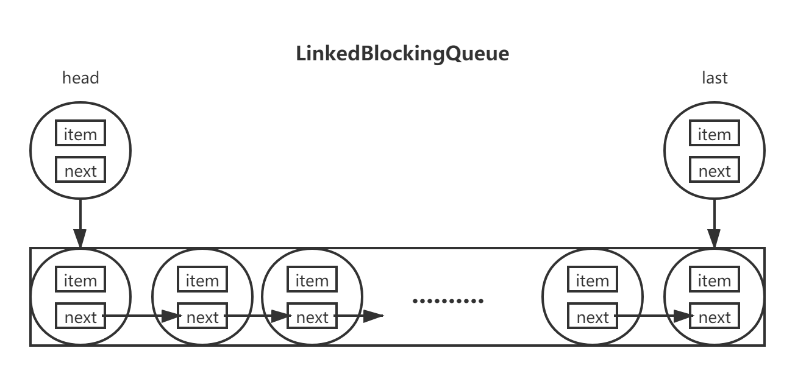

## 核心结论

`LinkedBlockingQueue` 是可指定容量的 FIFO 阻塞队列。原文实现通过分别保护入队和出队的锁、共享计数与条件通知协调生产者和消费者，因此部分入队与出队可以并行。未指定容量时上限为 `Integer.MAX_VALUE`，并不意味着实际内存足够。

## 问题与适用范围

本文回答链表、哨兵节点、容量计数和通知如何协作，保留未标注精确 JDK 修订的旧源码。具体节点和锁布局属于实现细节。用于任务积压时应明确容量与生产速度；迭代及批量转移也不能被当作脱离并发变化的固定快照。

<!-- more -->

## 链表节点

LinkedBlockingQueue是通过一个静态内部类Node来构成单向链表的。

```java
static class Node<E> {

    E item;

    Node<E> next;

    Node(E x) { item = x; }
}
```

* item代表的是当前节点持有的元素
* next代表的是当前节点的下一个节点

## 成员变量

### 节点

```java
transient Node<E> head;

private transient Node<E> last;
```

* head代表的链表的头部节点
* last代表的链表的尾部节点

在并发的情况下队列会形成如下图所示的链表结构



### 队列容量大小

```java
private final int capacity;

private final AtomicInteger count = new AtomicInteger();
```

* capacity代表的是队列允许存储元素的最大数量
* count代表的是当前队列中的元素个数，因为可能会存在多个线程同时读写队列，所以通过AtomicInteger这个原子类来保证并发情况下能够读取到当前队列中的元素数量

### 锁和监视器

```java
private final ReentrantLock takeLock = new ReentrantLock();

private final Condition notEmpty = takeLock.newCondition();

private final ReentrantLock putLock = new ReentrantLock();

private final Condition notFull = putLock.newCondition();
```

* takeLock代表的是在执行take, poll等**获取操作**时当前线程必须锁持有的锁
* notEmpty代表的是如果在执行take, poll等**获取操作**时如果队列为空，那么当前线程应该阻塞在这个Condition上直到队列不为空为止
* putLock代表的是在执行put, offer等**新增操作**时当前线程必须锁持有的锁
* notFull代表的是如果在执行put, offer等**新增操作**时如果队列已经满了，那么当前线程应该阻塞在这个Condition上直到队列空间可用为止

LinkedBlockingQueue内部是通过两把ReentrantLock锁来分别对**新增、获取**这种操作进行限制的，ReentrantLock底层是基于AQS的同步队列，不理解的可以看我之前写的AQS系列文章。

## 构造器

LinkedBlockingQueue提供了3个构造器

### 无参构造器

```java
public LinkedBlockingQueue() {
    this(Integer.MAX_VALUE);
}
```

无参构造器调用的是另一个带容量参数的构造器，也就是说调用无参构造器返回的是一个容量为Integer.MAX_VALUE的队列，也就相当于一个无界队列。

### 指定队列容量构造器

```java
public LinkedBlockingQueue(int capacity) {
    if (capacity <= 0) throw new IllegalArgumentException();
    this.capacity = capacity;
    last = head = new Node<E>(null);
}
```

一般情况下建议使用这个带容量参数的队列来构造有界阻塞队列，因为如果往队列中新增元素的速度远远超过从队列中获取元素的速度，那么在使用无参构造器的情况下这个阻塞队列很有可能会在段时间内达到Integer.MAX_VALUE大小，就很有可能造成内存溢出。

构造器的最后一行将head和last节点都初始化为同一个item为null的节点，此时head和last节点是没有关联的，它们还没有形成链表结构。形成链表结构是在往队列中新增元素时，即入队的时候。

### 通过集合构造队列

```java
public LinkedBlockingQueue(Collection<? extends E> c) {
    this(Integer.MAX_VALUE);
    final ReentrantLock putLock = this.putLock;
    putLock.lock(); // Never contended, but necessary for visibility
    try {
        int n = 0;
        for (E e : c) {
            if (e == null)
                throw new NullPointerException();
            if (n == capacity)
                throw new IllegalStateException("Queue full");
            enqueue(new Node<E>(e));
            ++n;
        }
        count.set(n);
    } finally {
        putLock.unlock();
    }
}
```

通过这个构造器默认情况下也是创建一个容量为Integer.MAX_VALUE的队列，然后迭代这个集合，默认是不允许往队列中新增null元素的，并且集合的长度也不能超过Integer.MAX_VALUE，接着则是调用enqueue方法将元素入队

#### enqueue

```java
private void enqueue(Node<E> node) {
    last = last.next = node;
}
```

入队方法很简单，不过理解起来可能有一点难度，上面的代码其实是分成两步

```java
last.next = node;
last=node;
```

1. 将尾部节点的next指向新增的节点（元素是从尾部入队的）
2. 再将尾部节点指向新增的节点

**这里有一个隐藏的细节，这个构造器第一步调用了`this(Integer.MAX_VALUE);`这个构造器，现在我们知道通过带容量的构造器会初始化head和last节点为同一个item为null的节点（`last = head = new Node<E>(null);`），所以在执行完`last.next = node;`这行代码后，其实就相当于将head节点的next指向了新增节点，接着执行`last=node;`完这一步就将头部节点、尾部节点和新增节点连接起来了。形成了一个单向链表结构。**

下面我们接着回到上面的构造器中，在所有元素成功入队后，通过AtomicInteger的set方法将当前队列中的元素设置为成功入队的数量，最终在finally块中释放锁，这里有一个疑问，为什么在构造器中需要加上锁呢？作者也加上了解释：**不会产生竞争，而是为了保证可见性。**究其原因是可能存在的指令重排序的原因，导致运行的结果和预期的不一致。

## put方法

```java
public void put(E e) throws InterruptedException {
    if (e == null) throw new NullPointerException();
    int c = -1;
    Node<E> node = new Node<E>(e);
    final ReentrantLock putLock = this.putLock;
    final AtomicInteger count = this.count;
    putLock.lockInterruptibly();
    try {
        // 如果队列满了则阻塞在此
        while (count.get() == capacity) {
            notFull.await();
        }
        // 元素入队
        enqueue(node);
        // 当前元素数量自增加一，注意getAndIncrement方法返回的是自增前的值
        c = count.getAndIncrement();
        // c+1代表此时队列中的数量，如果还没有超过容量则
        // 唤醒上一个因为队列已满而无法往队列新增元素导致阻塞在这个
        // notFull上的线程
        if (c + 1 < capacity)
            notFull.signal();
    } finally {
        // 真正的signal是在这一步发生的
        putLock.unlock();
    }
    // 走到这里如果c==0说明c = count.getAndIncrement();
    // 这行代码执行成功了，也就是现在队列中至少有一个元素了，
    // 那么就通知获取元素的线程开始运行
    if (c == 0)
        signalNotEmpty();
}
```

### signalNotEmpty

```java
private void signalNotEmpty() {
    final ReentrantLock takeLock = this.takeLock;
    takeLock.lock();
    try {
        notEmpty.signal();
    } finally {
        takeLock.unlock();
    }
}
```

当锁被释放之后如果c==0表明此刻队列中至少有一个元素，然后调用signalNotEmpty方法来唤醒上一个因为队列为空而阻塞的获取元素线程。

整个put方法中有一个奇怪的点在于下面这段代码

```java
if (c + 1 < capacity)
    notFull.signal();
```

为什么在元素入队成功之后且当前队列还未满的情况下要去通知另一个阻塞线程呢？我不是很明白这段代码会在什么情况下发生，因为无论是put锁还是take锁都是独占锁，而LinkedBlockingQueue中往队列中新增元素并且会阻塞（即调用notFull的await或者awaitNanos方法）的方法只有`put(E e)`和`offer(E e, long timeout, TimeUnit unit)`这两个方法，而由于独占锁的特性这两个方法是不可能被两个线程同时调用的。百思不得其解，后来在我阅读到作者在LinkedBlockingQueue源码开始的设计摘要上的一段话

```java
Also, to minimize need for puts to get takeLock and vice-versa, cascading notifies are used.
```

翻译成中文的意思是**为了最小化获取putLock和takeLock的需求，在相应的put和take方法内使用了级联通知。**重点在于**最小化获取锁**这段话，由于使用的是独占锁，所以无论是put还是take操作都是被一个线程独占调用的，所以上面那段代码只会发生在多线程的场景下多个线程执行put或take操作时频繁达到队列容量阈值的时候：

1. 假设存在一个队列Q，容量为100
2. A线程执行put操作将Q塞满了，然后A线程继续put走到`notFull.await();`这一行代码处被阻塞了（此刻没有任何其它线程从队列中take元素）
3. B线程开始从Q中take元素，当take到第50个元素的时候另一个C线程又继续往Q中put元素，成功入队后此时队列中的数量为51，队列未满，然后调用`notFull.signal();`这行代码唤醒上一个被阻塞的线程，这个线程就是A线程，A线程被唤醒后继续put第52个元素，直到队列容量满之后A和C两个线程都被阻塞，然后其它take线程take一个之后唤醒上一个被阻塞的线程，循环往复。

LinkedBlockingQueue中和put方法语义相同的方法还有带超时的offer和不带超时的offer方法，这两个方法与put方法在实现的流程上基本一致，这里就不再分析了。

## take方法

```java
public E take() throws InterruptedException {
    E x;
    int c = -1;
    final AtomicInteger count = this.count;
    final ReentrantLock takeLock = this.takeLock;
    takeLock.lockInterruptibly();
    try {
        while (count.get() == 0) {
            notEmpty.await();
        }
        x = dequeue();
        c = count.getAndDecrement();
        if (c > 1)
            notEmpty.signal();
    } finally {
        takeLock.unlock();
    }
    if (c == capacity)
        signalNotFull();
    return x;
}
```

在理解了put方法的原理之后，take方法的原理也是大同小异，只不过是换了一把take锁而已。整个take方法的执行流程如下：

1. take锁加锁
2. 如果队列是空的则阻塞
3. 调用出队方法dequeue
4. 如果此时队列中至少还有一个元素则调用 `notEmpty.signal();`唤醒其它执行take方法阻塞的线程。注意getAndDecrement方法是先get再递减，返回的是递减前的值
5. take锁释放锁，唤醒阻塞线程其实是在这一步发生的，不懂的可以看我之前写的Condiotion文章。
6. c == capacity为true代表`c = count.getAndDecrement();`这行代码执行成功了，这里需要注意getAndDecrement方法是先获取再递减，所以返回值是这次take成功前队列中元素的数量。那为什么是take前队列已满的情况下再通知put线程呢？难道take前队列还未满就不用通知了吗？这是因为独占锁的原因，同一时刻只会有一个线程去put，而put线程被阻塞的条件是队列已满，如果这次take前队列未满就不会有put线程被阻塞了，所以只会在take前队列已满的情况下再去唤醒上一个被阻塞的put线程。

take方法的大体流程如上所示，与put方法没有什么太大的区别。我们只需要关注一下元素是如何出队的就可以了

### dequeue

```java
private E dequeue() {
    Node<E> h = head;
    Node<E> first = h.next;
    h.next = h; // help GC
    head = first;
    E x = first.item;
    first.item = null;
    return x;
}
```

出队的流程如下

1. 拿到链表的head节点以及head节点的next节点，这个next节点就是真正持有元素的节点

   ```java
   Node<E> h = head;
   Node<E> first = h.next;
   ```

2. 帮助GC回收无用的对象，然后重新设置head节点

   ```java
   h.next = h; // help GC
   head = first;
   ```

3. 返回队列中的第一个元素，然后清空head节点中的元素

   ```java
   E x = first.item;
   first.item = null;
   ```

这里有一个需要注意的点是head节点在LinkedBlockingQueue中扮演的是一个哨兵的角色，它本身是不持有任何元素的。
所以出队本质上拿的是head节点next节点中的item。

LinkedBlockingQueue中和take方法语义相同的方法还有带超时的poll和不带超时的poll方法，这两个方法与take方法在实现的流程上基本一致，这里就不再分析了。

## remove方法

```java
public boolean remove(Object o) {
    if (o == null) return false;
    fullyLock();
    try {
        for (Node<E> trail = head, p = trail.next;
             p != null;
             trail = p, p = p.next) {
            if (o.equals(p.item)) {
                unlink(p, trail);
                return true;
            }
        }
        return false;
    } finally {
        fullyUnlock();
    }
}
```

remove方法的作用是将队列中第一个通过equals方法与指定Object匹配的对象从此队列中移除。与take方法不同，take方法允许在take期间有其它线程在进行put操作，而remove方法则不允许，进行remove时需要保证put锁和take锁都被当前执行remove方法的线程独占，因为如果remove方法只是独占一个take锁的话，原本队列中可能没有对象与Object匹配，而某一时刻如果有一个线程put进来一个Object满足条件，这就不符合预期的结果了，所以remove方法需要通过fullyLock方法来独占put和take锁。

### fullyLock

```java
void fullyLock() {
    putLock.lock();
    takeLock.lock();
}
```

执行remove的方法获取到两把锁之后，通过一个while循环从head节点的下一个真正持有元素的节点开始（head节点本身不持有元素，扮演一个哨兵的角色）只要这个节点中的item匹配Object的equals方法，就通过unlink方法将此节点从队列中删除，然后返回true。如果一个都没找到则返回false。重点在于这个unlink方法。

### unlink

```java
void unlink(Node<E> p, Node<E> trail) {
    p.item = null;
    trail.next = p.next;
    if (last == p)
        last = trail;
    if (count.getAndDecrement() == capacity)
        notFull.signal();
}
```

从上面的while循环中我们可以得知方法参数中的p代表的是持有的元素匹配Object，trail代表的是p的前一个节点。整个unlink方法的执行流程如下：

1. 帮助GC回收即将需要删除的节点p

   ```java
   p.item = null;
   ```

2. 将节点从链表中删除，trail是匹配的节点的上一个节点，所以只需要将trail的next执行p的next就将节点删除了

   ```java
   trail.next = p.next;
   ```

3. 校正last节点，如果last节点是与Object匹配的节点，需要将last执行p的前驱节点

   ```java
   if (last == p)
       last = trail;
   ```

4. 判断是否需要同时阻塞的put线程，因为unlink最终会使队列中的元素数量减一，所以如果之前有put线程被阻塞的话就尝试去唤醒，至于为什么是和capacity作比较，原因我已经在上面的take方法中做过解释了。

   ```java
   if (count.getAndDecrement() == capacity)
       notFull.signal();
   ```

## drainTo方法

LinkedBlockingQueue中的两个drainTo方法最终调用的后一个drainTo方法，即带最大转移数量参数的drainTo方法

```java
public int drainTo(Collection<? super E> c, int maxElements) {
    if (c == null)
        throw new NullPointerException();
    if (c == this)
        throw new IllegalArgumentException();
    if (maxElements <= 0)
        return 0;
    boolean signalNotFull = false;
    final ReentrantLock takeLock = this.takeLock;
    takeLock.lock();
    try {
        int n = Math.min(maxElements, count.get());
        // count.get provides visibility to first n Nodes
        Node<E> h = head;
        int i = 0;
        try {
            while (i < n) {
                Node<E> p = h.next;
                c.add(p.item);
                p.item = null;
                h.next = h;
                h = p;
                ++i;
            }
            return n;
        } finally {
            // Restore invariants even if c.add() threw
            if (i > 0) {
                // assert h.item == null;
                head = h;
                signalNotFull = (count.getAndAdd(-i) == capacity);
            }
        }
    } finally {
        takeLock.unlock();
        if (signalNotFull)
            signalNotFull();
    }
}
```

1. 待转移的集合不能为null，待转移的集合不能为本身，maxElements不能为0
2. 计算出maxElements与当前队列中元素数量这两者间较小的值作为即将转移的元素数量
3. take锁加锁
4. 通过一个while循环从head节点的下一个真正持有元素的节点开始将该节点中的item通过Collection的add方法转移到该集合中。注意因为add方法是可能抛出异常的，所以在while循环外层通过一个局部变量来记录在发生异常前的上一个节点，然后在finally块中确保将队列的head节点设置为正确的节点，i即为成功转移元素的数量，如果大于0则通过AtomicInteger的getAndAdd方法将队列中的元素数量设置为减去i的数量，需要注意的是getAndAdd方法是先获取再做减法，所以返回值队列转移元素前拥有的元素数量。将这个值与容量作比较含义为**只要转移前队列中的元素数量已经满了就通知被阻塞的put线程开始往队列中新增元素。**这里有一点疑问，如果转移前队列本身还未满，就不需要通知阻塞的put线程了吗？划重点**通知阻塞的put线程**，因为只有队列已满的情况下才有可能存在阻塞的put线程，如果转移前队列都未满的话那么就不会有put线程被阻塞了，所以`count.getAndAdd(-i)`是与容量作比较的。

## 例子

下面是一个使用LinkedBlockingQueue的简单例子

```java
package io.allurx;

import java.time.LocalDateTime;
import java.util.concurrent.BlockingQueue;
import java.util.concurrent.LinkedBlockingQueue;

/**
 * @author allurx
 */
public class Test {

    public static void main(String[] args) {
        BlockingQueue<Integer> blockingQueue = new LinkedBlockingQueue<>();
        Producer producer = new Producer(blockingQueue);
        Consumer consumer1 = new Consumer(blockingQueue, "consumer1");
        Consumer consumer2 = new Consumer(blockingQueue, "consumer2");
        Consumer consumer3 = new Consumer(blockingQueue, "consumer3");
        producer.start();
        consumer1.start();
        consumer2.start();
        consumer3.start();
    }

    static class Producer extends Thread {

        private BlockingQueue<Integer> blockingQueue;

        public Producer(BlockingQueue<Integer> blockingQueue) {
            this.blockingQueue = blockingQueue;
        }

        public void produce() {
            LocalDateTime end = LocalDateTime.now().plusSeconds(2);
            while (LocalDateTime.now().isBefore(end)) {
                try {
                    blockingQueue.put(1);
                } catch (InterruptedException e) {
                    e.printStackTrace();
                }
            }
        }

        @Override
        public void run() {
            produce();
        }
    }

    static class Consumer extends Thread {
        private BlockingQueue<Integer> blockingQueue;

        public Consumer(BlockingQueue<Integer> blockingQueue, String name) {
            super(name);
            this.blockingQueue = blockingQueue;
        }

        public void consume() {
            while (true) {
                try {
                    System.out.println(Thread.currentThread().getName() + "：" + blockingQueue.take());
                } catch (InterruptedException e) {
                    e.printStackTrace();
                }
            }
        }

        @Override
        public void run() {
            consume();
        }
    }
}
```

控制台输出

```java
consumer1：1
consumer1：1
consumer2：1
consumer2：1
consumer2：1
consumer3：1
consumer3：1
consumer3：1
..........
```

1. Producer线程往队列put元素两秒之后停止
2. 开启三个Consumer线程去消费队列中的元素直到队列中的元素为空为止，然后三个消费者被阻塞

## 总结

LinkedBlockingQueue是一个基于单向链表并且可设置容量的阻塞队列。LinkedBlockingQueue中的元素都是按照FIFO即先进先出的元素排列的，在队列头部的元素是在队列中停留时间最长的元素，相反在队列尾部的元素是则是在队列中停留时间最短的元素。元素是从队列尾部新增进入队列的，而获取元素是从队列头部开始获取的。但是head节点本身是不持有元素的，他仅仅扮演了一个哨兵的角色。LinkedBlockingQueue中有两把ReentrantLock分别对应put和take这两个语义，这两种操作单独执行都是独占相应锁的，但是put和take方法相互间是可以并行执行的，即A线程执行put操作与B线程执行take操作是可以同时执行的。

## 资料来源

- [LinkedBlockingQueue：容量与并发契约](https://docs.oracle.com/en/java/javase/25/docs/api/java.base/java/util/concurrent/LinkedBlockingQueue.html)
