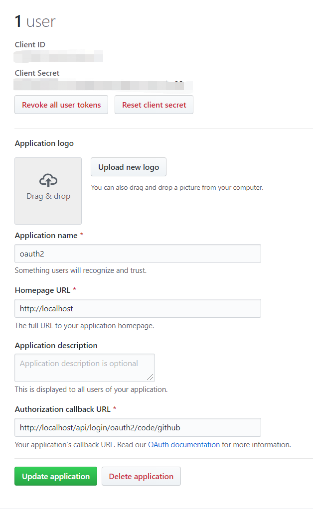

## 核心结论

OAuth2 登录包含发起授权、接收回调、用授权码换取访问令牌、获取用户信息这几个阶段。Spring Security 用不同过滤器和认证提供者协作完成流程，ClientRegistration 保存第三方配置，OAuth2AuthorizedClient 则保存已经授权的客户端及令牌；它们承担不同职责。

## 问题与适用范围

本文回答：OAuth2 客户端如何完成第三方授权登录，并把授权结果变成本地认证？

本文讨论 Servlet 应用的授权码登录流程。它延续以 Spring Boot 2.1.5.RELEASE 开始的历史系列，但原文没有独立锁定本篇的依赖版本；下面的自动配置和 WebSecurityConfigurerAdapter 示例按当时实现阅读。OAuth2 授权与应用内登录相关但并不等同，本文也没有完整讨论 OpenID Connect。

## 概述

OAuth（开放授权）是一个开放标准，允许用户授权第三方网站访问他们存储在另外的服务提供者上的信息，而不需要将用户名和密码提供给第三方网站或分享他们数据的所有内容。网上有很多关于OAuth协议的讲解，这里就不在详细解释OAuth相关的概念了，请读者自行查阅相关资料，否则本文接下来的内容可能会很难理解。

<!-- more -->

## Spring-Security对OAuth2.0的支持

截止到本文撰写的日期为止，Spring已经提供了对OAuth提供的支持（[spring-security-oauth](https://github.com/spring-projects/spring-security-oauth)），但是该工程已经被废弃了，因为Spring-Security工程提供了最新的OAuth2.0支持。如果你的项目中使用了过期的Spring-Security-OAuth，请参考《[OAuth 2.0迁移指南》](https://github.com/spring-projects/spring-security/wiki/OAuth-2.0-Migration-Guide)，本文将对OAuth2.0中的客户端模式进行原理分析，结合Spring官方指南中提供了一个简单的基于spring-boot与oauth2.0集成第三方应用登录的案例（[spring-boot-oauth2](https://spring.io/guides/tutorials/spring-boot-oauth2/)），一步一步分析其内部实现的原理。

### 创建GitHub OAuth Apps

在[Github OAuth Apps](https://github.com/settings/developers)中创建一个新的应用



示例中的 GITHUB_CLIENT_ID 和 GITHUB_CLIENT_SECRET 由运行环境提供，分别对应自己的 OAuth App 凭据，不应写入文章或提交到仓库。

这个应用相当于我们自己的应用（客户端），被注册在Github（授权服务器）中了，如果我们应用中的用户有github账号的话，则可以基于oauth2来登录我们的系统，替代原始的用户名密码方式。在官方指南的例子中，使用spring-security和oauth2进行社交登陆只需要在你的pom文件中加入以下几个依赖即可

```xml
<dependency>
    <groupId>org.springframework.boot</groupId>
    <artifactId>spring-boot-starter-oauth2-client</artifactId>
</dependency>
<dependency>
    <groupId>org.springframework.boot</groupId>
    <artifactId>spring-boot-starter-security</artifactId>
</dependency>
<dependency>
    <groupId>org.springframework.boot</groupId>
    <artifactId>spring-boot-starter-web</artifactId>
</dependency>
```

然后在配置文件中填上刚刚注册的应用的clientId和clientSecret

```yaml
spring:
  security:
    oauth2:
      client:
        registration:
          github:
            clientId: ${GITHUB_CLIENT_ID}
            clientSecret: ${GITHUB_CLIENT_SECRET}
```

紧接着就像普通的spring-security应用一样，继承WebSecurityConfigurerAdapter，进行一些简单的配置即可

```java
@SpringBootApplication
@RestController
public class SocialApplication extends WebSecurityConfigurerAdapter {

    // ...

    @Override
    protected void configure(HttpSecurity http) throws Exception {
        // @formatter:off
        http
            .authorizeRequests(a -> a
                .antMatchers("/", "/error", "/webjars/**").permitAll()
                .anyRequest().authenticated()
            )
            .exceptionHandling(e -> e
                .authenticationEntryPoint(new HttpStatusEntryPoint(HttpStatus.UNAUTHORIZED))
            )
            .oauth2Login();
        // @formatter:on
    }
}
```

也就是说我们只需要添加maven依赖以及继承WebSecurityConfigurerAdapter进行一些简单的配置，一个oauth2客户端应用就构建完成了。接下来按照指南上的步骤点击页面的github登录链接我们的页面就会跳转到github授权登录页，等待用户授权完成之后浏览器重定向到我们的callback URL最终请求user信息端点即可访问到刚刚登入的github用户信息，整个应用的构建是如此的简单，背后的原理是什么呢？接下来我们开始分析。还是和以前一样，我们在配置文件中将security的日志级别设置为debug

```yaml
logging:
  level:
    org.springframework.security: debug
```

重新启动应用之后，从控制台输出中我们可以看到与普通spring-security应用不同的地方在于整个过滤链多出了以下几个过滤器

```java
OAuth2AuthorizationRequestRedirectFilter
OAuth2LoginAuthenticationFilter
```

联想oauth2的授权码模式以及这两个过滤器的名字，熟悉spring-security的同学心中肯定已经有了一点想法了。对没错，spring-security对客户端模式的支持完全就是基于这两个过滤器来实现的。现在我们来回想以下授权码模式的执行流程

1. 用户在客户端页面点击三方应用登录按钮（客户端就是我们刚刚注册的github应用）

2. 页面跳转到三方应用注册的授权方页面（授权服务器即github）

3. 用户登入授权后，github调用我们应用的回调地址（我们刚刚注册github应用时填写的回调地址）

4. 第三步的回调地址中github会将code参数放到url中，接下来我们的客户端就会在内部拿这个code再次去调用github

   的access_token地址获取令牌

上面就是标准的authorization_code授权模式，OAuth2AuthorizationRequestRedirectFilter的作用就是上面步骤中的1.2步的合体，当用户点击页面的github授权url之后，OAuth2AuthorizationRequestRedirectFilter匹配这个请求，接着它会将我们配置文件中的clientId、scope以及构造一个state参数（防止csrf攻击）拼接成一个url重定向到github的授权url，OAuth2LoginAuthenticationFilter的作用则是上面3.4步骤的合体，当用户在github的授权页面授权之后github调用回调地址，OAuth2LoginAuthenticationFilter匹配这个回调地址，解析回调地址后的code与state参数进行验证之后内部拿着这个code远程调用github的access_token地址，拿到access_token之后通过OAuth2UserService获取相应的用户信息（内部是拿access_token远程调用github的用户信息端点）最后将用户信息构造成Authentication被SecurityContextPersistenceFilter过滤器保存到HttpSession中。

下面我们就来看一下这两个过滤器内部执行的原理

### OAuth2AuthorizationRequestRedirectFilter

```java
public class OAuth2AuthorizationRequestRedirectFilter extends OncePerRequestFilter {

    ......省略部分代码

	@Override
	protected void doFilterInternal(HttpServletRequest request, HttpServletResponse response, FilterChain filterChain)
			throws ServletException, IOException {

		try {
			OAuth2AuthorizationRequest authorizationRequest = this.authorizationRequestResolver.resolve(request);
			if (authorizationRequest != null) {
				this.sendRedirectForAuthorization(request, response, authorizationRequest);
				return;
			}
		} catch (Exception failed) {
			this.unsuccessfulRedirectForAuthorization(request, response, failed);
			return;
		}
        ......省略部分代码
}
```

通过authorizationRequestResolver解析器解析请求，解析器的默认实现是DefaultOAuth2AuthorizationRequestResolver，核心解析方法如下

```java

// 第一步解析
@Override
public OAuth2AuthorizationRequest resolve(HttpServletRequest request) {
    // 通过内部的authorizationRequestMatcher来解析当前请求中的registrationId
    // 也就是/oauth2/authorization/github中的github
    String registrationId = this.resolveRegistrationId(request);
    String redirectUriAction = getAction(request, "login");
    return resolve(request, registrationId, redirectUriAction);
}

// 第二步解析
private OAuth2AuthorizationRequest resolve(HttpServletRequest request, String registrationId, String redirectUriAction) {
    if (registrationId == null) {
        return null;
    }
	// 根据传入的registrationId找到注册的应用信息
    ClientRegistration clientRegistration = this.clientRegistrationRepository.findByRegistrationId(registrationId);
    if (clientRegistration == null) {
        throw new IllegalArgumentException("Invalid Client Registration with Id: " + registrationId);
    }

    Map<String, Object> attributes = new HashMap<>();
    attributes.put(OAuth2ParameterNames.REGISTRATION_ID, clientRegistration.getRegistrationId());

    OAuth2AuthorizationRequest.Builder builder;
    // 根据不同的AuthorizationGrantType构造不同的builder
    if (AuthorizationGrantType.AUTHORIZATION_CODE.equals(clientRegistration.getAuthorizationGrantType())) {
        builder = OAuth2AuthorizationRequest.authorizationCode();
        Map<String, Object> additionalParameters = new HashMap<>();
        if (!CollectionUtils.isEmpty(clientRegistration.getScopes()) &&
            clientRegistration.getScopes().contains(OidcScopes.OPENID)) {
            // Section 3.1.2.1 Authentication Request - https://openid.net/specs/openid-connect-core-1_0.html#AuthRequest
            // scope
            // 		REQUIRED. OpenID Connect requests MUST contain the "openid" scope value.
            addNonceParameters(attributes, additionalParameters);
        }
        if (ClientAuthenticationMethod.NONE.equals(clientRegistration.getClientAuthenticationMethod())) {
            addPkceParameters(attributes, additionalParameters);
        }
        builder.additionalParameters(additionalParameters);
    } else if (AuthorizationGrantType.IMPLICIT.equals(clientRegistration.getAuthorizationGrantType())) {
        builder = OAuth2AuthorizationRequest.implicit();
    } else {
        throw new IllegalArgumentException("Invalid Authorization Grant Type ("  +
                                           clientRegistration.getAuthorizationGrantType().getValue() +
                                           ") for Client Registration with Id: " + clientRegistration.getRegistrationId());
    }

    String redirectUriStr = expandRedirectUri(request, clientRegistration, redirectUriAction);

    OAuth2AuthorizationRequest authorizationRequest = builder
        .clientId(clientRegistration.getClientId())
        .authorizationUri(clientRegistration.getProviderDetails().getAuthorizationUri())
        .redirectUri(redirectUriStr)
        .scopes(clientRegistration.getScopes())
        // 生成随机state值
        .state(this.stateGenerator.generateKey())
        .attributes(attributes)
        .build();

    return authorizationRequest;
}
```

DefaultOAuth2AuthorizationRequestResolver判断请求是否是授权请求，最终返回一个OAuth2AuthorizationRequest对象给OAuth2AuthorizationRequestRedirectFilter，如果OAuth2AuthorizationRequest不为null的话，说明当前请求是一个授权请求，那么接下来就要拿着这个请求重定向到授权服务器的授权端点了，下面我们接着看OAuth2AuthorizationRequestRedirectFilter发送重定向的逻辑

```java
private void sendRedirectForAuthorization(HttpServletRequest request, HttpServletResponse response,
                                          OAuth2AuthorizationRequest authorizationRequest) throws IOException {

    if (AuthorizationGrantType.AUTHORIZATION_CODE.equals(authorizationRequest.getGrantType())) {
        this.authorizationRequestRepository.saveAuthorizationRequest(authorizationRequest, request, response);
    }
    this.authorizationRedirectStrategy.sendRedirect(request, response, authorizationRequest.getAuthorizationRequestUri());
}
```

1. 如果当前是授权码类型的授权请求那么就需要将这个请求信息保存下来，因为接下来授权服务器回调我们需要用到这个授权请求的参数进行校验等操作（比对state），这里是通过authorizationRequestRepository保存授权请求的，默认的保存方式是通过HttpSessionOAuth2AuthorizationRequestRepository保存在httpsession中的，具体的保存逻辑很简单，这里就不细说了。

2. 保存完成之后就要开始重定向到授权服务端点了，这里默认的authorizationRedirectStrategy是DefaultRedirectStrategy，重定向的逻辑很简单，通过response.sendRedirect方法使前端页面重定向到指定的授权

   ```java
   public void sendRedirect(HttpServletRequest request, HttpServletResponse response,
                            String url) throws IOException {
       String redirectUrl = calculateRedirectUrl(request.getContextPath(), url);
       redirectUrl = response.encodeRedirectURL(redirectUrl);

       if (logger.isDebugEnabled()) {
           logger.debug("Redirecting to '" + redirectUrl + "'");
       }

       response.sendRedirect(redirectUrl);
   }
   ```

   OAuth2AuthorizationRequestRedirectFilter处理逻辑讲完了，下面我们对它处理过程做一个总结

   1. 通过内部的OAuth2AuthorizationRequestResolver解析当前的请求，返回一个OAuth2AuthorizationRequest对象，如果当前请求是授权端点请求，那么就会返回一个构造好的对象，包含我们的client_id、state、redirect_uri参数，如果对象为null的话，那么就说明当前请求不是授权端点请求。注意如果OAuth2AuthorizationRequestResolver不为null的话，OAuth2AuthorizationRequestResolver内部会将其保存在httpsession中这样授权服务器在调用我们的回调地址时我们就能从httpsession中取出请求将state进行对比以防csrf攻击。
   2. 如果第一步返回的OAuth2AuthorizationRequest对象不为null的话，接下来就会通过response.sendRedirect的方法将OAuth2AuthorizationRequest中的授权端点请求发送到前端的响应头中然后浏览器就会重定向到授权页面，等待用户授权。

### OAuth2LoginAuthenticationFilter

   ```java
   public class OAuth2LoginAuthenticationFilter extends AbstractAuthenticationProcessingFilter {
       @Override
       public Authentication attemptAuthentication(HttpServletRequest request, HttpServletResponse response)
               throws AuthenticationException {

           MultiValueMap<String, String> params = OAuth2AuthorizationResponseUtils.toMultiMap(request.getParameterMap());
           // 如果请求参数中没有state和code参数，说明当前请求是一个非法请求
           if (!OAuth2AuthorizationResponseUtils.isAuthorizationResponse(params)) {
               OAuth2Error oauth2Error = new OAuth2Error(OAuth2ErrorCodes.INVALID_REQUEST);
               throw new OAuth2AuthenticationException(oauth2Error, oauth2Error.toString());
           }
           // 从httpsession中取出OAuth2AuthorizationRequestRedirectFilter中保存的授权请求，
           // 如果找不到的话说明当前请求是非法请求
           OAuth2AuthorizationRequest authorizationRequest =
                   this.authorizationRequestRepository.removeAuthorizationRequest(request, response);
           if (authorizationRequest == null) {
               OAuth2Error oauth2Error = new OAuth2Error(AUTHORIZATION_REQUEST_NOT_FOUND_ERROR_CODE);
               throw new OAuth2AuthenticationException(oauth2Error, oauth2Error.toString());
           }

           // 如果当前注册的应用中找不到授权请求时的应用了，那么也是一个不正确的请求
           String registrationId = authorizationRequest.getAttribute(OAuth2ParameterNames.REGISTRATION_ID);
           ClientRegistration clientRegistration = this.clientRegistrationRepository.findByRegistrationId(registrationId);
           if (clientRegistration == null) {
               OAuth2Error oauth2Error = new OAuth2Error(CLIENT_REGISTRATION_NOT_FOUND_ERROR_CODE,
                       "Client Registration not found with Id: " + registrationId, null);
               throw new OAuth2AuthenticationException(oauth2Error, oauth2Error.toString());
           }
           String redirectUri = UriComponentsBuilder.fromHttpUrl(UrlUtils.buildFullRequestUrl(request))
                   .replaceQuery(null)
                   .build()
                   .toUriString();
           OAuth2AuthorizationResponse authorizationResponse = OAuth2AuthorizationResponseUtils.convert(params, redirectUri);

           Object authenticationDetails = this.authenticationDetailsSource.buildDetails(request);
           OAuth2LoginAuthenticationToken authenticationRequest = new OAuth2LoginAuthenticationToken(
                   clientRegistration, new OAuth2AuthorizationExchange(authorizationRequest, authorizationResponse));
           authenticationRequest.setDetails(authenticationDetails);

           // 将未认证的OAuth2LoginAuthenticationToken委托给AuthenticationManager
           // 选择合适的AuthenticationProvider来对其进行认证，这里的AuthenticationProvider是
           // OAuth2LoginAuthenticationProvider
           OAuth2LoginAuthenticationToken authenticationResult =
               (OAuth2LoginAuthenticationToken) this.getAuthenticationManager().authenticate(authenticationRequest);

           // 将最终的认证信息封装成OAuth2AuthenticationToken
           OAuth2AuthenticationToken oauth2Authentication = new OAuth2AuthenticationToken(
               authenticationResult.getPrincipal(),
               authenticationResult.getAuthorities(),
               authenticationResult.getClientRegistration().getRegistrationId());
           oauth2Authentication.setDetails(authenticationDetails);

           // 构造OAuth2AuthorizedClient，将所有经过授权的客户端信息保存起来，默认是通过
           // AuthenticatedPrincipalOAuth2AuthorizedClientRepository来保存的，
           // 然后就能通过其来获取之前所有已授权的client？暂时不能确定其合适的用途
           OAuth2AuthorizedClient authorizedClient = new OAuth2AuthorizedClient(
               authenticationResult.getClientRegistration(),
               oauth2Authentication.getName(),
               authenticationResult.getAccessToken(),
               authenticationResult.getRefreshToken());

           this.authorizedClientRepository.saveAuthorizedClient(authorizedClient, oauth2Authentication, request, response);

           return oauth2Authentication;
       }
   }
   ```

   OAuth2LoginAuthenticationFilter的作用很简单，就是响应授权服务器的回调地址，核心之处在于OAuth2LoginAuthenticationProvider对OAuth2LoginAuthenticationToken的认证，

#### OAuth2LoginAuthenticationToken

##### OAuth2LoginAuthenticationProvider

```java
public class OAuth2LoginAuthenticationProvider implements AuthenticationProvider {

     ...省略部分代码

    @Override
	public Authentication authenticate(Authentication authentication) throws AuthenticationException {
		OAuth2LoginAuthenticationToken authorizationCodeAuthentication =
			(OAuth2LoginAuthenticationToken) authentication;

		// Section 3.1.2.1 Authentication Request - https://openid.net/specs/openid-connect-core-1_0.html#AuthRequest
		// scope
		// 		REQUIRED. OpenID Connect requests MUST contain the "openid" scope value.
		if (authorizationCodeAuthentication.getAuthorizationExchange()
			.getAuthorizationRequest().getScopes().contains("openid")) {
			// This is an OpenID Connect Authentication Request so return null
			// and let OidcAuthorizationCodeAuthenticationProvider handle it instead
			return null;
		}

		OAuth2AccessTokenResponse accessTokenResponse;
		try {
			OAuth2AuthorizationExchangeValidator.validate(
					authorizationCodeAuthentication.getAuthorizationExchange());
			// 远程调用授权服务器的access_token端点获取令牌
			accessTokenResponse = this.accessTokenResponseClient.getTokenResponse(
					new OAuth2AuthorizationCodeGrantRequest(
							authorizationCodeAuthentication.getClientRegistration(),
							authorizationCodeAuthentication.getAuthorizationExchange()));

		} catch (OAuth2AuthorizationException ex) {
			OAuth2Error oauth2Error = ex.getError();
			throw new OAuth2AuthenticationException(oauth2Error, oauth2Error.toString());
		}


		OAuth2AccessToken accessToken = accessTokenResponse.getAccessToken();
		Map<String, Object> additionalParameters = accessTokenResponse.getAdditionalParameters();

         // 通过userService使用上一步拿到的accessToken远程调用授权服务器的用户信息
		OAuth2User oauth2User = this.userService.loadUser(new OAuth2UserRequest(
				authorizationCodeAuthentication.getClientRegistration(), accessToken, additionalParameters));

		Collection<? extends GrantedAuthority> mappedAuthorities =
			this.authoritiesMapper.mapAuthorities(oauth2User.getAuthorities());

         // 构造认证成功之后的认证信息
		OAuth2LoginAuthenticationToken authenticationResult = new OAuth2LoginAuthenticationToken(
			authorizationCodeAuthentication.getClientRegistration(),
			authorizationCodeAuthentication.getAuthorizationExchange(),
			oauth2User,
			mappedAuthorities,
			accessToken,
			accessTokenResponse.getRefreshToken());
		authenticationResult.setDetails(authorizationCodeAuthentication.getDetails());

		return authenticationResult;
	}
    ...省略部分代码
}
```

OAuth2LoginAuthenticationProvider的执行逻辑很简单，首先通过code获取access_token，然后通过access_token获取用户信息，这和标准的oauth2授权码模式一致。

## 自动配置

在spring指南的例子中，我们发现只是配置了一个简单oauth2Login()方法，一个完整的oauth2授权流程就构建好了，其实这完全归功于spring-boot的autoconfigure，我们找到spring-boot-autoconfigure.jar包中的security.oauth2.client.servlet包，可以发现spring-boot给我们提供了几个自动配置类

```java
OAuth2ClientAutoConfiguration
OAuth2ClientRegistrationRepositoryConfiguration
OAuth2WebSecurityConfiguration
```

其中OAuth2ClientAutoConfiguration导入了OAuth2ClientRegistrationRepositoryConfiguration和OAuth2WebSecurityConfiguration的配置

### OAuth2ClientRegistrationRepositoryConfiguration

```java
@Configuration(proxyBeanMethods = false)
@EnableConfigurationProperties(OAuth2ClientProperties.class)
@Conditional(ClientsConfiguredCondition.class)
class OAuth2ClientRegistrationRepositoryConfiguration {

    @Bean
    @ConditionalOnMissingBean(ClientRegistrationRepository.class)
    InMemoryClientRegistrationRepository clientRegistrationRepository(OAuth2ClientProperties properties) {
        List<ClientRegistration> registrations = new ArrayList<>(
            OAuth2ClientPropertiesRegistrationAdapter.getClientRegistrations(properties).values());
        return new InMemoryClientRegistrationRepository(registrations);
    }

}
```

OAuth2ClientRegistrationRepositoryConfiguration将我们在配置文件中注册的client构造成ClientRegistration然后保存到内存之中。这里有一个隐藏的CommonOAuth2Provider类，这是一个枚举类，里面事先定义好了几种常用的三方登录授权服务器的各种参数例如GOOGLE、GITHUB、FACEBOO、OKTA

#### CommonOAuth2Provider

```java
public enum CommonOAuth2Provider {

	GOOGLE {

		@Override
		public Builder getBuilder(String registrationId) {
			ClientRegistration.Builder builder = getBuilder(registrationId,
					ClientAuthenticationMethod.BASIC, DEFAULT_REDIRECT_URL);
			builder.scope("openid", "profile", "email");
			builder.authorizationUri("https://accounts.google.com/o/oauth2/v2/auth");
			builder.tokenUri("https://www.googleapis.com/oauth2/v4/token");
			builder.jwkSetUri("https://www.googleapis.com/oauth2/v3/certs");
			builder.userInfoUri("https://www.googleapis.com/oauth2/v3/userinfo");
			builder.userNameAttributeName(IdTokenClaimNames.SUB);
			builder.clientName("Google");
			return builder;
		}
	},

	GITHUB {

		@Override
		public Builder getBuilder(String registrationId) {
			ClientRegistration.Builder builder = getBuilder(registrationId,
					ClientAuthenticationMethod.BASIC, DEFAULT_REDIRECT_URL);
			builder.scope("read:user");
			builder.authorizationUri("https://github.com/login/oauth/authorize");
			builder.tokenUri("https://github.com/login/oauth/access_token");
			builder.userInfoUri("https://api.github.com/user");
			builder.userNameAttributeName("id");
			builder.clientName("GitHub");
			return builder;
		}
	},

	FACEBOOK {

		@Override
		public Builder getBuilder(String registrationId) {
			ClientRegistration.Builder builder = getBuilder(registrationId,
					ClientAuthenticationMethod.POST, DEFAULT_REDIRECT_URL);
			builder.scope("public_profile", "email");
			builder.authorizationUri("https://www.facebook.com/v2.8/dialog/oauth");
			builder.tokenUri("https://graph.facebook.com/v2.8/oauth/access_token");
			builder.userInfoUri("https://graph.facebook.com/me?fields=id,name,email");
			builder.userNameAttributeName("id");
			builder.clientName("Facebook");
			return builder;
		}
	},

	OKTA {

		@Override
		public Builder getBuilder(String registrationId) {
			ClientRegistration.Builder builder = getBuilder(registrationId,
					ClientAuthenticationMethod.BASIC, DEFAULT_REDIRECT_URL);
			builder.scope("openid", "profile", "email");
			builder.userNameAttributeName(IdTokenClaimNames.SUB);
			builder.clientName("Okta");
			return builder;
		}
	};

	private static final String DEFAULT_REDIRECT_URL = "{baseUrl}/{action}/oauth2/code/{registrationId}";

	protected final ClientRegistration.Builder getBuilder(String registrationId,
															ClientAuthenticationMethod method, String redirectUri) {
		ClientRegistration.Builder builder = ClientRegistration.withRegistrationId(registrationId);
		builder.clientAuthenticationMethod(method);
		builder.authorizationGrantType(AuthorizationGrantType.AUTHORIZATION_CODE);
		builder.redirectUriTemplate(redirectUri);
		return builder;
	}

	public abstract ClientRegistration.Builder getBuilder(String registrationId);

}
```

这就是为什么我们没有配置github授权端点确能够跳转授权页面的原因。

### OAuth2WebSecurityConfiguration

OAuth2WebSecurityConfiguration配置一些web相关的类，像如何去保存和获取已经授权过的客户端，以及默认的oauth2客户端相关的配置

```java
@Configuration(proxyBeanMethods = false)
@ConditionalOnBean(ClientRegistrationRepository.class)
class OAuth2WebSecurityConfiguration {

	@Bean
	@ConditionalOnMissingBean
	OAuth2AuthorizedClientService authorizedClientService(ClientRegistrationRepository clientRegistrationRepository) {
		return new InMemoryOAuth2AuthorizedClientService(clientRegistrationRepository);
	}

	@Bean
	@ConditionalOnMissingBean
	OAuth2AuthorizedClientRepository authorizedClientRepository(OAuth2AuthorizedClientService authorizedClientService) {
		return new AuthenticatedPrincipalOAuth2AuthorizedClientRepository(authorizedClientService);
	}

    // 默认的oauth2客户端相关的配置
	@Configuration(proxyBeanMethods = false)
	@ConditionalOnMissingBean(WebSecurityConfigurerAdapter.class)
	static class OAuth2WebSecurityConfigurerAdapter extends WebSecurityConfigurerAdapter {

		@Override
		protected void configure(HttpSecurity http) throws Exception {
			http.authorizeRequests((requests) -> requests.anyRequest().authenticated());
			http.oauth2Login(Customizer.withDefaults());
			http.oauth2Client();
		}

	}

}
```

## 例子

[集成GitHub和QQ社交登录](https://github.com/allurx/spring-security-oauth2-demo/tree/master/spring-security-oauth2-client)

## 资料来源
[spring-security-oauth更新路线](https://spring.io/blog/2019/11/14/spring-security-oauth-2-0-roadmap-update)

[spring-security对oauth2.0授权服务器的支持](https://github.com/spring-projects/spring-security/issues/6320)

[使用spring-boot和oauth2.0构建社交登陆](https://spring.io/guides/tutorials/spring-boot-oauth2/)

- [Spring Boot 2.1.5.RELEASE 依赖版本表](https://docs.spring.io/spring-boot/docs/2.1.5.RELEASE/reference/html/appendix-dependency-versions.html)
- [Spring Security 5.1.5.RELEASE 参考文档](https://docs.spring.io/spring-security/site/docs/5.1.5.RELEASE/reference/htmlsingle/)
- [SecurityFilterChain 组件配置迁移指南](https://spring.io/blog/2022/02/21/spring-security-without-the-websecurityconfigureradapter)
- [当前 OAuth2 参考文档](https://docs.spring.io/spring-security/reference/servlet/oauth2/login/core.html)
