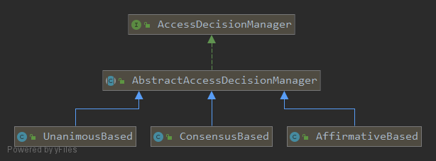
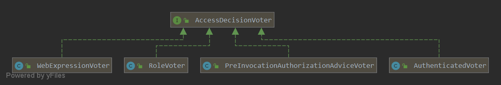

一个管理接口同时检查角色和访问时间：角色检查通过，时间检查拒绝，请求最后还能放行吗？在 Spring Security 的投票式授权中，答案取决于决策器。`AffirmativeBased` 会允许这组结果，`UnanimousBased` 会拒绝。把两个检查注册进去，并不自动意味着两个条件必须同时满足。

要读懂这条授权链，需要分开看两件事：投票者根据什么给出票，决策器又怎样把票变成最终决定。

本文以 **Spring Boot 2.1.5.RELEASE / Spring Security 5.1.5.RELEASE** 的投票式授权体系为准。需要先了解 `Authentication` 如何表示主体与权限；请求怎样进入授权组件，可参阅[请求授权入口](/filter-security-interceptor/)。下面的结论对应这一版本的 `AccessDecisionManager`，使用其他授权 API 时应重新核对调用关系。

文中框架源码摘录来自所链接的固定版本，版权归 Spring 项目原作者，按 [Apache License 2.0](https://www.apache.org/licenses/LICENSE-2.0) 提供。省略部分通过原始实现查阅，摘录不作为独立 Java 程序编译。

## 先分清规则、投票者与决策器

访问管理接口时，拦截器先取得当前主体和这个接口的访问规则，再把它们交给 `AccessDecisionManager`。管理器让各个 `AccessDecisionVoter` 判断：我认识这条规则吗？当前主体满足它吗？投票完成后，管理器正常返回表示允许继续，抛出 `AccessDeniedException` 表示拒绝。

| 对象 | 本次调用中的职责 |
| --- | --- |
| Authentication | 当前主体及其 GrantedAuthority |
| ConfigAttribute | 受保护操作所需的规则，例如独立角色属性或一个完整表达式 |
| AccessDecisionVoter | 对规则给出赞成 `1`、反对 `-1` 或弃权 `0` |
| AccessDecisionManager | 按策略汇总票数，决定是否允许继续调用 |

[](./images/access-decision-manager.png)

三种内置决策器继承 AbstractAccessDecisionManager，共用投票者列表和 `allowIfAllAbstainDecisions`。它默认是 false：**全部弃权时拒绝访问**，并不是禁止投票者弃权。单个投票者不理解某类规则时，弃权是正常结果。

## 三种策略怎样处理同一组票

| 票数或条件 | AffirmativeBased | ConsensusBased | UnanimousBased |
| --- | --- | --- | --- |
| 至少一张赞成，同时存在反对 | 允许 | 比较两类票数 | 拒绝 |
| 没有赞成，至少一张反对 | 拒绝 | 拒绝 | 拒绝 |
| 有赞成、没有反对，允许其他票弃权 | 允许 | 允许 | 允许 |
| 赞成和反对数量相同且都大于零 | 允许 | 由 `allowIfEqualGrantedDeniedDecisions` 决定，默认允许 | 拒绝 |
| 全部弃权 | 由共同配置决定，默认拒绝 | 同左；不走平票放行逻辑 | 同左 |

把开篇的例子代入：一张角色赞成票和一张时间反对票，在 `AffirmativeBased` 下足够放行，在默认 `ConsensusBased` 下因平票也会放行，在 `UnanimousBased` 下会被反对票挡住。只有第三种符合“任何检查都可以否决”的意图。

表格适合比较汇总方式，但 `UnanimousBased` 还改变了每次投票收到的输入：它逐个传入配置属性。下面的角色例子会说明，这个差异也能改变结果。

### AffirmativeBased：一张赞成票即可放行

它遍历投票者，遇到赞成立即返回，同时累计反对数。遍历结束仍没有赞成时，存在反对就拒绝，否则执行全部弃权的检查。换句话说，反对票在这个策略中没有否决权。

例如一个投票者检查角色并赞成，另一个检查其他条件并反对，最终仍允许访问。如果业务要求两个条件同时满足，不能仅把两个检查分别装进该决策器，就期望得到“与”关系。[AffirmativeBased 5.1.5 源码](https://github.com/spring-projects/spring-security/blob/5.1.5.RELEASE/core/src/main/java/org/springframework/security/access/vote/AffirmativeBased.java)

### ConsensusBased：比较赞成与反对数

这个策略完成全部投票，再比较 `grant` 和 `deny`。赞成多则允许，反对多则拒绝；两者相同且非零时才读取平票选项。零比零表示全部弃权，必须交给另一个开关。

因此，一赞成、一反对、一弃权默认允许；把 `allowIfEqualGrantedDeniedDecisions` 改为 false 才会拒绝。这个选择属于业务授权契约，不是无影响的实现替换。[ConsensusBased 5.1.5 源码](https://github.com/spring-projects/spring-security/blob/5.1.5.RELEASE/core/src/main/java/org/springframework/security/access/vote/ConsensusBased.java)

### UnanimousBased：每个属性都不能得到反对票

它为每个 ConfigAttribute 构造单元素集合，再调用所有投票者。任何一次调用返回反对就抛异常；循环结束后只要至少有一张赞成即可允许，其余调用可以弃权。[UnanimousBased 5.1.5 源码](https://github.com/spring-projects/spring-security/blob/5.1.5.RELEASE/core/src/main/java/org/springframework/security/access/vote/UnanimousBased.java)

下面的输入能同时观察“汇总策略”和“属性拆分”的区别：

| 输入 | 值 |
| --- | --- |
| 用户权限 | 只有 `ROLE_ADMIN` |
| 配置属性 | 两个独立属性 `ROLE_ADMIN`、`ROLE_DBA` |
| 投票者 | 一个 RoleVoter |

RoleVoter 面对整个集合，只要匹配其中一个角色就返回赞成，因此 AffirmativeBased 允许；UnanimousBased 分别传入两项，在 DBA 这一项得到反对而拒绝。若配置属性只有一个 `hasAnyRole('ADMIN', 'DBA')` 表达式，内部“或”关系由表达式求值完成，不能把它拆成上述两个角色属性来推断。

## 投票者决定规则如何解释

[](./images/access-decision-voter-implementations.png)

### RoleVoter：匹配权限字符串，不决定数据库结构

默认只识别以 `ROLE_` 开头的配置属性，再与 Authentication 中的 GrantedAuthority 字符串精确比较。没有可识别属性则弃权；有可识别属性但没有任何匹配则反对；有一个匹配就赞成。

```java
public int vote(Authentication authentication, Object object,
        Collection<ConfigAttribute> attributes) {
    if (authentication == null) {
        return ACCESS_DENIED;
    }
    int result = ACCESS_ABSTAIN;
    Collection<? extends GrantedAuthority> authorities = extractAuthorities(authentication);

    for (ConfigAttribute attribute : attributes) {
        if (this.supports(attribute)) {
            result = ACCESS_DENIED;

            // Attempt to find a matching granted authority
            for (GrantedAuthority authority : authorities) {
                if (attribute.getAttribute().equals(authority.getAuthority())) {
                    return ACCESS_GRANTED;
                }
            }
        }
    }

    return result;
}
```

把这段代码与前面的 `ROLE_ADMIN`、`ROLE_DBA` 例子对照，就能看出差异发生在内层比较成功后的立即返回。收到整个集合时，匹配 `ROLE_ADMIN` 已经足以赞成；只收到 `ROLE_DBA` 时，则遍历完权限仍找不到匹配，返回反对。

代码开头还处理了一个更早的失败：`authentication == null` 会直接反对。至于 `ROLE_` 前缀，它约束的是传给投票者的字符串；数据库可以保存业务自己的角色标识，再在构建 `GrantedAuthority` 时转换。[RoleVoter 源码](https://github.com/spring-projects/spring-security/blob/5.1.5.RELEASE/core/src/main/java/org/springframework/security/access/vote/RoleVoter.java)

### AuthenticatedVoter：区分认证强度

| 配置属性 | 可以获得赞成的身份 |
| --- | --- |
| `IS_AUTHENTICATED_FULLY` | 非匿名且非 Remember-Me |
| `IS_AUTHENTICATED_REMEMBERED` | Remember-Me 或完整认证 |
| `IS_AUTHENTICATED_ANONYMOUSLY` | 匿名、Remember-Me 或完整认证 |

这些条件依赖 AuthenticationTrustResolver 对令牌类型的判断，不能直接等同于 `authentication.isAuthenticated()`。在正常拦截链中，认证信息的准备和必要的重新认证先由拦截器完成；不要把单独调用这个投票者当成完整认证流程。[AuthenticatedVoter 源码](https://github.com/spring-projects/spring-security/blob/5.1.5.RELEASE/core/src/main/java/org/springframework/security/access/vote/AuthenticatedVoter.java)

### WebExpressionVoter 与方法前置投票者

WebExpressionVoter 找出 WebExpressionConfigAttribute，基于 FilterInvocation 建立求值上下文，再按表达式结果投赞成或反对；没有相应属性则弃权。PreInvocationAuthorizationAdviceVoter 针对 MethodInvocation，交给 PreInvocationAuthorizationAdvice 执行前置授权及参数过滤。两者面对的安全对象和规则类型不同，不能只因为都支持表达式就互换。

[WebExpressionVoter 源码](https://github.com/spring-projects/spring-security/blob/5.1.5.RELEASE/web/src/main/java/org/springframework/security/web/access/expression/WebExpressionVoter.java)、[PreInvocationAuthorizationAdviceVoter 源码](https://github.com/spring-projects/spring-security/blob/5.1.5.RELEASE/core/src/main/java/org/springframework/security/access/prepost/PreInvocationAuthorizationAdviceVoter.java)

## 怎样验证自己的组合

若管理接口要求“管理员并且处于允许访问的时间”，先把两项条件写成同一个明确的业务要求，再对照实际组件：两个投票者是否都收到所需属性？时间不满足时是否明确反对？决策器是否允许另一张赞成票覆盖它？这样才能把配置与预期的“并且”关系对应起来。

验证时尤其值得构造“一项通过、一项失败”的输入。只测试全部通过和全部失败，三种策略往往给出同样结果，最容易漏掉组合方式的差别。以上行为是对固定版本源码的分析，实际应用仍需通过自己的请求与权限配置验证。

配置器负责创建这些组件，拦截器负责调用它们。需要追踪一次 HTTP 授权失败时，继续看 [FilterSecurityInterceptor](/filter-security-interceptor/) 如何取得属性，以及 [ExceptionTranslationFilter](/exception-translation-filter/) 如何把拒绝转换为响应。
