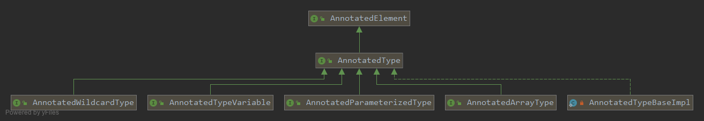

AnnotatedType 描述一次类型使用以及该位置上的注解。它与 AnnotatedElement 描述的声明注解不同：List<@Sensitive String> 中的 Sensitive 属于 String 这次使用，而不是字段声明或 String 类本身。

本文沿参数化类型、变量边界、通配符与数组四类嵌套结构展开。先了解 [Type 的结构](/reflection-types/) 和 [注解查询范围](/annotated-element/)。下面的完整程序仅依赖 JDK 标准库，已在 Windows、Oracle JDK 25.0.2（25.0.2+10-LTS-69）下编译运行。源码背景采用 [OpenJDK 8u202-b08 的 AnnotatedTypeFactory](https://github.com/openjdk/jdk8u/blob/jdk8u202-b08/jdk/src/share/classes/sun/reflect/annotation/AnnotatedTypeFactory.java)；当前公共 API 按 Java SE 25 理解，内部实现类名不属于稳定契约。

## 从声明对象取得带注解的类型视图

| 声明入口 | 普通类型视图 | 带注解的类型视图 |
| --- | --- | --- |
| 字段 | getGenericType | getAnnotatedType |
| 方法返回值 | getGenericReturnType | getAnnotatedReturnType |
| 方法参数 | getGenericParameterTypes | getAnnotatedParameterTypes |
| 父类声明 | getGenericSuperclass | getAnnotatedSuperclass |

运行时读取仍要求 RUNTIME 保留策略，类型使用位置通常要求 TYPE_USE 目标。声明对象与类型视图各自暴露 AnnotatedElement 方法，不能只因为方法名相同就把两处注解混在一起。getType 返回相应的普通 Type，丢失的只是当前视图携带的类型使用注解，不是把整个泛型结构抹掉。

[](./images/annotated-type.png)

将下面五个完整类保存为同名 .java 文件，在只含这些源文件的目录执行 `javac -encoding UTF-8 -d out *.java`。每一节给出运行命令与观察结果；字段枚举顺序不属于反射 API 的稳定保证，读取框架应按字段身份组织结果。

## 参数化类型：实参上的注解

getAnnotatedActualTypeArguments 返回带注解的各个实参，实参仍可能是另一个参数化类型，所以例子继续递归读取。字段 List 本身与 String 实参是不同的注解位置。

```java
package io.allurx;

import java.lang.annotation.*;
import java.lang.reflect.AnnotatedParameterizedType;
import java.util.Arrays;
import java.util.List;

/**
 * @author allurx
 */
public class AnnotatedParameterizedTypeTest {

    public List<@MyAnnotation(1) String> list1;

    public List<@MyAnnotation(2) List<@MyAnnotation(3) String>> list2;

    public static void main(String[] args) {
        Arrays.stream(AnnotatedParameterizedTypeTest.class.getDeclaredFields()).forEach(field -> print((AnnotatedParameterizedType) field.getAnnotatedType()));
    }

    private static void print(AnnotatedParameterizedType annotatedParameterizedType) {
        Arrays.stream(annotatedParameterizedType.getAnnotatedActualTypeArguments())
                .forEach(annotatedType -> {
                            System.out.println(Arrays.toString(annotatedType.getDeclaredAnnotations()));
                            if (annotatedType instanceof AnnotatedParameterizedType) {
                                print((AnnotatedParameterizedType) annotatedType);
                            }
                        }
                );
    }

    @Target({ElementType.FIELD, ElementType.TYPE_USE, ElementType.TYPE, ElementType.PARAMETER})
    @Retention(RetentionPolicy.RUNTIME)
    @Documented
    public @interface MyAnnotation {

        int value();
    }
}
```

执行 `java -cp out io.allurx.AnnotatedParameterizedTypeTest`：

```text
[@io.allurx.AnnotatedParameterizedTypeTest.MyAnnotation(1)]
[@io.allurx.AnnotatedParameterizedTypeTest.MyAnnotation(2)]
[@io.allurx.AnnotatedParameterizedTypeTest.MyAnnotation(3)]
```

## 类型变量：沿上界读取注解

T 的使用与 T 的声明边界是不同结构。getAnnotatedBounds 返回 Number、Cloneable、Serializable 上的类型使用注解；未显式写上界时，仍有无注解的 Object 上界。

```java
package io.allurx;

import io.allurx.AnnotatedTypeVariableTest.MyAnnotation;

import java.io.Serializable;
import java.lang.annotation.*;
import java.lang.reflect.AnnotatedTypeVariable;
import java.util.Arrays;

/**
 * @author allurx
 */
public class AnnotatedTypeVariableTest<T extends @MyAnnotation(1) Number & @MyAnnotation(2) Cloneable & @MyAnnotation(3) Serializable> {

    public T t;

    public static void main(String[] args) throws Exception {
        AnnotatedTypeVariable annotatedTypeVariable = (AnnotatedTypeVariable) AnnotatedTypeVariableTest.class.getDeclaredField("t").getAnnotatedType();
        Arrays.stream(annotatedTypeVariable.getAnnotatedBounds()).forEach(annotatedType -> System.out.println(Arrays.toString(annotatedType.getDeclaredAnnotations())));
    }

    @Target({ElementType.FIELD, ElementType.TYPE_USE, ElementType.TYPE, ElementType.PARAMETER})
    @Retention(RetentionPolicy.RUNTIME)
    @Documented
    public @interface MyAnnotation {

        int value();
    }
}
```

执行 `java -cp out io.allurx.AnnotatedTypeVariableTest`：

```text
[@io.allurx.AnnotatedTypeVariableTest.MyAnnotation(1)]
[@io.allurx.AnnotatedTypeVariableTest.MyAnnotation(2)]
[@io.allurx.AnnotatedTypeVariableTest.MyAnnotation(3)]
```

## 通配符：上下界都可能带注解

? extends Number 的注解在上界；? super Number 的注解在下界，同时还有无注解的 Object 上界。因此第二个字段先打印空数组，再打印下界注解，不能漏掉这一步。

```java
package io.allurx;

import java.lang.annotation.*;
import java.lang.reflect.AnnotatedParameterizedType;
import java.lang.reflect.AnnotatedWildcardType;
import java.util.Arrays;
import java.util.List;

/**
 * @author allurx
 */
public class AnnotatedWildcardTypeTest {

    public List<? extends @MyAnnotation(1) Number> list1;

    public List<? super @MyAnnotation(2) Number> list2;

    public static void main(String[] args) {
        Arrays.stream(AnnotatedWildcardTypeTest.class.getDeclaredFields())
                .forEach(field -> {
                    AnnotatedParameterizedType annotatedParameterizedType = (AnnotatedParameterizedType) field.getAnnotatedType();
                    print((AnnotatedWildcardType) annotatedParameterizedType.getAnnotatedActualTypeArguments()[0]);
                });
    }

    private static void print(AnnotatedWildcardType annotatedWildcardType) {
        Arrays.stream(annotatedWildcardType.getAnnotatedUpperBounds()).forEach(annotatedType -> System.out.println(Arrays.toString(annotatedType.getDeclaredAnnotations())));
        Arrays.stream(annotatedWildcardType.getAnnotatedLowerBounds()).forEach(annotatedType -> System.out.println(Arrays.toString(annotatedType.getDeclaredAnnotations())));
    }

    @Target({ElementType.FIELD, ElementType.TYPE_USE, ElementType.TYPE, ElementType.PARAMETER})
    @Retention(RetentionPolicy.RUNTIME)
    @Documented
    public @interface MyAnnotation {

        int value();
    }
}
```

执行 `java -cp out io.allurx.AnnotatedWildcardTypeTest`：

```text
[@io.allurx.AnnotatedWildcardTypeTest.MyAnnotation(1)]
[]
[@io.allurx.AnnotatedWildcardTypeTest.MyAnnotation(2)]
```

## 数组：每一层方括号有自己的位置

数组类型本身、组件类型以及嵌套数组组件都可以带注解。多维数组要逐层调用 getAnnotatedGenericComponentType；组件是参数化类型或类型变量时，再按相应接口展开。

```java
package io.allurx;

import io.allurx.AnnotatedArrayTypeTest.MyAnnotation;

import java.lang.annotation.*;
import java.lang.reflect.AnnotatedArrayType;
import java.lang.reflect.AnnotatedParameterizedType;
import java.lang.reflect.AnnotatedType;
import java.lang.reflect.AnnotatedTypeVariable;
import java.util.Arrays;
import java.util.List;

/**
 * @author allurx
 */
public class AnnotatedArrayTypeTest<T extends @MyAnnotation(8) Number> {

    public @MyAnnotation(1) String @MyAnnotation(2) [] array1;

    public @MyAnnotation(3) List<@MyAnnotation(4) String> @MyAnnotation(5) [] array2;

    public @MyAnnotation(6) T @MyAnnotation(7) [] array3;

    // 注意二维数组第一个[]代表的是二维数组本身，第二个[]代表的是二维数组的组件本身，所以@MyAnnotation(10)
    // 是二维数组本身上的注解，@MyAnnotation(11)是二维数组的组件本身上的注解，@MyAnnotation(9)是二维数组
    // 组件类型上的注解
    public @MyAnnotation(9) String @MyAnnotation(10) [] @MyAnnotation(11) [] array4;

    public static void main(String[] args) {
        Arrays.stream(AnnotatedArrayTypeTest.class.getDeclaredFields()).forEach(field -> {
            print((AnnotatedArrayType) field.getAnnotatedType());
        });
    }

    private static void print(AnnotatedArrayType annotatedArrayType) {
        AnnotatedType annotatedGenericComponentType = annotatedArrayType.getAnnotatedGenericComponentType();
        // 获取域上的注解，即[]上的注解
        System.out.println(Arrays.toString(annotatedArrayType.getDeclaredAnnotations()));
        // 获取组件上的注解，即数组元素类型上的注解
        System.out.println(Arrays.toString(annotatedGenericComponentType.getDeclaredAnnotations()));
        // 获取组件类型为AnnotatedParameterizedType的泛型参数上的注解
        if (annotatedGenericComponentType instanceof AnnotatedParameterizedType) {
            AnnotatedParameterizedType annotatedParameterizedType = (AnnotatedParameterizedType) annotatedGenericComponentType;
            System.out.println(Arrays.toString(annotatedParameterizedType.getAnnotatedActualTypeArguments()[0].getDeclaredAnnotations()));
            // 获取组件类型为AnnotatedTypeVariable的所有边界上的注解
        } else if (annotatedGenericComponentType instanceof AnnotatedTypeVariable) {
            AnnotatedTypeVariable annotatedTypeVariable = (AnnotatedTypeVariable) annotatedGenericComponentType;
            Arrays.stream(annotatedTypeVariable.getAnnotatedBounds()).forEach(annotatedType -> System.out.println(Arrays.toString(annotatedType.getDeclaredAnnotations())));
            // 递归获取组件类型为AnnotatedArrayType上的注解
        } else if (annotatedGenericComponentType instanceof AnnotatedArrayType) {
            print((AnnotatedArrayType) annotatedGenericComponentType);
        }
    }

    @Target({ElementType.FIELD, ElementType.TYPE_USE, ElementType.TYPE, ElementType.PARAMETER})
    @Retention(RetentionPolicy.RUNTIME)
    @Documented
    public @interface MyAnnotation {

        int value();
    }
}
```

执行 `java -cp out io.allurx.AnnotatedArrayTypeTest`：

```text
[@io.allurx.AnnotatedArrayTypeTest.MyAnnotation(2)]
[@io.allurx.AnnotatedArrayTypeTest.MyAnnotation(1)]
[@io.allurx.AnnotatedArrayTypeTest.MyAnnotation(5)]
[@io.allurx.AnnotatedArrayTypeTest.MyAnnotation(3)]
[@io.allurx.AnnotatedArrayTypeTest.MyAnnotation(4)]
[@io.allurx.AnnotatedArrayTypeTest.MyAnnotation(7)]
[@io.allurx.AnnotatedArrayTypeTest.MyAnnotation(6)]
[@io.allurx.AnnotatedArrayTypeTest.MyAnnotation(8)]
[@io.allurx.AnnotatedArrayTypeTest.MyAnnotation(10)]
[@io.allurx.AnnotatedArrayTypeTest.MyAnnotation(11)]
[@io.allurx.AnnotatedArrayTypeTest.MyAnnotation(11)]
[@io.allurx.AnnotatedArrayTypeTest.MyAnnotation(9)]
```

## 基础类型：公开接口之外的实现类

这里打印具体实现类只为观察当前 JDK。AnnotatedTypeBaseImpl 是内部实现，不是第五个公开子接口；业务无需导入它，直接使用 AnnotatedType 的公共方法。

```java
package io.allurx;

import java.util.Arrays;
import java.util.List;

/**
 * @author allurx
 */
public class AnnotatedTypeBaseImplTest<T> {

    private String a;

    private List<String> b;

    private T c;

    private String[] d;

    private T[] e;

    public static void main(String[] args) {
        Arrays.stream(AnnotatedTypeBaseImplTest.class.getDeclaredFields())
                .forEach(field -> System.out.println(field.getAnnotatedType().getClass()));
    }
}
```

执行 `java -cp out io.allurx.AnnotatedTypeBaseImplTest`：

```text
class sun.reflect.annotation.AnnotatedTypeFactory$AnnotatedTypeBaseImpl
class sun.reflect.annotation.AnnotatedTypeFactory$AnnotatedParameterizedTypeImpl
class sun.reflect.annotation.AnnotatedTypeFactory$AnnotatedTypeVariableImpl
class sun.reflect.annotation.AnnotatedTypeFactory$AnnotatedArrayTypeImpl
class sun.reflect.annotation.AnnotatedTypeFactory$AnnotatedArrayTypeImpl
```

## 从结构读取注解，到业务使用规则

AnnotatedType 提供的是声明材料，不规定业务该如何使用这些注解。数据脱敏、校验或序列化框架仍要明确：容器本身与元素上的注解如何组合、变量怎样替换为实际类型、循环边界如何终止，以及缺少运行时保留注解时如何处理。

作者的 [Blur 数据脱敏库](https://github.com/allurx/blur/blob/main/README.zh-CN.md) 展示了这一思路。原 desensitization 仓库地址现在指向 Blur；库的依赖、运行要求和 API 以其当前使用文档为准，不是复现本文标准库示例的前置条件。

## 资料来源

- [AnnotatedType：类型使用与拥有者](https://docs.oracle.com/en/java/javase/25/docs/api/java.base/java/lang/reflect/AnnotatedType.html)
- [AnnotatedParameterizedType](https://docs.oracle.com/en/java/javase/25/docs/api/java.base/java/lang/reflect/AnnotatedParameterizedType.html)
- [AnnotatedTypeVariable](https://docs.oracle.com/en/java/javase/25/docs/api/java.base/java/lang/reflect/AnnotatedTypeVariable.html)
- [AnnotatedWildcardType](https://docs.oracle.com/en/java/javase/25/docs/api/java.base/java/lang/reflect/AnnotatedWildcardType.html)
- [AnnotatedArrayType](https://docs.oracle.com/en/java/javase/25/docs/api/java.base/java/lang/reflect/AnnotatedArrayType.html)
