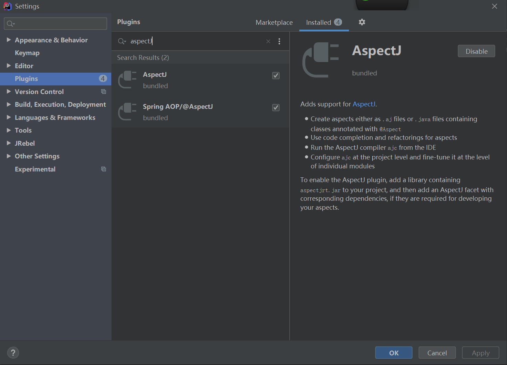

AOP 把日志、权限、事务等横切行为独立表达，再按连接点规则把它们应用到程序。AspectJ 可以通过编译时或类加载时织入改变字节码；Spring AOP 常用代理拦截方法调用。理解二者边界，比把 AOP 统称为“动态代理”更重要。

本文以一个可编译的 AspectJ 示例连接连接点、切点、通知和成员引入，再说明常见选择边界。示例已在 Windows、Oracle JDK 25.0.2（25.0.2+10-LTS-69）与 AspectJ 1.9.25.1 下完成编译时织入及运行。

## 先区分选中哪里与执行什么

| 概念 | 职责 |
| --- | --- |
| Join point（连接点） | 程序执行中可被识别的位置，例如调用、执行、字段访问 |
| Pointcut（切点） | 选择一组连接点的表达式或命名规则 |
| Advice（通知） | 在选中连接点的前、后或周围执行的代码 |
| Aspect（切面） | 组织切点、通知及其他切面声明的单元 |

call(void Person.eat()) 关注调用位置，execution(void Person.eat()) 关注方法体执行。静态字段、构造器、异常处理器等还具有各自的连接点规则；能否织入也取决于相关字节码是否经过 AspectJ 处理，不能仅写一个表达式就假定全系统都会拦截。

## 准备确定的编译与运行环境

选用 [AspectJ 1.9.25.1 稳定发布](https://github.com/eclipse-aspectj/aspectj/releases/tag/V1_9_25_1) 和 Java 25 LTS。1.9.25 系列支持 Java 25，编译器最低需要 JDK 17；AspectJ 的版本策略独立于 JDK，不能把它的版本号也称为 JDK LTS。

从 Maven Central 获取 [aspectjtools-1.9.25.1.jar](https://repo.maven.apache.org/maven2/org/aspectj/aspectjtools/1.9.25.1/aspectjtools-1.9.25.1.jar) 与 [aspectjrt-1.9.25.1.jar](https://repo.maven.apache.org/maven2/org/aspectj/aspectjrt/1.9.25.1/aspectjrt-1.9.25.1.jar)，与两个源文件放在同一工作目录。前者提供 ajc 编译器/织入器，后者提供运行库。

## 一个例子同时观察通知与成员引入

HelloWorld 调用普通方法，也访问切面引入的新方法和字段。最后故意向 saySomething 传入 null，用于观察通知阻止原方法执行。

保存为 HelloWorld.java：

```java
package io.allurx;

/**
 * @author allurx
 */
public class HelloWorld {

    private static String privateField = "I'm a private field on HelloWorld";

    public static void main(String[] args) throws Exception {
        HelloWorld helloWorld = new HelloWorld();
        helloWorld.say();
        helloWorld.newMethod();
        System.out.println(helloWorld.newField);
        helloWorld.catchException();
        helloWorld.saySomething(null);
    }

    public void say() {
        System.out.println("Hello World");
    }

    public void saySomething(String s) {
        System.out.println(s);
    }

    public void catchException() {
        try {
            throw new NullPointerException("发生了NPE！！！");
        } catch (NullPointerException e) {
        }
    }
}
```

保存为 HelloWorldAspect.aj：

```java
package io.allurx;

/**
 * 通过privileged修饰的aspect可以访问类的所有成员，即便是private的成员
 *
 * @author allurx
 */
public privileged aspect HelloWorldAspect {

    /**
     * 只能是无参构造函数
     */
    private HelloWorldAspect() {
    }

    /**
     * HelloWorld类中say方法的切入点
     */
    pointcut say(HelloWorld helloWorld):target(helloWorld) && call(void say());

    /**
     * 在say切点匹配的方法执行前（即HelloWorld中的say方法）打印信息
     */
    before(HelloWorld helloWorld):say(helloWorld) {
        System.out.println("before");
    }

    /**
     * 在say切点匹配的方法执行后（即HelloWorld中的say方法）打印信息
     */
    after(HelloWorld helloWorld):say(helloWorld){
        System.out.println("after");
    }

    /**
     * 在saySomething方法执行前判断输入参数是否为null
     */
    before(HelloWorld helloWorld)throws NullPointerException:target(helloWorld) && call(void saySomething(String)){
        if (thisJoinPoint.getArgs()[0] == null) {
            throw new NullPointerException();
        }
    }

    /**
     * 在HelloWorld构造器执行前访问HelloWorld的私有域
     */
    before():execution(HelloWorld.new()){
        System.out.println(HelloWorld.privateField);
    }

    /**
     * 拦截HelloWorld的catchException方法中的catch
     */
    before(NullPointerException e):handler(NullPointerException) && args(e){
        System.out.println(e.getMessage());
    }

    /**
     * 给HelloWorld类添加一个新的成员变量
     */
    public String HelloWorld.newField = "I'm a new field on HelloWorld";

    /**
     * 给HelloWorld类添加一个新的方法
     */
    public void HelloWorld.newMethod() {
        System.out.println("I'm a new method on HelloWorld");
    }

}
```

aspect 是 AspectJ 语法，不能交给普通 javac 单独编译；HelloWorld 还依赖切面引入的成员，所以两个源文件要一起交给 ajc。privileged 允许切面访问目标的私有成员，是这个演示访问 privateField 的前提，不是所有切面必须开启的选项。

## 按顺序编译、运行并解释结果

以下命令用于 Windows PowerShell；Linux、macOS 的运行时类路径分隔符改为冒号：

```powershell
java -cp aspectjtools-1.9.25.1.jar org.aspectj.tools.ajc.Main -25 -encoding UTF-8 -classpath aspectjrt-1.9.25.1.jar -d out HelloWorld.java HelloWorldAspect.aj
java -cp "out;aspectjrt-1.9.25.1.jar" io.allurx.HelloWorld
```

本例是编译时织入，不需要 javaagent。实际输出依次包含 privateField、before、Hello World、after、新方法文本、新字段文本和捕获的异常信息；最后 NullPointerException 来自切面主动拒绝空参数，运行退出码为 1 是预期结果。

```text
I'm a private field on HelloWorld
before
Hello World
after
I'm a new method on HelloWorld
I'm a new field on HelloWorld
发生了NPE！！！
Exception in thread "main" java.lang.NullPointerException
```

生成的织入方法名和堆栈行号取决于编译结果，不作为稳定 API。如果只有编译通过，却没有观察到 before/after，仍不能宣称织入结果正确；应检查源文件是否一起参与编译，以及运行时是否使用刚生成的 class。

## 切点表达式选择的是什么

| 表达式 | 关注的范围 |
| --- | --- |
| call / execution | 方法或构造器的调用位置/执行位置 |
| get / set | 非常量字段的读取/写入 |
| within / withincode | 声明类型或词法代码范围 |
| this / target / args | 当前执行对象、目标对象和参数类型或绑定 |
| cflow / cflowbelow | 指定连接点的动态控制流，后者排除起点本身 |
| handler | 异常处理器执行 |
| &&、||、! | 合取、析取和排除 |

this 与 target 在静态上下文不一定存在；call 与 execution 也不总有相同的当前对象。重用表达式时必须检查连接点种类，不能把“同一个方法名”当作上下文完全相同。

类型模式中的 * 匹配名称片段，.. 可表示包层级或参数数量，+ 表示子类型关系。完整语法和各连接点允许的状态见官方编程指南，文章不再复制一份容易与版本分叉的语法手册。

## 三种 after 与 around 的完成语义

| 通知 | 何时执行 |
| --- | --- |
| before | 进入选中连接点之前 |
| after returning | 仅正常返回之后 |
| after throwing | 抛出匹配异常之后 |
| 普通 after | 正常或异常完成之后，类似 finally |
| around | 包围或替代连接点，通过 proceed 决定是否继续 |

在 after returning 中改写绑定到局部变量的返回值，不等于修改调用者收到的结果；需要替换结果通常应由 around 返回新值。通知抛出异常也可能改变原调用结果，因此通用日志或统计逻辑不能随意引入新的失败行为。

## 织入与代理的选择边界

AspectJ 可作用于比普通方法代理更广的连接点，但需要构建或类加载链参与。Spring AOP 的代理机制不因此自动获得字段访问、构造器等全部能力；目标内部自调用与外部经过代理的调用也不同。

只有接口方法边界需要共享行为时，可以先考虑较简单的代理方案；需要字节码级连接点时，再评估织入对构建、调试和部署的影响。下面保留旧 IntelliJ IDEA 插件截图作为历史界面材料，当前集成按官方 IDE 文档配置，不作为本例复现前提。

[](./images/intellij-aspectj-plugin.png)

## 资料来源

- [AspectJ 编程指南](https://eclipse.dev/aspectj/doc/latest/progguide/index.html)
- [Advice 的完成、返回和异常语义](https://eclipse.dev/aspectj/doc/released/progguide/semantics-advice.html)
- [ajc 编译器选项](https://eclipse.dev/aspectj/doc/latest/devguide/ajc.html)
- [AspectJ 与 Java 版本兼容表](https://github.com/eclipse-aspectj/aspectj/blob/master/docs/release/JavaVersionCompatibility.adoc)
- [Spring AOP 的代理边界](https://docs.spring.io/spring-framework/reference/core/aop/proxying.html)
- [IntelliJ IDEA 的 AspectJ 集成](https://www.jetbrains.com/help/idea/aspectj.html)
