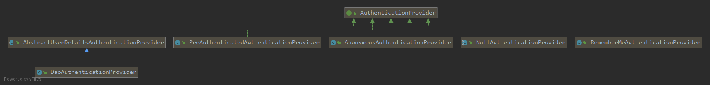

用户名密码认证不是过滤器直接比较两个字符串。过滤器收集凭据，AuthenticationManager 选择能够处理该令牌的提供者，提供者再取得用户、检查账户状态并验证密码。把这些职责分开，才能定位“没有提供者”“用户不存在”和“密码格式不匹配”等不同失败。

本文研究 **Spring Boot 2.1.5.RELEASE / Spring Security 5.1.5.RELEASE** 的历史 Servlet 用户名密码路径。前置知识是 Authentication 与 GrantedAuthority；可运行环境和默认登录示例见 [基本概念](/spring-security-basics/)。完整实现分别见 [ProviderManager](https://github.com/spring-projects/spring-security/blob/5.1.5.RELEASE/core/src/main/java/org/springframework/security/authentication/ProviderManager.java)、[AbstractUserDetailsAuthenticationProvider](https://github.com/spring-projects/spring-security/blob/5.1.5.RELEASE/core/src/main/java/org/springframework/security/authentication/dao/AbstractUserDetailsAuthenticationProvider.java) 和 [DaoAuthenticationProvider](https://github.com/spring-projects/spring-security/blob/5.1.5.RELEASE/core/src/main/java/org/springframework/security/authentication/dao/DaoAuthenticationProvider.java)。

文中框架源码摘录来自所链接的固定版本，版权归 Spring 项目原作者，按 [Apache License 2.0](https://www.apache.org/licenses/LICENSE-2.0) 提供。省略部分通过原始实现查阅，摘录不作为独立 Java 程序编译。

## 从登录令牌进入 ProviderManager

[UsernamePasswordAuthenticationFilter](/username-password-filter/) 取得表单字段后构造未认证的 UsernamePasswordAuthenticationToken，再调用 AuthenticationManager.authenticate。ProviderManager 是常见的管理器实现，它保存一个有顺序的 AuthenticationProvider 列表，并可持有父 AuthenticationManager。

| 组件 | 决定什么 | 不负责什么 |
| --- | --- | --- |
| 登录过滤器 | 本次 HTTP 请求是否需要认证、怎样取得凭据 | 查询用户和比较密码 |
| ProviderManager | 哪个提供者支持令牌、何时继续尝试或返回 | 每种凭据的具体校验 |
| DaoAuthenticationProvider | 用户名密码路径的用户加载与密码匹配 | HTTP 登录成功后跳到哪一页 |
| UserDetailsService | 根据用户名返回用户资料 | 独立完成身份认证 |

[](./images/authentication-provider.png)

这里的“父管理器”是委托关系，不是 Java 继承关系。一次调用可能先尝试本地提供者，再交给父管理器。

## supports、null 和异常分别怎样影响遍历

ProviderManager 先调用 `supports(authentication.getClass())`，只把令牌交给支持其类型的提供者。核心调用顺序可从下面的摘录看出，省略了日志和事件发布：

```java
if (!provider.supports(toTest)) {
    continue;
}
result = provider.authenticate(authentication);
if (result != null) {
    copyDetails(authentication, result);
    break;
}
```

“支持类型”不等于“认证一定成功”，也不等于提供者必须独占该类型。提供者的结果决定接下来发生什么：

| 本地提供者的结果 | ProviderManager 的动作 |
| --- | --- |
| 返回非 null Authentication | 停止本地遍历，准备返回认证结果 |
| 返回 null | 当前提供者没有完成处理，继续其他支持者 |
| AccountStatusException | 立即终止，传播账户状态异常 |
| InternalAuthenticationServiceException | 立即终止，传播内部认证服务异常 |
| 其他 AuthenticationException | 记住最后一次异常，继续尝试 |

因此，“密码错误后会尝试下一个提供者”不能推广为“任何错误都会继续”。账户锁定、禁用、过期等最终向外传播的状态异常有更强的中止语义。

本地仍没有结果且配置了父管理器时，才调用父管理器。父层也没有支持者时的 ProviderNotFoundException 不一定覆盖本地已有的更具体异常；最终既没有结果也没有其他异常，才创建“没有可用 AuthenticationProvider”的异常。

## 返回结果之前还要擦除凭据与发布事件

默认 `eraseCredentialsAfterAuthentication=true`。当结果实现 CredentialsContainer 时，管理器调用 `eraseCredentials()` 清除密码等秘密；认证结果通常仍保留主体和权限。业务不应依赖认证成功后还能从 Authentication 取回明文密码。

父管理器已经发布成功或失败事件时，本地管理器尽量避免重复发布。事件只是认证结果的通知，不替代返回值或异常，也不代表 HTTP 响应已经提交。

## DAO 路径先取用户，再检查状态和密码

DaoAuthenticationProvider 继承 AbstractUserDetailsAuthenticationProvider。父类组织流程，子类提供读取用户和额外凭据检查两个关键步骤。

| 阶段 | 该版本的主要行为 |
| --- | --- |
| 检查令牌类型 | 要求 UsernamePasswordAuthenticationToken 或其子类 |
| 获取用户名 | 从 principal 得到用户名，再尝试 UserCache |
| 加载用户 | 缓存未命中时调用 retrieveUser，最终委托 UserDetailsService |
| 前置状态检查 | 检查是否锁定、启用、账户是否过期 |
| 密码检查 | 调用 PasswordEncoder.matches |
| 后置状态检查 | 检查凭据是否过期 |
| 缓存与结果 | 按需更新缓存，构造带权限的已认证令牌 |

默认 UserCache 是 NullUserCache，不会跨请求缓存用户。只有应用配置了真实缓存时，下面的“重新加载”分支才有作用：如果缓存中的用户没有通过前置检查或密码检查，父类会从用户服务重新取得资料，再检查一次。这用于避免旧缓存决定最终结果；没有用缓存时，不会无条件重复查询。

### UserDetailsService 的失败契约

用户不存在应抛出 UsernameNotFoundException，不能返回 null。返回 null 会被视为接口契约违反，并包装成 InternalAuthenticationServiceException。默认 `hideUserNotFoundExceptions=true`，用户不存在会对调用者呈现为 BadCredentialsException，避免直接暴露用户名是否存在。

DAO 提供者还会在用户不存在时执行一次密码匹配工作，减轻存在与不存在用户名之间的时间差。它是特定实现中的缓解措施，不能据此保证整个登录端点对所有输入都具有完全相同的耗时。

### 密码校验是匹配，不是解密

```java
protected void additionalAuthenticationChecks(UserDetails userDetails,
        UsernamePasswordAuthenticationToken authentication)
        throws AuthenticationException {
    if (authentication.getCredentials() == null) {
        logger.debug("Authentication failed: no credentials provided");

        throw new BadCredentialsException(messages.getMessage(
                "AbstractUserDetailsAuthenticationProvider.badCredentials",
                "Bad credentials"));
    }

    String presentedPassword = authentication.getCredentials().toString();

    if (!passwordEncoder.matches(presentedPassword, userDetails.getPassword())) {
        logger.debug("Authentication failed: password does not match stored value");

        throw new BadCredentialsException(messages.getMessage(
                "AbstractUserDetailsAuthenticationProvider.badCredentials",
                "Bad credentials"));
    }
}
```

凭据为空会失败；否则把提交的原文交给配置的 PasswordEncoder，与 UserDetails 保存的编码值匹配。数据库、LDAP 或其他用户资料来源不改变这个契约。

## 默认编码器与存储格式必须配套

构造器实际使用的是委托编码器：

```java
public DaoAuthenticationProvider() {
    setPasswordEncoder(PasswordEncoderFactories.createDelegatingPasswordEncoder());
}
```

在 5.1.5.RELEASE 中，`PasswordEncoderFactories.createDelegatingPasswordEncoder()` 返回 DelegatingPasswordEncoder，编码新密码时默认使用 bcrypt，并保留 `{bcrypt}` 标识；匹配时根据 `{id}` 选择具体编码器。

| 写入方式与认证配置 | 结果 |
| --- | --- |
| 委托编码器 encode，完整保存结果，再由同一配置 matches | 格式一致 |
| 直接 BCryptPasswordEncoder.encode，省略 `{bcrypt}`，再交给默认委托编码器 | 无法识别算法，会报告 id 为 null 的错误 |
| 显式把认证提供者配置为 BCryptPasswordEncoder，同时按它的格式保存 | 是另一套一致的配置方式 |

这里不需要也不存在把密码解密回原文的步骤。新增或迁移密码时，应明确实际使用的编码器及存储格式，而不是看到源码中出现 bcrypt 就假定默认类型是 BCryptPasswordEncoder。[该版本的密码编码与格式说明](https://docs.spring.io/spring-security/site/docs/5.1.5.RELEASE/reference/htmlsingle/#core-services-password-encoding)

## 成功后构造结果，必要时升级编码

父类创建新的 UsernamePasswordAuthenticationToken，带上用户主体、经过 GrantedAuthoritiesMapper 映射的权限及请求详情。`forcePrincipalAsString` 可以把主体改成用户名字符串，默认则保留 UserDetails。

DaoAuthenticationProvider 还支持 UserDetailsPasswordService：当配置了该服务且 `upgradeEncoding` 判断当前格式需要更新时，成功认证路径使用本次明文重新编码并更新存储，再返回认证结果。它不是每次登录都强制修改密码，也不应在密码尚未验证时执行。

## 按失败所在的层次排查

先确认登录过滤器是否生成了预期令牌，再看 supports 是否选择了正确提供者；随后检查用户加载契约、账户状态、编码格式及 matches 结果。认证成功但页面没有跳转，应转向成功处理器；已登录但访问被拒绝，应转向授权组件。把认证与 HTTP 响应、权限决策分开，才能避免在错误的层次补逻辑。
