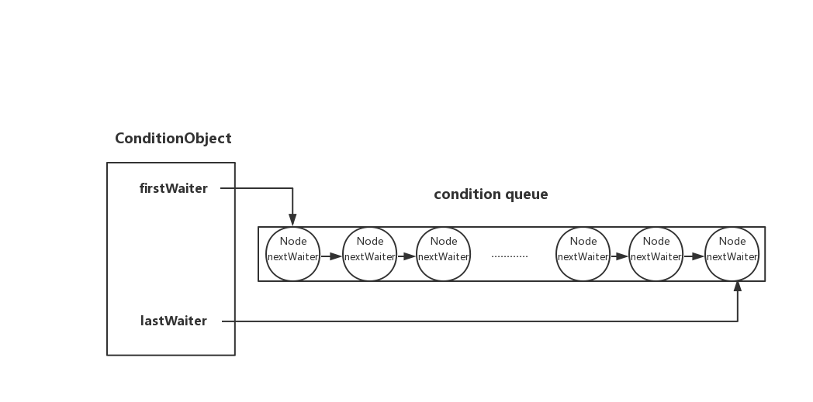

消费者已经拿到缓冲区的锁，却发现没有元素可取。它需要等生产者放入元素，但如果一直持锁等待，生产者也进不来，双方就无法继续。`Condition.await()` 为这种情况提供了配套动作：登记等待，释放锁，让其他线程有机会改变条件；恢复执行前再把锁取回来。

生产者调用 `signal()` 后，消费者也不一定立即得到元素。通知让它重新参与锁竞争，而元素是否还在，需要拿到锁以后再次检查。下面沿这个生产与消费过程，观察等待节点如何移动。

源码以 [OpenJDK 8u202-b08 的 AQS.ConditionObject](https://github.com/openjdk/jdk8u/blob/jdk8u202-b08/jdk/src/share/classes/java/util/concurrent/locks/AbstractQueuedSynchronizer.java)为准。示例使用 `ReentrantLock`，其 `await`、`signal`、`signalAll` 都要求当前线程持有锁；`Condition` 的其他实现可以定义不同语义。完整示例使用公开标准库 API，目标环境为 Windows、Oracle JDK 25.0.2（25.0.2+10-LTS-69）。

## 同一把锁，可以对应不同的等待条件

生产者需要“缓冲区未满”，消费者需要“缓冲区非空”。两者共用同一把锁保护数组、索引和计数，却在不同的 Condition 上等待。创建 Condition 本身不要求持锁；检查或改变共享状态、等待与通知都发生在加锁之后。

下载 [BoundedBuffer.java](./BoundedBuffer.java)，执行 `javac -encoding UTF-8 -d out BoundedBuffer.java` 与 `java -cp out io.allurx.BoundedBuffer`。入口让生产者放入 `42`，消费者取出，预期输出为 `42`；这个入口演示一次交接，下面的源码分析进一步解释等待路径。

完整的环形数组、索引更新和运行入口放在 [BoundedBuffer.java](./BoundedBuffer.java)。下面只摘取两条路径中与条件等待相关的部分：

```java
// put：拿到锁以后，等到至少有一个空位。
while (count == items.length) {
    notFull.await();
}
items[putIndex] = x;
if (++putIndex == items.length) {
    putIndex = 0;
}
++count;
notEmpty.signal();

// take：拿到同一把锁以后，等到至少有一个元素。
while (count == 0) {
    notEmpty.await();
}
Object x = items[takeIndex];
items[takeIndex] = null;
if (++takeIndex == items.length) {
    takeIndex = 0;
}
--count;
notFull.signal();
```

这两段分别位于完整程序的 `put` 和 `take` 方法内，都在 `lock.lock()` 与 `finally` 中的 `unlock()` 之间执行。它们不是接在一起运行的程序。

put 先检查 count，满时 await；take 在空时 await。await 原子地释放锁并开始等待，返回前重新获取锁，因此 while 再检查状态时仍受锁保护。取出的槽位置为 null，避免缓冲区继续持有已经消费的对象。

不能把 while 换成 if：虚假唤醒可能发生，已收到通知的线程也可能在重新获得锁前被其他消费者抢先取走元素。通知只意味着“值得重新检查”，不预留某一个元素或槽位。

## 一次等待，要经过两个队列

### 条件未满足与暂时拿不到锁是两种状态

条件队列使用 nextWaiter 连接，firstWaiter、lastWaiter 记录首尾。同步队列使用 AQS 的 prev、next 连接，负责锁的竞争。

[](./images/condition-wait-queue.png)

| 阶段 | 节点位置 | 线程持锁情况 |
| --- | --- | --- |
| 检查条件并调用 await | 加入条件队列 | 仍持锁 |
| fullyRelease 之后 | 条件队列 | 完整释放原持锁状态 |
| 被 signal、取消或超时转移 | 同步队列 | 等待重新获取锁 |
| await 正常返回或报告等待期间的中断 | 已重新获取锁 | 恢复等待前的持锁状态 |

signal 必须持锁，所以它与条件队列上的添加、移除受同一锁约束；同步队列仍有其他获取线程、中断和超时取消的线程并发入队，两者不能混同。

### await：先登记等待，再完整释放锁

await 先检查中断，然后 addConditionWaiter 创建 CONDITION 节点；fullyRelease 保存 state 并完整释放锁。可重入锁可能持有多次，因此不能只调用一次普通 unlock。

```java
public final void await() throws InterruptedException {
    if (Thread.interrupted())
        throw new InterruptedException();
    Node node = addConditionWaiter();
    int savedState = fullyRelease(node);
    int interruptMode = 0;
    while (!isOnSyncQueue(node)) {
        LockSupport.park(this);
        if ((interruptMode = checkInterruptWhileWaiting(node)) != 0)
            break;
    }
    if (acquireQueued(node, savedState) && interruptMode != THROW_IE)
        interruptMode = REINTERRUPT;
    if (node.nextWaiter != null) // clean up if cancelled
        unlinkCancelledWaiters();
    if (interruptMode != 0)
        reportInterruptAfterWait(interruptMode);
}
```

isOnSyncQueue 为 false 时，线程使用 park 等待。它会检查 CONDITION 状态和 prev、next；局部链接不足以判断时从 tail 回查。新节点已经写入 prev、但 CAS 发布 tail 尚未成功时，不能仅凭 prev 非空就说已经入队。

节点转入同步队列后，acquireQueued 使用 savedState 重新获取原来的完整持锁状态。await 不会因为“超时到了”或“收到通知”而绕过这一步。取消后残留在条件链上的节点通过 unlinkCancelledWaiters 清理，避免继续被当作候选等待者。

### signal：让等待者重新参与锁竞争

signal 从条件队列头部选择候选节点。已取消的节点可能转移失败，此时继续向后寻找；signalAll 则对所有候选节点执行转移。

```java
final boolean transferForSignal(Node node) {
    if (!compareAndSetWaitStatus(node, Node.CONDITION, 0))
        return false;

    Node p = enq(node);
    int ws = p.waitStatus;
    if (ws > 0 || !compareAndSetWaitStatus(p, ws, Node.SIGNAL))
        LockSupport.unpark(node.thread);
    return true;
}
```

成功把 CONDITION 改为零的一方取得转移责任。enq 把节点加入同步队列，再尝试让前驱承担 SIGNAL 通知责任；前驱已取消或状态设置失败时，直接 unpark 让目标线程重新协调。

回到缓冲区：生产者放入一个元素，调用 `notEmpty.signal()` 时仍然持锁。消费者即使收到通知，也要等生产者 `unlock`，再参与竞争。假如另一个消费者先得到锁并取走唯一的元素，被通知的消费者重新检查时又会发现 `count == 0`，于是再次 `await`。这就是业务条件必须放在 `while` 中的具体原因。

`ReentrantLock` 的条件队列按 FIFO 顺序选择等待者，重新获取锁的顺序则受公平或非公平策略影响。`Object.notify` 不承诺同样的等待者选择顺序。

## 等待怎样因中断或超时结束

### 中断与通知竞争转移责任

中断不会让节点停留在条件队列并直接抛出异常。线程要先确定转移责任，重新持锁后再报告等待期间的中断。

```java
final boolean transferAfterCancelledWait(Node node) {
    if (compareAndSetWaitStatus(node, Node.CONDITION, 0)) {
        enq(node);
        return true;
    }
    while (!isOnSyncQueue(node))
        Thread.yield();
    return false;
}
```

| 状态竞争结果 | await 的处理 |
| --- | --- |
| 中断取消先把 CONDITION 改为零 | 自己入同步队列，重新持锁后抛 InterruptedException |
| 通知先完成状态转换 | 等通知方完成入队，重新持锁后恢复中断标记 |
| 重新获取锁期间检测到中断 | 若此前未决定抛异常，则记录并在返回前恢复标记 |

判断依据是节点状态的 CAS 结果，不是“interrupt 方法和 signal 方法哪个先开始调用”。awaitUninterruptibly 仍记录中断，只是不因此取消等待；返回时恢复中断标记。

### 超时结束后，仍要重新获取锁

| 方法 | 计时方式与返回值 |
| --- | --- |
| awaitNanos(nanos) | 相对等待，返回剩余可等待纳秒数的估计值 |
| await(time, unit) | 相对等待，true 表示等待未超时，false 表示超时 |
| awaitUntil(date) | 墙上时间截止点，超时与通知可能竞争同一节点 |

定时等待到期后也要重新获取锁。如果其他线程长时间持锁，方法实际返回可能晚于指定时间；系统调度也可能推迟恢复。需要延续条件循环的等待预算时，利用 awaitNanos 的剩余时间，而不是每次唤醒都重新给一个完整预算。下面模板不包含首次获取锁的耗时；若要求整个操作的端到端期限，还须用单调时钟保存截止点，并让首次获取锁也受剩余预算限制。

```java
long remaining = unit.toNanos(timeout);
lock.lockInterruptibly();
try {
    while (!conditionSatisfied()) {
        if (remaining <= 0) {
            return false;
        }
        remaining = changed.awaitNanos(remaining);
    }
    return true;
} finally {
    lock.unlock();
}
```

这段是使用模板：conditionSatisfied、changed 和 lock 由业务定义，不能直接编译成独立程序。它表明超时预算和条件检查如何组合；一个未超时的返回值仍不能替代业务谓词。

## 资料来源

- [OpenJDK 8u202-b08：ConditionObject 与节点转移的完整实现](https://github.com/openjdk/jdk8u/blob/jdk8u202-b08/jdk/src/share/classes/java/util/concurrent/locks/AbstractQueuedSynchronizer.java)
- [Condition：等待与超时契约](https://docs.oracle.com/en/java/javase/25/docs/api/java.base/java/util/concurrent/locks/Condition.html)
- [ReentrantLock.newCondition：通知及重新获取锁的顺序](https://docs.oracle.com/en/java/javase/25/docs/api/java.base/java/util/concurrent/locks/ReentrantLock.html#newCondition())
