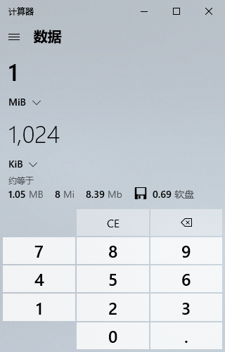

同一个数据量或速率出现不同数值，常常是单位不同：bit 与 byte 差 8 倍，十进制前缀与二进制前缀又采用不同倍数。先统一单位，才能比较硬盘容量、下载速率或内存占用。

本文使用 NIST 所列的 SI 与二进制前缀定义，不依赖某个编程语言运行时。界面只写 KB、MB 时，仍应查明软件采用的定义，不能只凭标签推断。

## bit 与 byte：先区分大小写

bit 是一个二进制位，有 0、1 两种状态；这里按现代通用定义，1 byte = 8 bit，因此一个字节有 2⁸ = 256 种位模式。字节符号写 B，网络速率中的 b 通常表示 bit。

| 数量 | 含义 |
| --- | --- |
| 1 B | 8 bit |
| 1 kB | 1000 B |
| 1 KiB | 1024 B |
| 1 MB | 1000² B |
| 1 MiB | 1024² B |
| 1 GB | 1000³ B |
| 1 GiB | 1024³ B |

SI 的 kilo 使用小写 k；Ki、Mi、Gi 明确表示二进制倍数。不要把 1 MB = 1024 KB 当作所有软件和标准通用的等式。

## 把网络速率换算为字节速率

1 Mbps 表示每秒 1,000,000 bit，先除以 8，再选择字节前缀：

```text
1 Mbps = 1,000,000 bit/s ÷ 8
       = 125,000 B/s
       = 125 kB/s
       ≈ 122.07 KiB/s
```

同理，100 Mbps 的理论字节速率是 12.5 MB/s，约 11.92 MiB/s。实际下载还包含协议、重传、服务端和存储等影响，不能保证达到这个仅按单位换算的上限。

反向比较时也应保持同一套单位。例如客户端显示 10 MiB/s，换算约为 83.89 Mbps，而不是恰好 80 Mbps；差异来自 Mi 与 M 的倍数不同。

## 容量显示的差异不等于数据消失

按十进制标注的 1 TB 为 10¹² B，换算为二进制约 931.32 GiB。这个数值变化本身只是重新选单位；文件系统元数据、保留空间等则是另一类实际占用，应分别分析。

下面保留 Windows 10 计算器的历史截图，显示 1 MiB = 1024 KiB，与前面的定义一致。它用于观察一次界面换算，定义仍以标准资料为准。

[](./images/windows-data-unit-conversion.png)

## 资料来源

- [NIST：二进制前缀与十进制前缀](https://physics.nist.gov/cuu/Units/binary.html)
- [NIST：SI 前缀](https://www.nist.gov/pml/owm/metric-si-prefixes)
