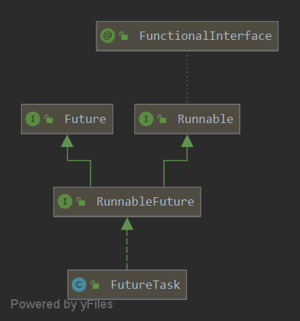

## 核心结论

`FutureTask` 同时是可执行的 `Runnable` 和可读取结果的 `Future`，包装任务后记录完成、异常或取消状态。`get()` 等待的是任务结果；取消会改变 Future 的状态，并可能请求中断执行线程，但不能保证任务的业务代码立即停止。

## 问题与适用范围

本文回答任务如何执行、如何发布结果，以及等待者如何被唤醒，保留原文基于 CAS 与 `LockSupport` 的旧实现分析，未标注精确 JDK 修订。正文列出的是原文版本的 `Future` 方法，不能当作当前 API 的完整清单。任务被取消与执行线程已经退出是不同事实。

<!-- more -->

## FutureTask

在分析FutureTask内部原理前我们先来看一下它的继承和实现的接口



从上图我们可以发现FutureTask实现了一个RunnableFuture接口，这个接口是干嘛的呢？我们点进去看一下这个接口的定义

### RunnableFuture

```java
package java.util.concurrent;


public interface RunnableFuture<V> extends Runnable, Future<V> {

    void run();
}
```

发现RunnableFuture继承了Runnable和Future接口，并且重写了Runnable的run方法，其实这个RunnableFuture笼统的讲是一个**将来能够运行任务**，但是由于java原生的Thread类只支持提交Runnable类型的执行任务，而Runnable本身是没有返回值的，提交给线程后就会立马被执行，你也不知道任务啥时候执行完毕，开发人员不能很好的控制提交的任务。因此RunnableFuture接口就出现了，它是用来替代Runnable接口的，同时继承Future接口的原因是因为Future内部提供了很多有用的方法以便我们能够灵活的控制提交给线程的任务，例如取消刚刚提交的任务、看看刚刚提交的任务有没有完成等等这些新特性。既然这个Future这么神奇，那我们就接着看一看它内部究竟定义了那些方法

### Future

```java
public interface Future<V> {

    boolean cancel(boolean mayInterruptIfRunning);


    boolean isCancelled();


    boolean isDone();


    V get() throws InterruptedException, ExecutionException;


    V get(long timeout, TimeUnit unit)
        throws InterruptedException, ExecutionException, TimeoutException;
}
```

Future一共定义了五个有用的方法来帮助我们控制提交给线程的任务。

1.  `boolean cancel(boolean mayInterruptIfRunning)`

   使用这个方法可以尝试取消刚刚提交的任务。 参数mayInterruptIfRunning为true代表会尝试中断当前执行该任务的线程来尝试终止该任务，false代表正在运行的任务将会被完成。

2. `boolean isCancelled()`

   如果此任务在正常完成之前被取消，则返回true。

3. `boolean isDone()`

   如果此任务完成，则返回true。 完成可能是由于正常终止，异常或取消引起的，在所有这些情况下，此方法都将返回true。

4. `V get() throws InterruptedException, ExecutionException`

   获取任务执行结果，阻塞直到该任务完成为止

5. `V get(long timeout, TimeUnit unit) throws InterruptedException, ExecutionException, TimeoutException`

   带超时时间的阻塞获取任务执行结果方法

Future提供了五个很有用的方法来帮助我们对异步任务的控制，接下来我们开始分析它的实现类之一FutureTask的内部实现原理。在分析其内部原理前，我们先看一个使用FutureTask的例子，这样有便于我们对其有一个直观的理解。

### 例子

```java
package io.allurx;

import java.time.LocalTime;
import java.util.concurrent.FutureTask;

/**
 * @author allurx
 */
public class Test {

    public static void main(String[] args) throws Exception {

        // 任务1，包装Callable对象
        FutureTask<Person> task1 = new FutureTask<>(() -> {
            System.out.println("开始执行task1：" + LocalTime.now());
            Thread.sleep(2000);
            Person person = new Person();
            person.add(1);
            return person;
        });

        // 任务2，包装Runnable对象
        Person person = new Person();
        FutureTask<Person> task2 = new FutureTask<>(() -> {
            System.out.println("开始执行task2：" + LocalTime.now());
            try {
                Thread.sleep(2000);
            } catch (InterruptedException e) {
                e.printStackTrace();
            }
            person.add(2);
        }, person);


        // 直接调用FutureTask的run方法，注意这种使用方式阻塞的是当前执行线程，
        // 也就是main线程，实际使用中应该使用线程池或者通过new Thread(java.lang.Runnable)
        // 这种方式来提交任务，不然的话异步任务就没有“异步的意义”了
        task1.run();

        int num1 = task1.get().num;
        System.out.println("task1执行完毕：" + LocalTime.now() + "：结果：" + num1);

        // 执行任务2，也可以将这个任务提交给线程池，本质上是一样的
        new Thread(task2).start();

        int num2 = task2.get().num;
        System.out.println("task2执行完毕：" + LocalTime.now() + "：结果：" + num2);
    }

    static class Person {

        int num;

        void add(int n) {
            num += n;
        }
    }

}
```

控制台输出

```java
开始执行task1：20:27:44.244
task1执行完毕：20:27:46.245：结果：1
开始执行task2：20:27:46.245
task2执行完毕：20:27:48.245：结果：2
```

在上面的例子中分别通过FutureTask对Callable与Runnable进行了包装，任务都是对Person对象的num值进行一个add操作，通过`Thread.sleep(2000)`模拟这个耗时操作。然后调用get方法获取相应任务的结果，可以发现get方法是会阻塞当前执行这个get方法的线程的。下面我们就基于这个get方法来分析其内部原理。

### 原理

#### 任务状态

FutureTask在执行任务的过程中定义了一系列的任务状态，一共分为以下几种状态

```java
// 当前任务的状态值，使用volatile修饰保证线程的可见性
private volatile int state;

// 状态定义

// 初始化状态，调用构造器时的状态为NEW
private static final int NEW          = 0;

// 正在执行中
private static final int COMPLETING   = 1;

// 已正常完成
private static final int NORMAL       = 2;

// 执行过程中发生异常
private static final int EXCEPTIONAL  = 3;

// 已被取消
private static final int CANCELLED    = 4;

// 正在被中断
private static final int INTERRUPTING = 5;

// 已被中断
private static final int INTERRUPTED  = 6;
```

以上几种状态是在整个任务执行过程中可能出现的几种状态，不同状态间的转换只会存在以下几种情况

```java
NEW -> COMPLETING -> NORMAL
NEW -> COMPLETING -> EXCEPTIONAL
NEW -> CANCELLED
NEW -> INTERRUPTING -> INTERRUPTED
```

#### 内部变量

```java
// 提交的任务
private Callable<V> callable;
// 任务执行返回的结果或者是任务执行过程中发生的异常
private Object outcome;
// 1、执行提交任务的线程，如果直接调用run方法就是当前调用run方法的线程
// 2、如果是将任务提交给线程池或者new Thread(java.lang.Runnable)
// 这种方式执行对应的就是线程池中的线程或者是构造的出来的线程对象
private volatile Thread runner;
// 调用get方法的线程被挂在这个节点上，并发的情况下这个WaitNode会形成一个单向链表
private volatile WaitNode waiters;
```

主要关注一下这个WaitNode，它是一个静态内部类，是一个单向链表的结构，在多线程调用get方法时，将这些线程通过cas组成链表的形式

```java
static final class WaitNode {
    volatile Thread thread;
    volatile WaitNode next;
    WaitNode() { thread = Thread.currentThread(); }
}
```

**WaitNode初始化时会将当前线程保存起来，而WaitNode只会在awaitDone方法中被构造，同时awaitDone方法也只会在两个get方法中被调用，也就是说这个currentThread就是调用get方法的线程，这里你可能看不太明白，下面分析get方法原理的时候就明白了。**

#### 任务状态初始化

FutureTask内部有两个构造器，分别是对Callable与Runnable进行包装。两个构造器最终都会将成员变量callable设置为传入的任务，并且初始化当前任务状态为NEW

```java
// 包装Callable的构造器
public FutureTask(Callable<V> callable) {
    if (callable == null)
        throw new NullPointerException();
    this.callable = callable;
    // 初始化状态
    this.state = NEW;
}

// 包装Runnable的构造器
public FutureTask(Runnable的构造器 runnable, V result) {
    this.callable = Executors.callable(runnable, result);
    // 初始化状态
    this.state = NEW;
}
```

如果传入的是Runnable对象，内部会通过Executors的一个静态方法来适配这个Runnable，最终返回的依旧是一个Callable

```java
public static <T> Callable<T> callable(Runnable task, T result) {
    if (task == null)
        throw new NullPointerException();
    return new RunnableAdapter<T>(task, result);
}
```

通常情况下FutureTask构造完毕，在我们将这个任务提交给相应的线程池或者线程时，我们就会去调用get方法来获取任务返回值，下面我们来分析get方法内部的原理，看看它是如何阻塞当前调用线程的。

#### get方法

Future中定义了两个get方法，一个是带超时参数，另一个是不带参数的，这两个方法的实现在FutureTask中大同小异，因此接下来就基于这个不带参数的get方法来分析

```java
public V get() throws InterruptedException, ExecutionException {
    int s = state;
    if (s <= COMPLETING)
        s = awaitDone(false, 0L);
    return report(s);
}
```

首先第一步获取当前任务执行状态，正常情况下是NEW，不正常情况是有多个线程执行了同一个FutureTask，实际操作中我们应该一个任务对于一个线程，不要多个线程执行同一个任务（为什么要多个线程执行同一个任务？）因此在执行get前对状态做了一个判断，如果没有其它线程已经完成这个任务，就调用awaitDone方法，看这个方法的名字大概也能猜出来它的作用是用来等待任务完成的，言外之意就是让当前执行get方法的线程阻塞一下，等任务完成了再通知你。

#### awaitDone方法

```java
private int awaitDone(boolean timed, long nanos)
    throws InterruptedException {
    // 超时等待时间
    final long deadline = timed ? System.nanoTime() + nanos : 0L;
    // 准备将当前调用get方法的线程挂在这个节点上
    WaitNode q = null;
    // 上面的节点q是不是已经被排队了
    boolean queued = false;
    // 一个死循环
    for (;;) {
        // 如果调用get方法的线程已经中断了，就将这个节点移除，然后抛出中断异常
        if (Thread.interrupted()) {
            removeWaiter(q);
            throw new InterruptedException();
        }

        // 当前任务状态
        int s = state;
        // 比COMPLETING值大的状态要么是NORMAL（正常完成状态）
        // 要么是取消，中断、异常这几种状态，所以这个时候任务至少是
        //以上几种状态之一，可以返回了，由report方法来根据状态返回值
        if (s > COMPLETING) {
            if (q != null)
                // 帮助gc回收
                q.thread = null;
            return s;
        }
        // 当前任务正在执行中，可能还有很短的时间就执行完成了。
        // 让当前线程yield让步一下，说不定下一次cpu调度当前线程
        // 就能直接返回值了
        else if (s == COMPLETING)
            Thread.yield();
        // 第一次循环q肯定为null，那么构造一个新的节点，接着就会
        // 进入下一次for循环
        else if (q == null)
            q = new WaitNode();
        // 下一次for循环如果发现这个WaitNode还没有被排队，那么
        // 就通过cas排队，同时形成链表
        else if (!queued)
            queued = UNSAFE.compareAndSwapObject(this, waitersOffset,
                                                 q.next = waiters, q);
        // 如果调用是带超时参数的get方法
        else if (timed) {
            nanos = deadline - System.nanoTime();
            // 超时了
            if (nanos <= 0L) {
                removeWaiter(q);
                return state;
            }
            // 没超时就通过LockSupport将当前线程阻塞指定纳秒时间，
            // 时间到了当前线程自动醒来，继续for循环就相当于超时了
            LockSupport.parkNanos(this, nanos);
        }
        // 调用不到参数的get方法走到这一步说明任务还没有执行完，
        // 就调用LockSupport将当前线程阻塞在this对象上
        else
            LockSupport.park(this);
    }
}
```

awaitDone方法带两个参数，分别对应超时的get方法和不带参数的get方法，如果任务没有完成最终都是通过LockSupport使当前线程阻塞的。接着回到get方法中

```java
public V get() throws InterruptedException, ExecutionException {
    int s = state;
    if (s <= COMPLETING)
        // 正常情况下当前线程就在这一步阻塞了
        s = awaitDone(false, 0L);
    return report(s);
}
```

现在我们已经知道调用get方法的线程会被阻塞在调用awaitDone方法那一行（其实是调用具体LockSupport.park方法的那一行），那么任务在完成后肯定是会唤醒当前线程的，线程是在是在什么时候被唤醒的呢？在以下三种情况下调用get方法的线程会被唤醒

* 任务正常完成时
* 任务执行过程中发生异常时
* 任务被取消时

还记得FutureTask实现的接口吗，FutureTask实现了RunnableFuture接口，而RunnableFuture接口继承了Runnable, Future接口，并且重写了Runnable的run方法，使得FutureTask成为了一个能够被线程执行的Runnable，所以FutureTask包装Runnable与Callable的目的就是要代理它们执行，而代理它们的话FutureTask必定就实现了RunnableFuture的run方法，这样线程在执行FutureTask的时候调用的就是其run方法，然后FutureTask内部的run方法又调用了被包装的Runnable与Callable，所以可以猜想在FutureTask的run方法中必定会在任务执行成功或者发生异常时唤醒调用get方法的线程。

#### run方法

```java
public void run() {
    // 任务执行前，如果是以下两种情况之一则不执行任务
    // 1、当前任务不是NEW状态
    // 2、当前的runner（真正执行任务的线程）已经被其它线程设置了。
    // （cas失败只会发生在多个线程执行同一个FutureTask的时候）
    // 发生以上两种情况说明当前FutureTask已经被其它线程执行了，就没必要执行了，直接返回即可
    if (state != NEW ||
        !UNSAFE.compareAndSwapObject(this, runnerOffset,
                                     null, Thread.currentThread()))
        return;
    // 走到这里说明当前线程可能是即将执行任务的线程
    try {
        Callable<V> c = callable;
        // 再次判断callable不为null以及状态为NEW
        // 1、callable只会在finishCompletion方法中被置为null
        // 而finishCompletion方法会在取消，发生异常、以及任务完成时被调用，
        // 运行到这一步只会在取消，发生异常这两种情况下c==null
        ///2、同样 运行到这一步在取消，发生异常这两种情况下state!=NEW，
        // 因此这两个值在执行到这个if语句时都再次做了判断，这也解释了
        // Future中cancel方法的mayInterruptIfRunning参数的含义，如果
        // 这个if为true，当前线程就会走到下面的result = c.call()这一步，
        // 然后调用cancel方法就会尝试中断当前线程
        if (c != null && state == NEW) {
            V result;
            // 是否成功运行的标记
            boolean ran;
            try {
                // 调用Callable的call方法，返回结果
                result = c.call();
                ran = true;
            } catch (Throwable ex) {
                result = null;
                ran = false;
                // 发生异常的回调
                setException(ex);
            }
            if (ran)
                // 成功运行的回调
                set(result);
        }
    } finally {
		// 无论是否执行成功还是发生异常还是任务被取消了，都将当前的runner置为null，
        // 防止并发的调用run方法
        runner = null;
        int s = state;
        // 如果任务状态是被中断的则通过handlePossibleCancellationInterrupt方法通过
        // Thread.yield()的方式使调用cancel方法的线程先去执行取消方法，直到其成功为止。
        if (s >= INTERRUPTING)
            handlePossibleCancellationInterrupt(s);
    }
}
```

run方法在运行过程中可能是正常完成，也可能发生了异常，甚至是运行到一半被取消了，以上这三种情况下都会将调用get方法的线程唤醒。

#### setException方法

setException方法只会在线程执行任务发生异常时被调用

```java
protected void setException(Throwable t) {
    if (UNSAFE.compareAndSwapInt(this, stateOffset, NEW, COMPLETING)) {
        outcome = t;
        UNSAFE.putOrderedInt(this, stateOffset, EXCEPTIONAL); // final state
        finishCompletion();
    }
}
```

首先通过cas判断是否能将当前任务状态设置为COMPLETING，（因为即便当前任务发生异常也有可能被其它线程中断）如果成功的话（cancel方法只会取消状态为NEW的任务，所以只要cas成功if里面的代码就是线程安全的），则将返回值设置为发生的具体异常，然后改变任务最终状态为EXCEPTIONAL，最后调用收尾方法finishCompletion。

#### set方法

set方法只会在任务成功执行后被调用

```java
protected void set(V v) {
    if (UNSAFE.compareAndSwapInt(this, stateOffset, NEW, COMPLETING)) {
        outcome = v;
        UNSAFE.putOrderedInt(this, stateOffset, NORMAL); // final state
        finishCompletion();
    }
}
```

set方法的逻辑和setException方法大同小异，都是先cas判断再调用收尾方法finishCompletion。

#### finishCompletion方法

finishCompletion方法会在cancel方法返回true时、任务成功执行时即set方法能够成功执行时、执行任务发生异常时即setException方法能够成功执行时被执行。

```java
private void finishCompletion() {
    // 遍历waiters，即遍历waiters链表
    for (WaitNode q; (q = waiters) != null;) {
        // cas将waiters设置为null，因为finishCompletion方法会在上述的三种情况下被调用，使用存在并发
        if (UNSAFE.compareAndSwapObject(this, waitersOffset, q, null)) {
            for (;;) {
                Thread t = q.thread;
                // 通过LockSupport方法唤醒WaitNode上等待的线程，即调用get方法的线程
                if (t != null) {
                    q.thread = null;
                    LockSupport.unpark(t);
                }
                // 看看链表是否还有下一个WaitNode，如果没有就可以跳出循环了
                WaitNode next = q.next;
                if (next == null)
                    break;
                // 帮助gc回收
                q.next = null;
                // 继续下次for循环，即唤醒下一个WaitNode上的线程
                q = next;
            }
            // 走到这一步说明整个链表中的线程都被唤醒了，所以可以结束最外面的for循环了
            break;
        }
    }
	// 钩子方法，默认为空，子类可以重新这个方法以便回调
    done();
	// 清除callable
    callable = null;
}
```

finishCompletion的作用是确保阻塞在get方法中的线程无论如何都会被唤醒。

现在我们继续回到get方法中来，我们已经理清了调用get方法的线程是如何被阻塞的和唤醒的，接下来在被唤醒之后就是获取任务的执行结果了

```java
public V get() throws InterruptedException, ExecutionException {
    int s = state;
    if (s <= COMPLETING)
        s = awaitDone(false, 0L);
    // 现在我们走到了这一步，可能是任务正常完成，也可能是执行过程中发生异常了，甚至是任务被取消了
    return report(s);
}
```

也就是说在线程被唤醒之后会返回当前任务的明确状态，然后report方法根据状态来返回相应类型的返回值

#### report方法

```java
private V report(int s) throws ExecutionException {
    Object x = outcome;
    if (s == NORMAL)
        return (V)x;
    if (s >= CANCELLED)
        throw new CancellationException();
    throw new ExecutionException((Throwable)x);
}
```

outcome的值可能是任务执行返回的值，也可能是执行过程中抛出的异常，分别是在set方法与setException方法中被设置的，但如果s的状态是CANCELLED、INTERRUPTING、INTERRUPTED中的一种的话，那么最终会抛出CancellationException，否则的话，即s为EXCEPTIONAL的话则表明任务执行过程中发生了异常，最终抛出ExecutionException。

#### cancel方法

```java
public boolean cancel(boolean mayInterruptIfRunning) {
    // 只会取消状态为NEW的任务
    if (!(state == NEW &&
          UNSAFE.compareAndSwapInt(this, stateOffset, NEW,
                                   mayInterruptIfRunning ? INTERRUPTING : CANCELLED)))
        return false;
    try {
        // 如果参数为true则会尝试中断正在执行任务的线程
        if (mayInterruptIfRunning) {
            try {
                Thread t = runner;
                if (t != null)
                    t.interrupt();
            } finally {
                // 将任务状态设置为已中断
                UNSAFE.putOrderedInt(this, stateOffset, INTERRUPTED);
            }
        }
    } finally {
        finishCompletion();
    }
    return true;
}
```

cancel方法只会取消状态为NEW的任务，如果mayInterruptIfRunning参数为true则会尝试中断当前正在执行任务的线程。最终无论如何都会调用finishCompletion方法唤醒调用get方法的线程。

#### runAndReset方法

```java
protected boolean runAndReset() {
    if (state != NEW ||
        !UNSAFE.compareAndSwapObject(this, runnerOffset,
                                     null, Thread.currentThread()))
        return false;
    boolean ran = false;
    int s = state;
    try {
        Callable<V> c = callable;
        if (c != null && s == NEW) {
            try {
                c.call(); // don't set result
                ran = true;
            } catch (Throwable ex) {
                setException(ex);
            }
        }
    } finally {
        runner = null;
        s = state;
        if (s >= INTERRUPTING)
            handlePossibleCancellationInterrupt(s);
    }
    return ran && s == NEW;
}
```

在FutureTask内部还有一个受保护的runAndReset方法，它内部执行的逻辑和run方法执行的逻辑差不多，只不过这个方法不会设置FutureTask的值，也不会在执行成功后唤醒任何调用get方法的线程，方法注释上表明这个方法是用来给那些需要执行多次的任务设计的。

## 总结

FutureTask实现了RunnableFuture接口使自身成为了一个Thread能够执行的Runnable，而RunnableFuture又继承了Future接口，Future接口内部定义了许多对已提交任务的控制方法。例如判断任务是否已完成、取消任务等等。同时FutureTask提供了两个构造器来对Callable与Runnable进行了包装，同时内部重写了run方法，所以当我们将一个FutureTask提交给线程执行时，本质相当于委托这个任务交给FutureTask来控制，而FutureTask内部又是通过CAS+LockSupport来控制着任务的执行流程，从而实现Future接口中那些对任务控制的方法，方便我们能够细粒度的操作已提交的任务。

## 资料来源

- [FutureTask：执行、完成与取消](https://docs.oracle.com/en/java/javase/25/docs/api/java.base/java/util/concurrent/FutureTask.html)
- [Future：等待结果与取消契约](https://docs.oracle.com/en/java/javase/25/docs/api/java.base/java/util/concurrent/Future.html)
