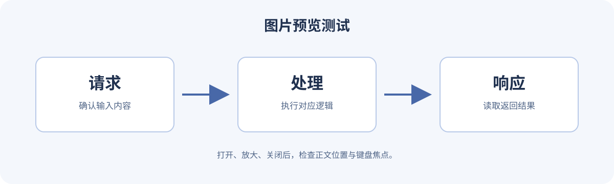

图片预览帮助读者看清较宽的技术图，背景动效只提供装饰。这两个目标应分开处理：图片使用 NexT 已集成的预览能力；背景通过主题的自定义模板加入少量 CSS，并让窄屏和减少动态效果偏好直接控制表现。

本文基线为 **Hexo 8.1.2、NexT 8.29.0、Node.js 24.19.0 LTS、npm 12.2.0**，主题方案采用 Gemini。先按[Hexo 与 NexT 入门](/hexo-writing/)建立站点。所有路径都相对于站点根目录；主题设置保存在 `_config.next.yml`。浏览器需要支持 CSS 媒体查询、渐变与 transform，这些能力不依赖额外背景动画库。

## 用一张明确的宽图检查预览

先下载下面的[预览测试图](./images/preview-demo.svg)，保存为 Hexo 站点的 `source/images/preview-demo.svg`。它是本例自制的矢量示意图，包含较小的细节文字，便于比较正文缩放与打开原图后的阅读效果。

[](./images/preview-demo.svg)

在一篇测试文章中引用：

```md

```

这里的 `/images/` 指生成后站点根路径；如果博客部署在子路径，应按 Hexo 的 root 与链接规则调整。正文中只有一个图片元素，接下来交给主题的图片预览集成处理。

## 开启一种主题图片预览方式

NexT 支持 Fancybox 和 Medium Zoom。Fancybox 提供灯箱式浏览，Medium Zoom 更接近在正文中直接放大图片；选择一种即可，避免两个处理器同时响应同一次点击。[NexT 图片预览配置](https://theme-next.js.org/docs/third-party-services/external-libraries)

本例在 `_config.next.yml` 中保留已有 `scheme: Gemini`，添加：

```yaml
fancybox: true
mediumzoom: false
```

图片存在、主题开关正确和前端资源能加载，是三个独立条件。NexT 的第三方资源默认可由 CDN 提供；生成成功不能证明浏览器已取得预览脚本。如果图片显示但点击没有预期效果，先看资源请求与控制台，再核对配置。[NexT 第三方资源](https://theme-next.js.org/docs/third-party-services/)

## 把背景样式放在主题之外

NexT 8 使用 Nunjucks 模板。下载本例的 [body-end.njk](./body-end.njk)，保存到 `source/_data/body-end.njk`，再把它接到 `_config.next.yml`：

```yaml
custom_file_path:
  bodyEnd: source/_data/body-end.njk
```

已有 custom_file_path 时，在同一个映射下补 bodyEnd，不要重复声明整个键。模板单独保存，升级或重新安装 `node_modules` 不会覆盖它。[NexT 自定义文件入口](https://theme-next.js.org/docs/advanced-settings/custom-files.html)

附件里的核心是一个背景伪元素：

```css
body {
  isolation: isolate;
}

@media (min-width: 64rem) {
  body::before {
    content: '';
    position: fixed;
    inset: -15vmax;
    z-index: -1;
    pointer-events: none;
    background:
      radial-gradient(ellipse at 20% 30%, rgb(117 154 230 / 20%), transparent 45%),
      radial-gradient(ellipse at 80% 70%, rgb(126 196 190 / 18%), transparent 45%);
  }
}
```

`isolation` 为背景建立可控的堆叠上下文，负 z-index 将它放在内容后面；pointer-events 让它不参与链接和滚动的命中。它随视口固定，主题自己的内容面板仍承担正文背景，不需要把装饰覆盖到文字上。

## 用原生媒体查询处理动态偏好

完整模板只在宽屏且用户没有要求减少动态效果时应用动画：

```css
@media (min-width: 64rem) and (prefers-reduced-motion: no-preference) {
  body::before {
    animation: allurx-ambient-pan 20s ease-in-out infinite alternate;
  }
}

@keyframes allurx-ambient-pan {
  from { transform: translate3d(-2%, -1%, 0); }
  to { transform: translate3d(2%, 1%, 0); }
}
```

窄屏时不创建背景伪元素；宽屏减少动态效果时保留静态渐变。媒体查询会在窗口尺寸或偏好改变时重新生效，不需要脚本维护加载、销毁或全局鼠标事件。20 秒和位移幅度只是本例的视觉参数，不是性能指标。

如果站点已有 body 伪元素或特殊堆叠布局，应先合并样式责任，不能直接覆盖已有主题扩展。背景色、透明度和面板遮挡也要结合实际深浅主题判断；装饰与阅读冲突时，应降低装饰或移除它。

## 验证从阅读到预览再返回的完整操作

在站点根目录运行：

```sh
npx hexo clean
npx hexo generate --bail
npx hexo server
```

打开实际测试文章，完成图片打开、放大、关闭，检查返回正文的位置和键盘焦点。再连续缩窄与放宽窗口，切换减少动态效果与深浅主题，确认背景跟随条件变化、正文对比度和链接点击没有受影响。

同时检查预览脚本与 CSS 的网络请求、控制台错误和警告。背景无需额外网络资源；图片预览仍取决于主题集成及其依赖，不能把两者的验证结果互相替代。
