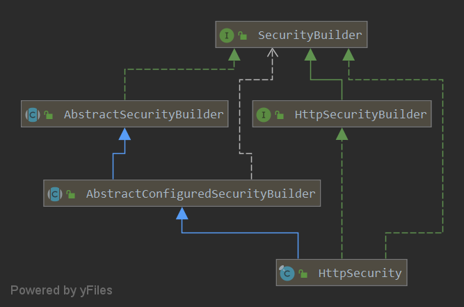

HttpSecurity 的配置方法看起来像在立即添加过滤器，实际中间还经过配置器的生命周期。它收集规则与共享对象，在构建阶段让各配置器完成工作，再把排序后的过滤器与请求匹配器组合为单条安全链。

本文研究 **Spring Boot 2.1.5.RELEASE / Spring Security 5.1.5.RELEASE** 的历史构建 API。应先理解[适配器如何创建 HttpSecurity](/web-security-configurer/)和[构建器生命周期](/web-security/)。固定源码见 [HttpSecurity 5.1.5](https://github.com/spring-projects/spring-security/blob/5.1.5.RELEASE/config/src/main/java/org/springframework/security/config/annotation/web/builders/HttpSecurity.java)。

文中框架源码摘录来自所链接的固定版本，版权归 Spring 项目原作者，按 [Apache License 2.0](https://www.apache.org/licenses/LICENSE-2.0) 提供。省略部分通过原始实现查阅，摘录不作为独立 Java 程序编译。

## 单条链有哪些需要构建的部分

[](./images/http-security.png)

| 状态 | 作用 |
| --- | --- |
| requestMatcher | 决定这条链匹配哪些请求；默认匹配所有请求 |
| filters | 保存配置阶段产生的过滤器 |
| comparator | 在最终组链时确定过滤器顺序 |
| 共享对象 | 让不同配置器访问 AuthenticationManagerBuilder、ApplicationContext 等协作对象 |

请求匹配器决定整条链是否被选中，链内 authorizeRequests 的规则决定某个请求是否获准访问。这两个匹配层次不能混用。

## 配置方法先取得配置器

以 authorizeRequests 为例：

```java
public ExpressionUrlAuthorizationConfigurer<HttpSecurity>.ExpressionInterceptUrlRegistry authorizeRequests()
        throws Exception {
    ApplicationContext context = getContext();
    return getOrApply(new ExpressionUrlAuthorizationConfigurer<>(context))
            .getRegistry();
}
```

它取得或应用 ExpressionUrlAuthorizationConfigurer，再返回其规则登记入口。反复调用同一配置入口时，getOrApply 会优先返回已有同类配置器：

```java
private <C extends SecurityConfigurerAdapter<DefaultSecurityFilterChain, HttpSecurity>> C getOrApply(
        C configurer) throws Exception {
    C existingConfig = (C) getConfigurer(configurer.getClass());
    if (existingConfig != null) {
        return existingConfig;
    }
    return apply(configurer);
}
```

这与直接调用基类 apply 的同类替换语义有关，但不是同一个入口行为：getOrApply 明确先查找并复用。因此不能从“apply 会替换同类型”推断每次 authorizeRequests 都抛弃此前规则。

## init 与 configure 把规则变成过滤器

HttpSecurity 继承 AbstractConfiguredSecurityBuilder。构建时先初始化配置器和共享对象，再执行各配置器的 configure。例如授权配置器创建 FilterSecurityInterceptor 并加入过滤器集合，异常处理等其他配置器加入自己的组件。

应用调用配置 API 的先后，不等于最后过滤器一定按这个顺序执行。最终排序使用独立的比较器；过滤器的执行职责和依赖关系决定了其相对位置。

## performBuild 生成 DefaultSecurityFilterChain

```java
protected DefaultSecurityFilterChain performBuild() throws Exception {
    Collections.sort(filters, comparator);
    return new DefaultSecurityFilterChain(requestMatcher, filters);
}
```

最后一步只做两件事：对已产生的过滤器排序，再用当前 requestMatcher 构造 DefaultSecurityFilterChain。它不在这里进行用户认证，也不会把多条链合并成代理；后者由 WebSecurity 完成。

## 用一个多链场景检查两层规则

假设第一条 HttpSecurity 只匹配 `/api/**`，第二条匹配其余请求。访问 `/api/orders` 时，FilterChainProxy 先选第一条链，再执行这条链内配置的认证与授权规则。第一条链没有配置到的过滤器，不会自动从第二条链借来补齐。

排查时应分别查看链的 requestMatcher、链内过滤器顺序和授权属性。只核对某个 authorizeRequests 表达式，不能证明整个请求已经进入包含它的安全链。[FilterChainProxy 的选择过程](/filter-chain-proxy/)
