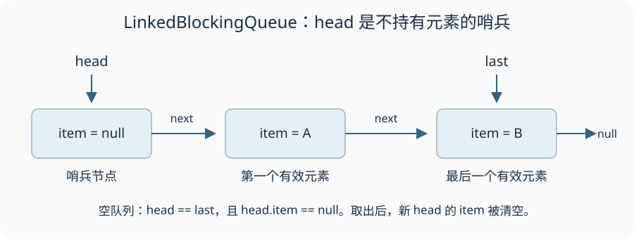

LinkedBlockingQueue 是可指定容量的 FIFO 阻塞队列。它把入队与出队分别交给两把锁，共享计数和条件通知连接两侧，因此一个生产者入队与一个消费者出队可以并行；这并不意味着内部字段都可以无锁访问。

本文按存储不变量、入队、出队和批量操作阅读 [OpenJDK 8u202-b08 实现](https://github.com/openjdk/jdk8u/blob/jdk8u202-b08/jdk/src/share/classes/java/util/concurrent/LinkedBlockingQueue.java)，最后给出有限生产消费程序。先了解 [BlockingQueue 契约](/blocking-queue/) 与 [Condition](/condition/)。完整用法示例仅依赖标准库，已在 Windows、Oracle JDK 25.0.2（25.0.2+10-LTS-69）下编译运行。

## 哨兵、尾节点和计数维护同一个队列

Node 保存 item 与 next。head 是不持有有效元素的哨兵，last 指向末尾；空队列时二者指向同一个哨兵。真正的队头元素在 head.next，而不是 head.item。

[](./images/linked-blocking-queue.svg)

capacity 是容量上限，AtomicInteger count 是当前元素数。无参构造器选择 Integer.MAX_VALUE，这只是数值上限，不是内存容量保证。生产速度长期高于消费速度时应按业务设置容量。

| 保护对象 | 锁与条件 |
| --- | --- |
| 尾部入队 | putLock 与 notFull |
| 头部出队 | takeLock 与 notEmpty |
| 同时改变两端或中间链接 | 按固定顺序同时取得两把锁 |

count 的原子读写既协调容量转换，也参与节点内容的可见性。它与锁共同构成协议，不能因为计数是 AtomicInteger 就把其他链表读写随意移到锁外。

## put：持入队锁等待容量，再发布新节点

```java
public void put(E e) throws InterruptedException {
    if (e == null) throw new NullPointerException();
    int c = -1;
    Node<E> node = new Node<E>(e);
    final ReentrantLock putLock = this.putLock;
    final AtomicInteger count = this.count;
    putLock.lockInterruptibly();
    try {
        while (count.get() == capacity) {
            notFull.await();
        }
        enqueue(node);
        c = count.getAndIncrement();
        if (c + 1 < capacity)
            notFull.signal();
    } finally {
        putLock.unlock();
    }
    if (c == 0)
        signalNotEmpty();
}
```

入队把旧 last.next 指向新节点，再更新 last。随后 getAndIncrement 返回的是旧计数 c：若 c 为零，本次完成从空到非空的转换，需要跨到 takeLock 一侧通知消费者。

put 内部还在 c + 1 小于 capacity 时通知 notFull。这是级联通知：多个生产者可能已在 await 中释放 putLock 并等待；消费者从满队列移走一个元素后先唤醒一个生产者，醒来的生产者发现仍有容量，再把机会向后传递。独占锁限制同时执行受保护代码的线程数，不限制已经等待的线程数。

## take：移动哨兵，按计数转换通知生产者

```java
public E take() throws InterruptedException {
    E x;
    int c = -1;
    final AtomicInteger count = this.count;
    final ReentrantLock takeLock = this.takeLock;
    takeLock.lockInterruptibly();
    try {
        while (count.get() == 0) {
            notEmpty.await();
        }
        x = dequeue();
        c = count.getAndDecrement();
        if (c > 1)
            notEmpty.signal();
    } finally {
        takeLock.unlock();
    }
    if (c == capacity)
        signalNotFull();
    return x;
}
```

dequeue 保存旧 head，取出 head.next 的 item，再把这个节点变为新哨兵并清空 item。旧哨兵的 next 指向自身，断开它对后续链的引用；这也与迭代器识别已出队节点的实现配合。

```java
private E dequeue() {
    Node<E> h = head;
    Node<E> first = h.next;
    h.next = h; // help GC
    head = first;
    E x = first.item;
    first.item = null;
    return x;
}
```

旧计数 c 大于 1，说明本次之后仍有元素，可以级联通知另一个消费者。只有 c 等于 capacity 时，本次才完成从满到未满的转换，需要跨锁通知生产者；此前未满不表示绝对没有等待者，其他通知由对应侧继续传播。

## offer 与 poll 的区别是等待政策

无超时 offer 在当前无法插入时返回 false，poll 在当前无元素时返回 null；带超时版本按预算等待；put、take 等待直到条件满足或响应中断。它们复用相近的链表和计数结构，却不具有相同的等待契约。

先 remainingCapacity 再 offer、先 isEmpty 再 take，都不是一个原子检查。并发下应依赖实际操作结果；需要“查看后执行”的额外业务约束时，必须找到明确的共同同步边界。

## remove 为什么同时取得两把锁

remove(Object) 沿链寻找首个 equals 相等的元素，并可能修改中间链接或 last。只持入队锁或出队锁都不足以覆盖这些修改，所以 fullyLock 按 putLock、takeLock 的顺序加锁。

unlink 清除 item，跳过节点；删除尾节点时还更新 last，并在满到未满时通知生产者。这里删除的是一个元素，不是删除所有相等元素。

## drainTo 不提供跨集合事务

drainTo 在 takeLock 下决定本次最多转移数量，逐个调用目标集合的 add，再清空相应节点。目标 add 失败时，finally 仍按已经转移的数量更新 head、count 和通知状态，保持队列自身不变量。

不能因此说整个转移是“全成功或全失败”：目标集合可能已经收到部分元素，且它的线程安全不是队列替它保证的。maxElements 小于等于零返回零；目标不能为 null 或队列自身。完整的异常路径和迭代行为见固定版本源码。

## 用有限任务观察生产与消费

一个生产者依次放入 1 到 12，三个消费者共用容量为 4 的队列。生产者最后为每个消费者放入一个 -1 结束标记；实际任务都是正数，因此这个标记不会与任务混淆。FIFO 保证结束标记排在此前提交的任务之后，但不保证三个消费者平均分配任务。

```java
package io.allurx;

import java.util.concurrent.BlockingQueue;
import java.util.concurrent.LinkedBlockingQueue;
import java.util.concurrent.atomic.AtomicInteger;

/**
 * @author allurx
 */
public class Test {

    public static void main(String[] args) throws InterruptedException {
        BlockingQueue<Integer> queue = new LinkedBlockingQueue<>(4);
        AtomicInteger consumed = new AtomicInteger();
        Thread[] consumers = new Thread[3];
        for (int i = 0; i < consumers.length; i++) {
            consumers[i] = new Thread(() -> {
                try {
                    while (true) {
                        int value = queue.take();
                        if (value == -1) {
                            return;
                        }
                        System.out.println(Thread.currentThread().getName() + "：" + value);
                        consumed.incrementAndGet();
                    }
                } catch (InterruptedException exception) {
                    Thread.currentThread().interrupt();
                }
            }, "consumer" + (i + 1));
            consumers[i].start();
        }

        try {
            for (int value = 1; value <= 12; value++) {
                queue.put(value);
            }
            for (int i = 0; i < consumers.length; i++) {
                queue.put(-1);
            }
            for (Thread consumer : consumers) {
                consumer.join();
            }
            System.out.println("消费总数：" + consumed.get());
        } finally {
            for (Thread consumer : consumers) {
                consumer.interrupt();
            }
        }
    }
}
```

正常完成后应打印“消费总数：12”。各消费者的打印先后可能与取出先后不同，因为 take 返回后线程还会再次被调度；不要把控制台行序当作队列破坏 FIFO 的证据。结束标记只适用于本例已知的生产者和消费者数量，业务系统还需要自己的关闭协议。


该程序保存为 Test.java，执行 `javac -encoding UTF-8 -d out Test.java`、`java -cp out io.allurx.Test`。使用结束标记是这个有限协议的设计，不是 BlockingQueue 内置的关闭能力。

## 资料来源

- [OpenJDK 8u202-b08 LinkedBlockingQueue：完整实现与可见性说明](https://github.com/openjdk/jdk8u/blob/jdk8u202-b08/jdk/src/share/classes/java/util/concurrent/LinkedBlockingQueue.java)
- [LinkedBlockingQueue：容量、迭代和操作契约](https://docs.oracle.com/en/java/javase/25/docs/api/java.base/java/util/concurrent/LinkedBlockingQueue.html)
