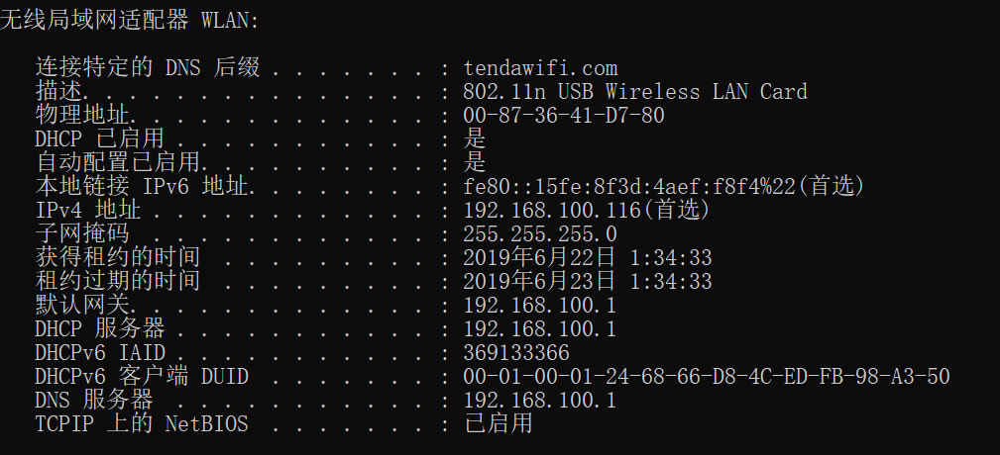
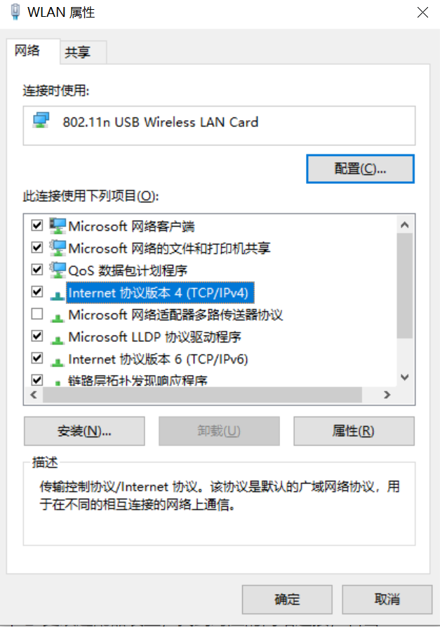
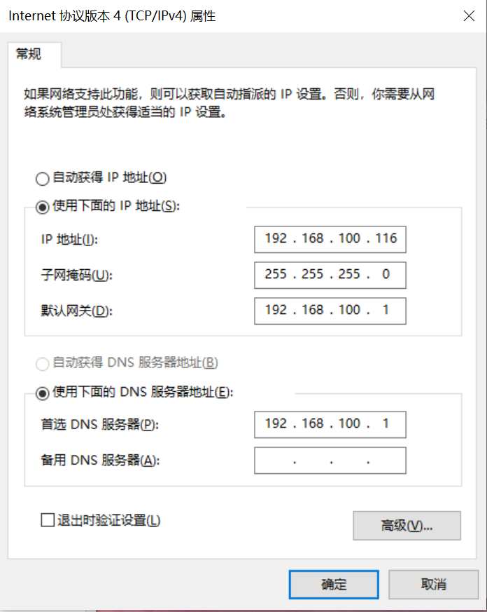
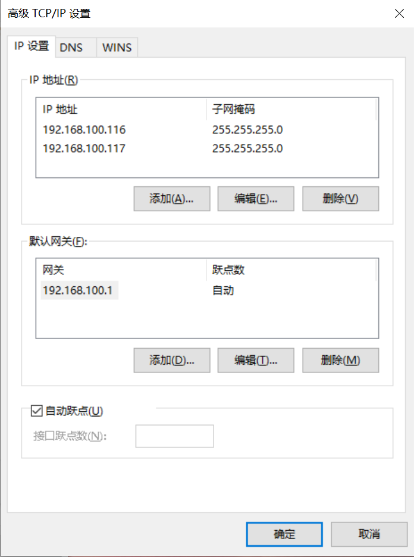
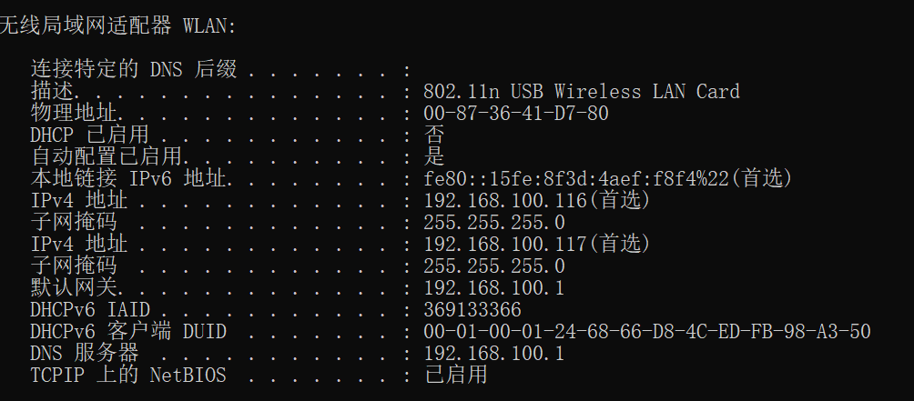

“本机 IP”不是一个在所有场景下都唯一的值。主机名解析、网卡绑定地址、某条连接的本地端点以及 NAT 后的公网出口，回答的是不同问题。先明确用途，才能选择正确 API。

本文比较主机名解析与接口枚举，并保留一个历史 Windows 多地址实验。完整 Java 示例仅依赖标准库，已在 Windows、Oracle JDK 25.0.2（25.0.2+10-LTS-69）运行；本次没有修改本机网络配置。

## getLocalHost 返回主机名的解析结果

InetAddress.getLocalHost 获取本机主机名，再通过名称服务解析地址。hosts 文件可能参与解析，也可能使用 DNS、缓存和系统配置。返回回环地址不表示没有其他网卡；返回某个内网地址也不证明它是访问任意远端时使用的源地址。

因此，某次修改 Linux hosts 后得到指定地址，只能说明那次环境中的解析路径。不能把它写成所有 Windows 或 Linux 系统都只依赖一个文件的固定规则。

## 枚举候选地址时保留接口关系

同一接口可能有多个 IPv4 或 IPv6 地址，机器也可能有物理、VPN、容器等多个接口。下面列出已启用、非回环接口中的非回环、非通配地址，并同时打印接口名；不把虚拟接口一律当作无效接口。

保存为 Ip.java，执行 `javac -encoding UTF-8 -d out Ip.java`、`java -cp out io.allurx.Ip`：

```java
package io.allurx;

import java.net.InetAddress;
import java.net.NetworkInterface;
import java.net.SocketException;
import java.util.Enumeration;

/**
 * @author allurx
 */
public class Ip {

    public static void main(String[] args) throws SocketException {
        Enumeration<NetworkInterface> interfaces = NetworkInterface.getNetworkInterfaces();
        if (interfaces == null) {
            return;
        }

        while (interfaces.hasMoreElements()) {
            NetworkInterface network = interfaces.nextElement();
            if (!network.isUp() || network.isLoopback()) {
                continue;
            }
            Enumeration<InetAddress> addresses = network.getInetAddresses();
            while (addresses.hasMoreElements()) {
                InetAddress address = addresses.nextElement();
                if (!address.isLoopbackAddress() && !address.isAnyLocalAddress()) {
                    System.out.println(network.getName() + " " + address.getHostAddress());
                }
            }
        }
    }
}
```

每个地址输出一行，实际内容由机器配置决定；本次执行确实枚举出同一接口上的多个地址。顺序不保证稳定，不能把“第一个非回环地址”当作通用答案。SocketException 直接传播，避免枚举失败后悄悄改用另一种选址语义。

链路本地 IPv6 地址还依赖作用域标识，输出中的接口关系不能随意去掉。枚举只得到当前绑定的候选地址，不会自动查询 NAT 后的公网地址。

## 历史实验：同一 Windows 接口绑定两个 IPv4 地址

以下截图来自 2019 年的 USB 无线网卡实验。它用于说明一个接口可以有多个地址，不是当前 Windows 菜单布局的保证，也不能照抄其中地址到其他网络。

先执行 `ipconfig /all` 记录原配置。截图中接口通过 DHCP 获得 192.168.100.116：

[](./images/ipconfig-before-additional-address.png)

通过网络适配器属性进入 IPv4 设置：

[](./images/wireless-adapter-properties.png)

[](./images/ipv4-properties.png)

这个实验后续采用手动地址配置，所以前后截图的 DHCP 状态也改变了，不是仅添加一个地址而其他配置完全不动。地址、子网掩码、网关和 DNS 都需符合所在网络规划。

在高级设置中保留 192.168.100.116，并增加 192.168.100.117：

[](./images/advanced-ip-addresses.png)

再次执行 `ipconfig /all`，对照接口名称确认两个 IPv4 条目：

[](./images/ipconfig-after-additional-address.png)

Java 枚举程序对每个绑定地址逐行输出，因此能对应这些条目。若实现是在找到第一个地址后立即 return，则不可能由同一次调用输出两个地址；验证结果必须与真正运行的代码对应。

## 从候选地址到实际连接的本地端点

| 需求 | 入口 | 不能据此推出 |
| --- | --- | --- |
| 主机名解析到的地址 | InetAddress.getLocalHost | 全部绑定地址或任意目的地的出口地址 |
| 当前接口绑定地址 | NetworkInterface 枚举 | 路由一定选择其中哪一个 |
| 已建立连接的本地端点 | 对应 Socket/Channel 的本地地址 | 其他目的地也使用同一个地址 |

已经连接的 Socket 可通过 getLocalAddress/getLocalSocketAddress 观察实际本地端点；这是那条连接的结果。多网卡时还要考虑目标地址、路由、接口状态及应用是否显式绑定，不能由一个全局“获取本机 IP”方法替所有场景作决定。

## 资料来源

- [InetAddress：本机主机名与地址解析](https://docs.oracle.com/en/java/javase/25/docs/api/java.base/java/net/InetAddress.html)
- [NetworkInterface：接口和绑定地址](https://docs.oracle.com/en/java/javase/25/docs/api/java.base/java/net/NetworkInterface.html)
- [Socket：连接的本地地址](https://docs.oracle.com/en/java/javase/25/docs/api/java.base/java/net/Socket.html)
