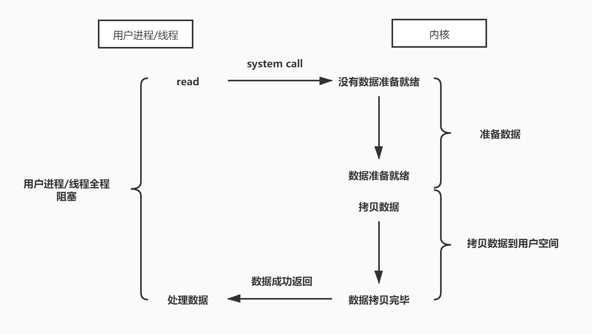
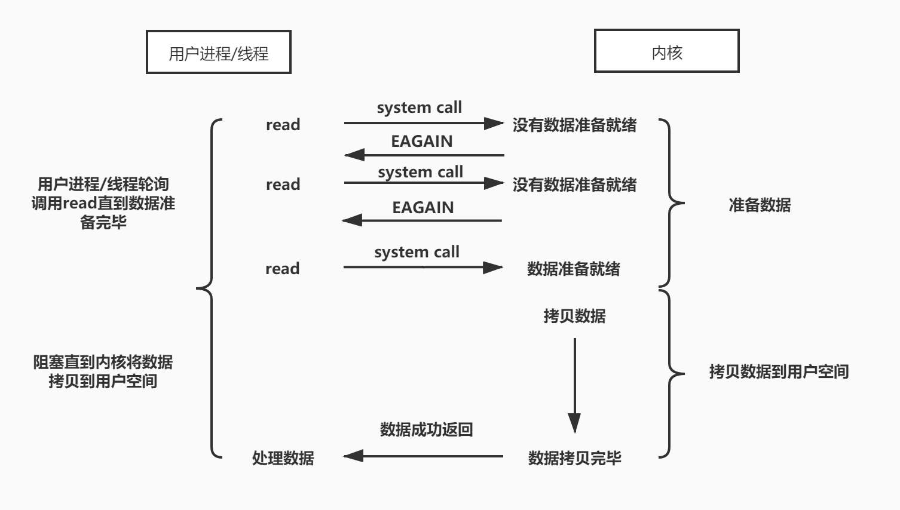
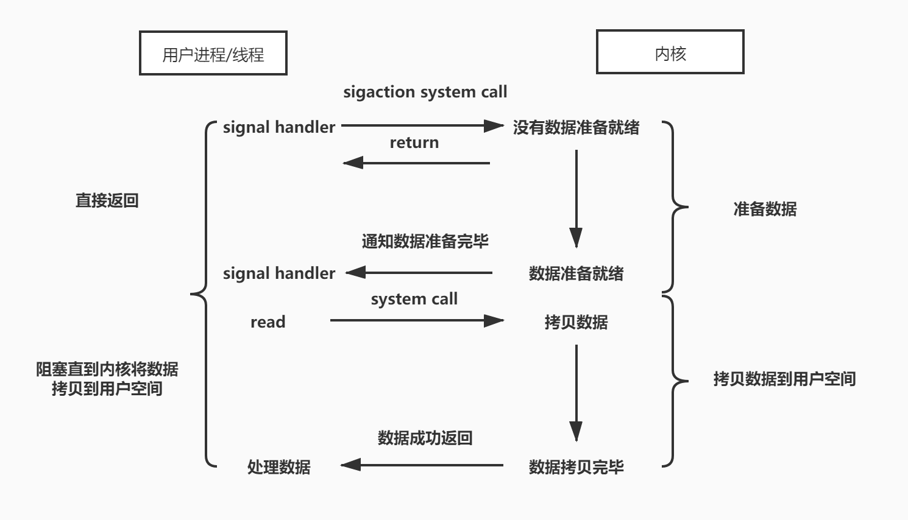
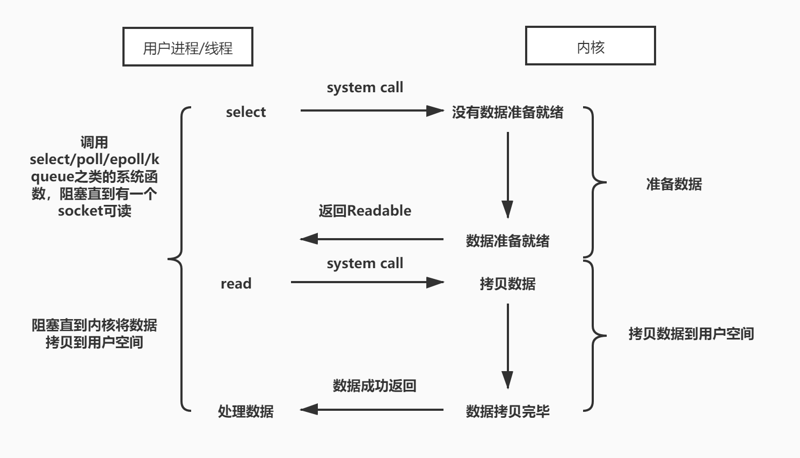
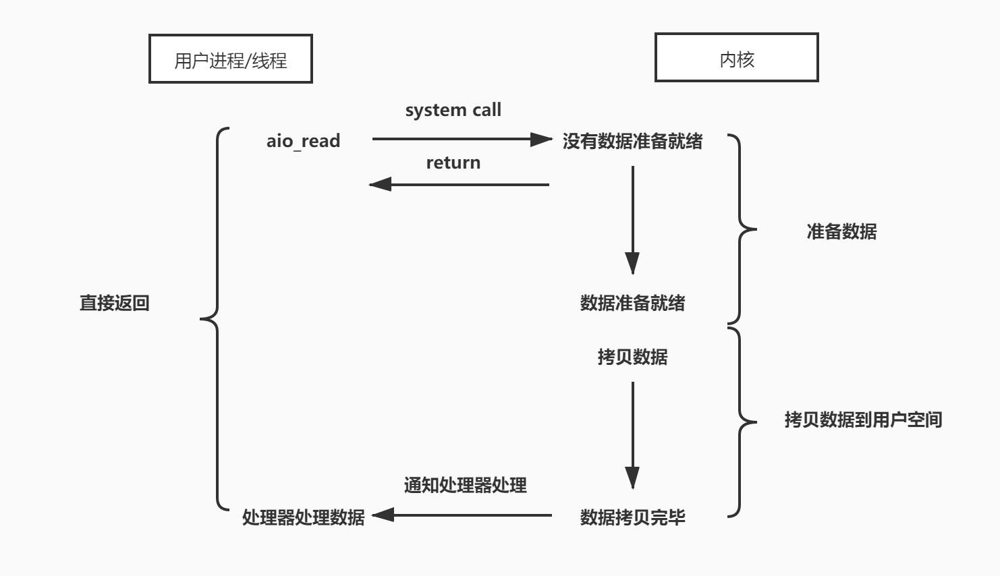

## 核心结论

网络读取可以从“等待数据就绪”和“完成读取”两个阶段理解。阻塞调用、非阻塞轮询、就绪通知和异步完成通知的区别，是谁等待、何时返回、谁执行后续操作。Java 的 `Socket`、`Selector` 和异步通道提供不同入口，选择时还要考虑连接数量、业务耗时和线程成本。

## 问题与适用范围

本文用五种经典模型解释网络 I/O，并结合 Java 的 BIO、NIO、AIO 示例。图示是理解操作系统接口的模型，不能直接代表每个平台的实现或吞吐量。原文服务器使用固定线程池，结论受其容量与拒绝策略影响；使用虚拟线程时，阻塞代码的线程成本也与传统平台线程不同。

<!-- more -->

## 阻塞IO

阻塞IO在数据拷贝的两个阶段进程都处于阻塞阶段。一次socket的读流程如下图所示

`java.net`包下的`Socket`类就是一个阻塞套接字，只要当前Stream中没有数据且Stream未关闭的话，就会阻塞当前线程。这种io模型的好处是在连接数较小时有比较好的性能，一个线程对应一个socket读写任务，代码编写也比较简单。不好之处在于如果有大量连接同时建立时我们不可能无限制的创建线程，我们就必须要使用固定大小的线程池来管理线程，大量连接长期等待时，传统平台线程模型的资源成本会成为限制；是否可行还取决于线程模型、连接行为与容量，不能仅凭阻塞 API 判定。

## 非阻塞IO

非阻塞IO在数据拷贝的第一个阶段是不会阻塞进程的，第二个阶段还是阻塞的。进程需要设置socket为非阻塞状态，然后在第一阶段不停的调用read方法询问内核数据是否准备好了没有。一次socket的读流程如下图所示

从上图可以看出，进程需要将socket设置为非阻塞状态，然后根据自己的轮询策略去调用read方法，根据内核返回的错误码来判断数据有没有准备好。这种IO模型可以使用一个线程来轮询所有socket的IO是否准备就绪，但是这会大大提高cpu的占用率，这种模型中核心思想是以轮询的方式检测**数据是否准备就绪**，实际上操作系统提供了更为高效的检测**数据是否准备就绪**作用的接口，例如select/poll/epoll/kqueue之类的系统函数，可以一次检测多个连接是否活跃。所以这种IO模型实际应用的并不多。

## 信号驱动IO

信号驱动IO在数据拷贝的第一个阶段是不会阻塞进程的，第二个阶段还是阻塞的。这一点与非阻塞IO表现的一致，只不过信号驱动IO是在数据准备阶段调用sigaction系统函数告诉内核在数据准备完毕之后发一下通知给我。然后进程在收到这个SIGIO信号进入数据拷贝阶段阻塞直到拷贝完成，最后在业务中处理读到的数据。一次socket的读流程如下图所示

不过在实际使用中，信号驱动IO通常都是使用在UDP协议中，因为UDP协议中能触发SIGIO信号的IO事件只有两种：

1. 有数据可读
2. socket上发生一些错误

而TCP中会有很多触发SIGIO的IO事件，应用程序无法知道当前的SIGIO究竟是数据可读、还是可写，甚至当前的socket已经关闭了。

## IO多路复用

IO多路复用在数据拷贝的两个阶段进程都处于阻塞阶段。首先我们要记住io多路复用是基于事件驱动实现的一种io模型。操作系统为我们提供了select/poll/epoll/kqueue之类的系统函数，这些函数都可以同时监视多个描述符的读写就绪状况，当某个socket可读或者可写的时候，它会给我们一个通知，这样当配合非阻塞的socket使用时，只有当系统通知我哪个描述符可读了，我才去执行read操作，可以保证每次read都能读到有效数据而不像上面的非阻塞IO那样不停的轮询做无用功。这样多个描述符的I/O操作都能在一个线程内并发交替地顺序完成，这就叫I/O多路复用，这里的“复用”指的是复用同一个线程来处理多个已准备就绪的IO事件。一次socket的读流程如下图所示

IO多路复用本质上是利用了操作系统提供给我们的select/poll/epoll/kqueue函数来监控socket可读、可写、可接受等IO事件，但是在数据拷贝的两阶段当前进程都是处于阻塞状态的，但是它提供了一种高性能IO编程的思路，我们可以在一个线程内监听所有socket的acceptable事件，在另外固定数量的线程内监听socket的readable/writeable事件，然后将读到的数据提交给线程池执行业务逻辑，最终将数据响应给客户端。对于阻塞IO无法面对海量连接的窘境，通过IO多路复用模型则能完美的解决。这种思想还有一个更加专业的名称`Reactor`，意为反应堆。基于`java.nio`包下`Selector`、`Channel`、`ByteBuffer`这三个类就能编写一个高性能的服务器。很多高性能的网络框架例如Netty等，它们背后都是基于IO多路复用的思想实现的。

## 异步IO

在上面的四种IO模型中，进程都会阻塞在第二阶段的数据拷贝过程中，必须等待内核将数据成功拷贝到用户空间之后进程才能继续执行，它们本质上都是阻塞IO。而异步IO则是真正意义上的异步非阻塞，在一次数据拷贝的两个阶段进程都处于非阻塞阶段。一次socket的读流程如下图所示

从上图可以看出，异步IO在执行完aio_read系统函数之后就立刻返回了，然后等到第二阶段的数据拷贝完成之后内核通知进程在aio_read时注册的处理器处理本次内核读到的数据。`java.nio.channels`包下以Asynchronous开头的channel类都是完全异步的，例如使用AsynchronousSocketChannel读取通道中的数据时，我们只需要传入一个ByteBuffer（用来存放内核拷贝的数据）和一个CompletionHandler（内核拷贝成功后就会调用这个处理器）就能完成一次异步IO读取。

## 例子

理解了常见的5种网络IO模型之后，那我们就可以着手分别基于阻塞IO、IO多路复用、异步IO这三种IO模型来尝试编写高性能的TCP服务器了。（示例未覆盖直接轮询和信号驱动模型，不能由此推断它们在所有场景都不可用）。

[基于BIO、NIO、AIO模型实现的简单TCP服务器](https://github.com/allurx/socket)

感兴趣的同学可以在本地通过Jmeter等压测工具测试一下不同模型下服务器的吞吐量。例子中的NIO和AIO服务器内部都是将客户端发送过来的信息提交到一个固定线程数为100任务队列长度为1000的业务线程池中执行的，而BIO则是维护了一个固定线程数为100的线程池处理每一个Socket连接，新来的socket连接则会被抛弃。

## 资料来源

- [Socket：流式套接字 API](https://docs.oracle.com/en/java/javase/25/docs/api/java.base/java/net/Socket.html)
- [Selector：就绪事件选择](https://docs.oracle.com/en/java/javase/25/docs/api/java.base/java/nio/channels/Selector.html)
- [AsynchronousSocketChannel：异步操作](https://docs.oracle.com/en/java/javase/25/docs/api/java.base/java/nio/channels/AsynchronousSocketChannel.html)
- [JEP 444：虚拟线程的设计边界](https://openjdk.org/jeps/444)
