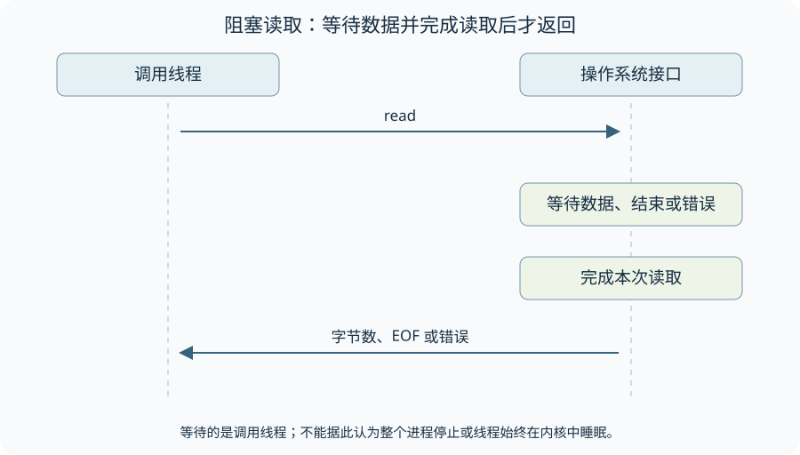
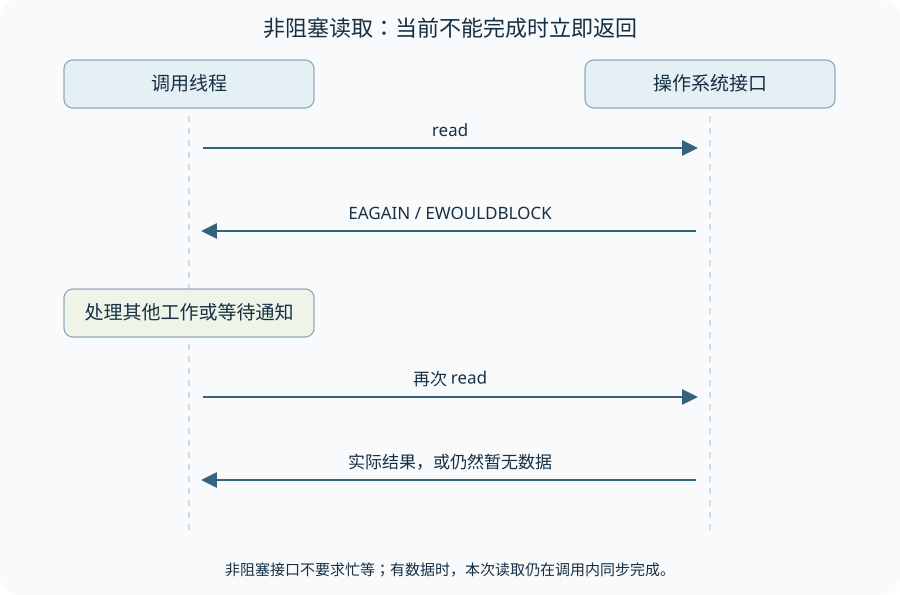
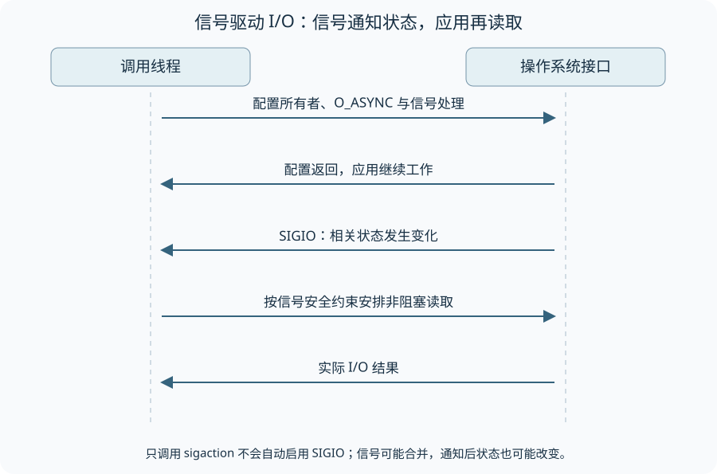
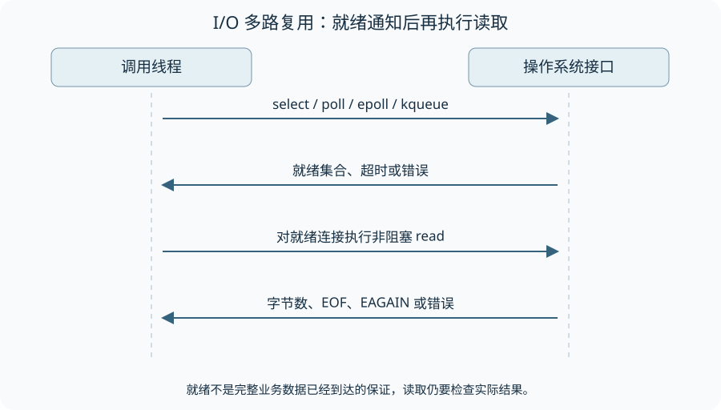
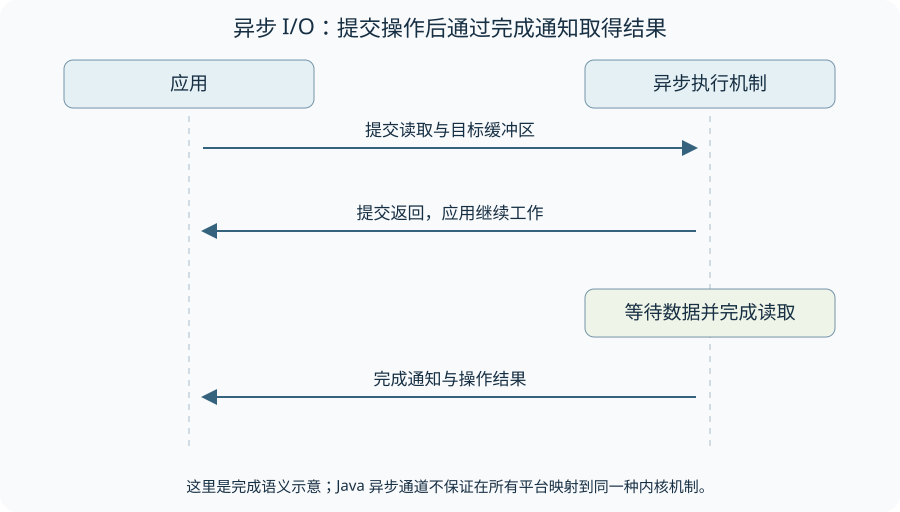

一台聊天服务器上有一万个连接，大部分用户此刻没有发消息。服务器怎样等这些连接：让每个读取任务停在 `read`，反复询问哪些连接有数据，还是先登记关注的事件、等通知再处理？这几种安排影响线程怎样使用，却都没有改变业务需要拿到一段字节的目标。

先把一次读取拆成两个阶段：数据尚未到达时要等待；数据到达后，要把本次结果交到应用缓冲区。比较 I/O 模型时，沿着这两个阶段看调用何时返回、谁来发起读取，会比记住 BIO、NIO、AIO 几个缩写更清楚。

下面用五种经典模型比较调用与通知的时序，再对应到 Java 的 Socket、Selector 与异步通道。图示中的“等待数据”和“复制数据”是概念阶段；同步调用要等复制完成才返回，不等于线程在复制期间始终处于操作系统的睡眠状态。

Java API 部分采用 Java SE 25 的 Socket、Selector 与异步通道契约；Linux 行为按所链接的 Linux man-pages 中的 socket、select 接口说明解释。图示是时序模型，不是特定内核版本的性能实验，也不是可直接执行的系统调用程序。

## 应用自己发起读取的四种安排

### 阻塞 I/O：让当前调用等到有结果

阻塞读取在没有数据时等待，取得数据并完成本次读取后才返回。调用线程在返回前不能继续执行调用后的代码，但其他线程仍可工作；不能把一个线程的等待描述成整个进程停止。

Java Socket 的输入流提供这种同步读取接口。没有可读数据时，调用可能等待数据、流结束、错误或配置的读取超时。一个连接对应一个读取任务，控制流容易理解；大量连接长期等待时，平台线程的数量与内存成本可能成为限制。使用虚拟线程会改变等待的线程成本，但不会增加下游资源容量。[Socket API](https://docs.oracle.com/en/java/javase/25/docs/api/java.base/java/net/Socket.html) · [JEP 444](https://openjdk.org/jeps/444)

### 非阻塞 I/O：立即告诉应用当前能否读取

非阻塞读取在当前没有数据时立即返回，让调用方决定何时再试。在 Linux 中通常通过 O_NONBLOCK 配置套接字，读取暂时无法完成时返回 EAGAIN 或 EWOULDBLOCK；有数据时，本次调用仍同步完成实际读取。[Linux socket 接口](https://man7.org/linux/man-pages/man7/socket.7.html)

不断轮询所有连接可以避免等待在某一条连接上，却可能把 CPU 消耗在尚无进展的重试中。非阻塞接口并不要求忙等；它通常与后面的就绪通知机制配合，只在收到通知后尝试读写。

### 信号驱动 I/O：收到就绪信号后再读取

信号驱动 I/O 用信号通知就绪事件，应用收到信号后再读取。在 Linux 中，仅调用 sigaction 注册处理器还不够，还需要设置接收信号的所有者并启用 O_ASYNC。SIGIO 表示发生了相关事件，不表示应用缓冲区中已经有完整结果。[socket(7) 的信号机制](https://man7.org/linux/man-pages/man7/socket.7.html)

信号可能合并，收到信号时状态也可能已经变化。处理器需要遵守信号安全限制，并通过实际 I/O 结果确认发生了什么；不能把一次信号与一个完整报文对应起来，也不能据此把这种机制限定为 UDP 专用。

### I/O 多路复用：一次等待关注多条连接

select、poll、epoll、kqueue 等接口让一个调用同时关注多条连接的就绪事件。等待调用可以阻塞、限时等待或立即返回；返回后，应用再对就绪连接执行非阻塞读写。这样一个事件循环可以交替推进多条连接，而不必为每条等待中的连接分配平台线程。

就绪通知不是成功读取的凭证。流结束也可能表现为可读，状态还可能在通知与读取之间改变；Linux select 文档也明确记录了虚假就绪的情况。因此读取仍要处理无数据、部分结果、结束与错误，不能保证每次通知都得到有效业务数据。[select(2) 的就绪语义与边界](https://man7.org/linux/man-pages/man2/select.2.html)

Java 的 Selector、SelectableChannel 与 ByteBuffer 可以表达这种 Reactor 结构：事件循环检测就绪并推进 I/O，耗时业务交给受控的执行器。事件循环中执行慢任务仍会拖延其他连接，业务队列也需要容量限制；多路复用解决的是如何等待多条连接，并不自动解决过载。[Selector 的选择操作](https://docs.oracle.com/en/java/javase/25/docs/api/java.base/java/nio/channels/Selector.html)

## 异步 I/O：提交操作，等待完成结果

前面的模型最终都由应用发起一次同步读取，只是等待数据就绪的方式不同；其中也包含非阻塞调用，不能统称为阻塞 I/O。异步读取则在提交操作时提供目标缓冲区，随后通过完成通知取得结果，提交者不必等待本次读取完成。

AsynchronousSocketChannel.read 可以返回 Future，也可以接收 CompletionHandler。完成处理器由异步通道组的执行机制调用；Java API 不保证底层在所有平台都直接映射到同一种内核异步接口。操作完成前不能随意复用其缓冲区，同一通道也不允许同时挂起多个读操作。[AsynchronousSocketChannel 的操作契约](https://docs.oracle.com/en/java/javase/25/docs/api/java.base/java/nio/channels/AsynchronousSocketChannel.html)

## 从读取接口走向服务器结构

### 对照三种 Java 实现的任务流转

可以用同一个 TCP 请求协议比较阻塞读取、就绪通知与异步完成三种编程接口，观察等待发生在哪里，以及任务如何交给业务处理代码。下面的工程提供相应实现供阅读：

[BIO、NIO、AIO 三种实现的示例工程](https://github.com/allurx/socket/tree/3f2b27fd388be1754f9eed61bd3098a954f85047)

该固定提交的 Maven 配置使用 Java 17、Lombok 1.18.26 和 Logback 1.4.7，具体见 [pom.xml](https://github.com/allurx/socket/blob/3f2b27fd388be1754f9eed61bd3098a954f85047/pom.xml)。阅读时重点跟踪“连接在哪里等待、字节由谁读取、业务在哪个线程执行”。本文未运行这一依赖组合；它与前文 Java 25 API 契约的版本范围不同。

比较性能时，需要同时固定请求协议、连接行为、业务工作量与资源上限，并记录超时、错误和拒绝数量。不同线程池与队列配置本身就会改变结果；单次吞吐量差异不能直接归因于 BIO、NIO 或 AIO 的名称。

### 先比较交接方式，再测量性能

| 模型 | 等待数据时谁安排后续工作 | 读取结果何时交给应用 |
| --- | --- | --- |
| 阻塞调用 | 调用线程等待 | 本次调用返回时 |
| 非阻塞调用 | 应用决定重试或等待通知 | 每次调用立即报告当前结果 |
| 就绪或信号通知 | 应用收到通知后再尝试读取 | 后续读取返回时 |
| 异步操作 | 提交者继续工作，执行机制推进操作 | 完成通知或结果句柄报告完成时 |

回到聊天服务器：就绪通知可以告诉事件循环某条连接值得尝试读取，却不能告诉它已经收到一条完整聊天消息。一次 `read` 可能只取得半条消息，也可能取得多条消息的字节。因此，选择模型后仍需处理分帧、部分读写、EOF、错误和取消，并限制后续业务队列。等待方式解决了连接如何取得进展，完整的服务器还要安排取得进展之后的工作。

## 资料来源

- [Socket：流式套接字 API](https://docs.oracle.com/en/java/javase/25/docs/api/java.base/java/net/Socket.html)
- [Selector：就绪事件选择](https://docs.oracle.com/en/java/javase/25/docs/api/java.base/java/nio/channels/Selector.html)
- [AsynchronousSocketChannel：异步操作](https://docs.oracle.com/en/java/javase/25/docs/api/java.base/java/nio/channels/AsynchronousSocketChannel.html)
- [JEP 444：虚拟线程的设计边界](https://openjdk.org/jeps/444)
