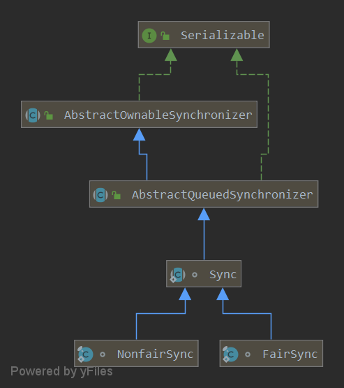

`ReentrantLock` 提供独占重入、可中断获取、超时获取和多个条件队列等控制能力。公平模式倾向于按等待顺序获取锁，但不保证线程调度公平；不带超时的 `tryLock()` 仍可插队。是否采用它应取决于所需能力，不能笼统认定它总比 `synchronized` 更快。

下面以 [OpenJDK 8u202-b08](https://github.com/openjdk/jdk8u/blob/jdk8u202-b08/jdk/src/share/classes/java/util/concurrent/locks/ReentrantLock.java) 分析公平与非公平获取、重入计数、释放和 AQS 的关系。使用时在成功加锁后通过 finally 释放；选择锁的依据是功能与实际负载，不是未经测量的性能判断。


## 公平锁和非公平锁

* 公平模式在已有排队前驱时让新竞争者排队，倾向于按等待顺序获取；它不保证操作系统调度公平，也不限制当前拥有者重入。
* 非公平模式允许新到达线程在锁空闲时直接竞争，因此可能越过已经排队的线程。能否成功既受锁状态和 CAS 结果影响，也受执行调度影响。

ReentrantLock是通过内部类Sync的两个子类FairSync（公平锁）和NonfairSync（非公平锁）来实现线程获取锁的。其中默认的构造函数创建的就是非公平锁。可以通过ReentrantLock另一个构造函数传入true来构造公平锁。

```java
public ReentrantLock() {
    sync = new NonfairSync();
}

public ReentrantLock(boolean fair) {
    sync = fair ? new FairSync() : new NonfairSync();
}
```

下面我们看一下这这两个锁的父类Sync的类图



可以发现Sync最终是继承AbstractQueuedSynchronizer，它内部的实现完全是基于AQS实现的，同时从ReentrantLock的类注释上我们可以得知它是一种类似synchronized关键字的独占重入锁。并且从内部类Sync的两个子类以及其重写AQS的tryAcquire以及tryRelease方法我们更加可以断定ReentrantLock是以独占模式去获取和释放锁的。由于ReentrantLock的默认构造函数是以非公平锁的方式运行，接下来我们就先从非公平锁的代码入手，一步一步分析其内部的原理。

### NonfairSync

```java
static final class NonfairSync extends Sync {
    private static final long serialVersionUID = 7316153563782823691L;
	// 加锁
    final void lock() {
        // cas设置AQS的state为1，成功则设置独占线程为当前线程。
        // 这个if判断其实已经存在于else的acquire方法中了，即nonfairTryAcquire
        // 方法中AQS最终会调用子类的tryAcquire方法
        if (compareAndSetState(0, 1))
            setExclusiveOwnerThread(Thread.currentThread());
        // 失败则调用AQS的acquire方法排队
        else
            acquire(1);
    }
	// 现在我们知道AQS的acquire方法是根据子类的tryAcquire方法来实现的
    // 这里调用的是在父类Sync中定义的nonfairTryAcquire方法尝试获取锁
    protected final boolean tryAcquire(int acquires) {
        return nonfairTryAcquire(acquires);
    }
}
```

NonfairSync加锁是在其父类的nonfairTryAcquire方法中实现的，接下来我们分析一下这个方法

#### nonfairTryAcquire

```java
final boolean nonfairTryAcquire(int acquires) {
    // 当前线程
    final Thread current = Thread.currentThread();
    // 当前重入的次数
    int c = getState();
    // 初始状态，代表还没有线程获取过锁
    if (c == 0) {
        // cas设置状态为1，成功则代表获取锁成功，
        // 然后设置独占线程为当前线程，返回true
        if (compareAndSetState(0, acquires)) {
            setExclusiveOwnerThread(current);
            return true;
        }
    }
    // 如果当前线程就是此刻独占锁的线程（发生了重入）返回true。
    // 这段代码不需要加锁的正因为是独占锁的特性，同一时刻只可能有一个线程独占锁，
    // 走到这个if判断说明此刻肯定已经有一个线程获取到锁了，要么是当前线程，要么是其它线程
    else if (current == getExclusiveOwnerThread()) {
        // 增加重入次数
        int nextc = c + acquires;
        // 重入次数溢出了
        if (nextc < 0) // overflow
            throw new Error("Maximum lock count exceeded");
        // 重新设置重入次数
        setState(nextc);
        return true;
    }
    // 锁已经被其它线程获取了
    return false;
}
```

nonfairTryAcquire 在 state 为零时直接 CAS 获取，不先检查队列中是否已有前驱，因此新到达线程可以越过等待者。若当前线程本就持锁，则增加重入计数；其余情况获取失败，由 AQS 安排后续等待。

### FairSync

```java
static final class FairSync extends Sync {
    private static final long serialVersionUID = -3000897897090466540L;

    // 加锁，最终AQS会调用子类的tryAcquire
    final void lock() {
        acquire(1);
    }

    protected final boolean tryAcquire(int acquires) {
        final Thread current = Thread.currentThread();
        int c = getState();
        // 初始状态，即当前没有现存获取锁
        if (c == 0) {
            // 如果当前队列中没有等待锁时间超过当前线程的线程，并且
            // 当前线程cas设置state成功的话则设置独占线程为当前线程然后返回true
            if (!hasQueuedPredecessors() &&
                compareAndSetState(0, acquires)) {
                setExclusiveOwnerThread(current);
                return true;
            }
        }
        // 线程重入
        else if (current == getExclusiveOwnerThread()) {
            int nextc = c + acquires;
            if (nextc < 0)
                throw new Error("Maximum lock count exceeded");
            setState(nextc);
            return true;
        }
        return false;
    }
}
```

FairSync 在 state 为零时，先通过 hasQueuedPredecessors 检查是否存在排队前驱，再尝试 CAS。当前持锁线程仍可重入。非公平版本省略前驱检查，并在 lock 入口先做一次直接 CAS；不带超时的 tryLock 也使用非公平获取。

#### hasQueuedPredecessors

```java
public final boolean hasQueuedPredecessors() {
    Node t = tail;
    Node h = head;
    Node s;
    return h != t &&
        ((s = h.next) == null || s.thread != Thread.currentThread());
}
```

将主要判断逻辑拆分成if语句后的形式如下

```java
public final boolean hasQueuedPredecessors() {
    Node t = tail;
    Node h = head;
    Node s;
    if (h != t) {
        return (s = h.next) == null || s.thread != Thread.currentThread();
    }
    return false;
}
```

当这个方法返回true时表明存在排队时间超过当前线程的线程。也就是要满足`h != t`这个条件，将整个判断逻辑翻译成大白话就是**如果此刻头部节点和尾部节点不相同并且头部节点的下一个节点为null（说明头部节点刚刚设置完成或者下一个节点刚刚设置到尾部还没来得及将头部节点的next指向该节点）或者下一个节点中的线程不是当前线程（表明其它线程在当前线程之前就已经排队了）**，就代表当前队列中存在排队时间超过当前线程的线程。同时在FairSync中的tryAcquire方法中获取锁的第一个if判断中`if (c == 0)`这个判断已经提早避免了一些由于线程调度发生的意外情况了。

## unlock

在上面公平锁和非公平锁的分析中我们已经了解了ReentrantLock是通过其内部类重写AQS的tryAcquire方法然后配合AQS实现独占锁逻辑的，而解锁是不存在公平和非公平性的，ReentrantLock的解锁同样是依赖AQS实现的。

```java
public void unlock() {
    sync.release(1);
}
```

解锁的时调用的是内部类Sync的release方法，而Sync继承了AQS，本质上还是调用了AQS的解锁方法。AQS的release方法调用的是子类重写的tryRelease方法，它会根据该方法返回值来判断是否需要唤醒下一个等待的线程。

```java
protected final boolean tryRelease(int releases) {
    // 当前剩余的重入次数
    int c = getState() - releases;
    // 因为是独占锁，解锁的线程肯定是拥有锁的线程
    if (Thread.currentThread() != getExclusiveOwnerThread())
        throw new IllegalMonitorStateException();
    boolean free = false;
    // 剩余的重入次数等于0说明当前线程已经完全释放锁了
    if (c == 0) {
        free = true;
        setExclusiveOwnerThread(null);
    }
    // 重新设置剩余重入次数，可能是0也可能不是0
    setState(c);
    return free;
}
```

tryRelease方法根据AQS中state值减去releases值剩余的值来判断当前线程是否还拥有锁，等于0说明能够解锁，否则说明当前线程还存在重入。由于独占锁特性，不需要原子性的操作setState和setExclusiveOwnerThread方法。

## 例子

```java
package io.allurx;


import java.util.concurrent.locks.ReentrantLock;

/**
 * @author allurx
 */
public class DemoApplication {

    private static int n;

    private static ReentrantLock reentrantLock = new ReentrantLock();

    public static void main(String[] args) throws InterruptedException {
        Thread thread1 = new Thread(new Worker());
        Thread thread2 = new Thread(new Worker());
        thread1.start();
        thread2.start();
        thread1.join();
        thread2.join();
        System.out.println(n);
    }

    static class Worker implements Runnable {

        @Override
        public void run() {
            for (int i = 0; i < 100000; i++) {
                reentrantLock.lock();
                try {
                    n++;
                } finally {
                    reentrantLock.unlock();
                }
            }
        }
    }
}
```

ReentrantLock使用需要保证加锁后一定能够被解锁，否则其它线程就会一直阻塞无法被唤醒。通常配合finally关键字使用，保证加锁后一定能够被解锁。

## 总结

ReentrantLock是一种独占可重入锁，提供了公平锁和非公平锁两种锁的特性。默认实现是非公平锁。内部加锁和解锁是依赖AQS实现的。两种锁内部类都继承了另一个名为Sync的继承了AQS的类，重写了tryAcquire和tryRelease方法。对AQS熟悉的话那么理解ReentrantLock完全是没有难度的。

## 资料来源

- [ReentrantLock：公平性、tryLock 与条件队列](https://docs.oracle.com/en/java/javase/25/docs/api/java.base/java/util/concurrent/locks/ReentrantLock.html)
