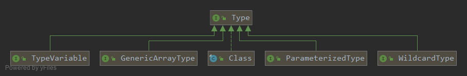
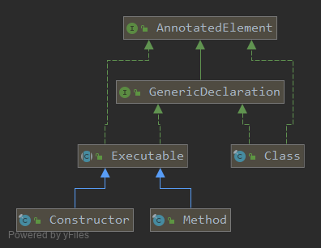

`Type` 描述反射中的类型结构：`Class`、`ParameterizedType`、`TypeVariable`、`WildcardType` 与 `GenericArrayType` 表达不同的信息。解析泛型时应按结构递归处理类型参数、边界、所有者与数组组件，不能把每个 `Type` 强转为 `Class`。

读取泛型信息需要从保留类型签名的声明入手。类型擦除意味着从普通对象的 `getClass()` 通常不能还原它创建时的所有泛型实参；带有泛型签名的字段、方法和父类声明才是本文示例的入口。普通数组可以由数组 `Class` 表达，泛型组件数组则可能由 `GenericArrayType` 表达。


## 具体实现

实现Type的具体类型一共有五种，分别是Class（原始类型）、ParameterizedType（参数化的类型、泛型类型）、TypeVariable（类型变量）、WildcardType（通配符类型）、GenericArrayType（数组类型）这五种java中的具体类型。



### Class

```java
public final class Class<T> implements java.io.Serializable,
                              GenericDeclaration,
                              Type,
                              AnnotatedElement {
   ......
}
```

java中每一个对象都有一个确定的Class，可以通过Object的getClass()方法或者`类名.class`等方法获取这个Class，拿到这个Class对象后我们就可以通过反射获取对象的一些特殊属性了。例如获取对象的Constructor、Method、Field等等。Class是java反射的基础，相关的方法调用就不再赘述了 。

### ParameterizedType

ParameterizedType表示参数化类型，例如`List<String>、Map<String,String>`就是参数化的的类型，也就是我们平时说的泛型。

```java
public interface ParameterizedType extends Type {

    // 获取源代码中泛型类型的实际参数
    Type[] getActualTypeArguments();

	// 获取泛型类型的本身类型
    Type getRawType();

    // 获取定义该泛型类型的类型，如果该泛型类型是顶级类型（非嵌套类）的话则返回null
    Type getOwnerType();
}
```
看一个具体的例子：

```java
package io.allurx;

import java.lang.reflect.ParameterizedType;
import java.util.Arrays;
import java.util.List;

/**
 * @author allurx
 */
public class ParameterizedTypeTest<T> {

    public static void main(String[] args) {
        class F<T> {
        }
        class E extends F<String> {

        }
        print(ParameterizedTypeTest.B.class);
        print(ParameterizedTypeTest.C.class);
        print(D.class);
        print(E.class);
    }

    private static void print(Class<?> clazz) {
        ParameterizedType type = (ParameterizedType) clazz.getGenericSuperclass();
        String str = clazz.getName() + "[" + Arrays.toString(type.getActualTypeArguments()) +
                "," +
                type.getRawType() +
                "," +
                type.getOwnerType() +
                "]";
        System.out.println(str);

    }

    static class A<T> {

    }

    static class B<T> extends ParameterizedTypeTest.A<T> {

    }

    static class C extends ParameterizedTypeTest.A<List<String>> {

    }
}

class D extends ParameterizedTypeTest<String> {
}

```

控制台输出

```java
io.allurx.ParameterizedTypeTest$B[[T],class io.allurx.ParameterizedTypeTest$A,class io.allurx.ParameterizedTypeTest]
io.allurx.ParameterizedTypeTest$C[[java.util.List<java.lang.String>],class io.allurx.ParameterizedTypeTest$A,class io.allurx.ParameterizedTypeTest]
io.allurx.D[[class java.lang.String],class io.allurx.ParameterizedTypeTest,null]
io.allurx.ParameterizedTypeTest$1E[[class java.lang.String],class io.allurx.ParameterizedTypeTest$1F,null]
```

在main方法中通过print方法分别打印B、C、D、E这四个类的ParameterizedType的父类，其中getActualTypeArguments方法明确的反映了父类在源码中的类型参数。getRawType方法则反映了ParameterizedType父类的实际类型。getOwnerType方法则反映了ParameterizedType父类所在类的类型，对于B、C来说它们的父类都是ParameterizedTypeTest$A，而ParameterizedTypeTest$A是被定义在ParameterizedTypeTest中的静态内部类，所以getOwnerType方法返回了io.allurx.ParameterizedTypeTest，而对于D、E来说它们的父类ParameterizedTypeTest和F都是单独定义的顶级类（非嵌套类）所以getOwnerType方法最终返回了null。

由于java类型擦除的原因，我们无法在运行时获取诸如T、O这种类型变量的实际类型，但是我们可以利用ParameterizedType的getActualTypeArguments方法定义一个`TypeToken`，通过new一个匿名的子类然后反射获取被擦出对象的实际类型。实际上很多第三方库例如Gson、guava都是通过这种方式来获取泛型的实际类型的。

#### 一个简单的TypeToken例子

```java
package io.allurx;

import java.lang.reflect.ParameterizedType;
import java.lang.reflect.Type;
import java.util.List;

/**
 * @author allurx
 */
public abstract class TypeToken<T> {

    private final Type runtimeType;

    public TypeToken() {
        Type superclass = getClass().getGenericSuperclass();
        if (!(superclass instanceof ParameterizedType)) {
            throw new IllegalArgumentException(getClass() + "必须是参数化类型");
        }
        runtimeType = ((ParameterizedType) superclass).getActualTypeArguments()[0];
    }
}

```

通过这个TypeToken我们就能够在运行时获取泛型类型的具体类型了

`new TypeToken<List<String>>() {}.getType() => java.util.List<java.lang.String>`

### TypeVariable

TypeVariable意为类型变量，也就是ParameterizedType中的变量，也就是我们常见的T、O这些泛型参数，例如`List<String>`中的String就是TypeVariable，而整个`List<String>`则代表着ParameterizedType。

```java
public interface TypeVariable<D extends GenericDeclaration> extends Type, AnnotatedElement {

    // 获取类型变量的所有上边界
    Type[] getBounds();

    // 获取定义类型变量的对象（Constructor、Class、Method这些能够定义类型变量的对象）
    D getGenericDeclaration();

    // 类型变量在源代码中的名称，例如T、O，返回的就是T、O
    String getName();

    // Java 8 引入，通过 AnnotatedType 读取类型使用位置上的注解
    AnnotatedType[] getAnnotatedBounds();
}

```

看一个具体的例子：

```java

package io.allurx;

import java.io.Serializable;
import java.lang.reflect.TypeVariable;
import java.util.Arrays;

/**
 * @author allurx
 */
public class TypeVariableTest<T extends Number & Cloneable & Serializable> {


    <O> TypeVariableTest(O o) {

    }

    private static <T> void test(T t) {

    }


    public static void main(String[] args) throws Exception {
        // 获取类上声明的类型变量
        print(TypeVariableTest.class.getTypeParameters()[0]);

        // 获取构造器定义的类型变量
        print(TypeVariableTest.class.getDeclaredConstructors()[0].getTypeParameters()[0]);

        // 获取方法定义的类型变量
        print(TypeVariableTest.class.getDeclaredMethod("test", Object.class).getTypeParameters()[0]);

    }

    private static void print(TypeVariable typeVariable) {
        System.out.println(typeVariable.getGenericDeclaration()
                + "["
                + typeVariable.getName()
                + ","
                + Arrays.toString(typeVariable.getBounds())
                + "]"
        );
    }

}

```
控制台输出：
```java
class io.allurx.TypeVariableTest[T,[class java.lang.Number, interface java.lang.Cloneable, interface java.io.Serializable]]
io.allurx.TypeVariableTest(java.lang.Object)[O,[class java.lang.Object]]
public static void io.allurx.TypeVariableTest.test(java.lang.Object)[T,[class java.lang.Object]]
```

从结果可以看出getName方法明确的反映了类型变量在定义在源码中的名称，getBounds方法反映了类型变量的按顺序定义的所有上边界，你可能会好奇为什么没有下边界，因为super关键字不能用在类型变量的定义上，只能用在通配符声明上。getGenericDeclaration方法则明确的反映了定义类型变量的对象。并且所有继承GenericDeclaration的对象都可以声明类型变量。



从上图的GenericDeclaration类图上我们可以看出Class和Executable都继承了它，而Constructor和Method继承了Executable，因此Class、Constructor、Method这三者都可以声明类型变量。

### WildcardType

WildcardType表示通配符类型表达式，例如`?`、`? extends Number`、`? super Integer`。

```java
public interface WildcardType extends Type {

    // 获取通配符的所有上边界（使用extends关键字），目前只能是一个，为了保持扩展返回数组
    Type[] getUpperBounds();

    // 获取通配符的所有下边界（使用super关键字），目前只能是一个，为了保持扩展返回数组
    Type[] getLowerBounds();
}
```

看一个具体的例子：

```java

package io.allurx;

import java.lang.reflect.ParameterizedType;
import java.lang.reflect.WildcardType;
import java.util.Arrays;
import java.util.List;

/**
 * @author allurx
 */
public class WildcardTypeTest<T> {

    public List<? extends Number> list1;

    public List<? super Number> list2;

    public List<? extends T> list3;

    public static void main(String[] args) throws Exception {
        ParameterizedType list1 = (ParameterizedType) WildcardTypeTest.class.getField("list1").getGenericType();
        ParameterizedType list2 = (ParameterizedType) WildcardTypeTest.class.getField("list2").getGenericType();
        ParameterizedType list3 = (ParameterizedType) WildcardTypeTest.class.getField("list3").getGenericType();
        print((WildcardType) list1.getActualTypeArguments()[0]);
        print((WildcardType) list2.getActualTypeArguments()[0]);
        print((WildcardType) list3.getActualTypeArguments()[0]);
    }

    private static void print(WildcardType wildcardType) {
        System.out.println("UpperBounds："
                + Arrays.toString(wildcardType.getUpperBounds())
                + ","
                + "LowerBounds："
                + Arrays.toString(wildcardType.getLowerBounds()));
    }
}

```

控制台输出：

```java
UpperBounds：[class java.lang.Number],LowerBounds：[]
UpperBounds：[class java.lang.Object],LowerBounds：[class java.lang.Number]
UpperBounds：[T],LowerBounds：[]
```

main方法中通过反射将WildcardTypeTest类中的三个ParameterizedType的集合中的WildcardType的类型参数的上边界和下边界分别打印出来了。

### GenericArrayType

GenericArrayType表示那些组件类型为ParameterizedType或TypeVariable的数组。（泛型数组）

```java
public interface GenericArrayType extends Type {

    // 获取数组内部元素的类型
    Type getGenericComponentType();
}
```

看一个具体的例子：

```java


package io.allurx;

import java.lang.reflect.GenericArrayType;
import java.util.List;

/**
 * @author allurx
 */
public class GenericArrayTypeTest<T> {

    public T[] array1;

    public T[][] array2;

    public List<String>[] array3;

    public List<?>[] array4;

    public static void main(String[] args) throws Exception {
        GenericArrayType array1 = (GenericArrayType) GenericArrayTypeTest.class.getDeclaredField("array1").getGenericType();
        GenericArrayType array2 = (GenericArrayType) GenericArrayTypeTest.class.getDeclaredField("array2").getGenericType();
        GenericArrayType array3 = (GenericArrayType) GenericArrayTypeTest.class.getDeclaredField("array3").getGenericType();
        GenericArrayType array4 = (GenericArrayType) GenericArrayTypeTest.class.getDeclaredField("array4").getGenericType();
        print(array1);
        print(array2);
        print(array3);
        print(array4);
    }

    private static void print(GenericArrayType genericArrayType) {
        System.out.println(genericArrayType.getGenericComponentType().getClass());
    }
}
```

控制台输出：

```java
class sun.reflect.generics.reflectiveObjects.TypeVariableImpl
class sun.reflect.generics.reflectiveObjects.GenericArrayTypeImpl
class sun.reflect.generics.reflectiveObjects.ParameterizedTypeImpl
class sun.reflect.generics.reflectiveObjects.ParameterizedTypeImpl
```

main方法中通过反射将GenericArrayTypeTest类中的四个GenericArrayType的字段的内部元素类型输出到控制台，可以发现getGenericComponentType方法明确的反映了元素的Type。**这里有一点需要注意的是如果数组内部的元素既不是ParameterizedType也不是TypeVariable，那么该数组代表的Type则是一个数组Class，而不是GenericArrayType**。

## 总结

Type作为Java编程语言中所有类型的通用超级接口，涵盖Class（原始类型）、ParameterizedType（参数化的类型、泛型类型）、TypeVariable（类型变量）、WildcardType（通配符类型）、GenericArrayType（数组类型），以Class为切入点将所有的类型串联起来了，方便我们通过反射在运行时解析复杂的数据类型。

## 资料来源

- [Type：反射类型的公共接口](https://docs.oracle.com/en/java/javase/25/docs/api/java.base/java/lang/reflect/Type.html)
- [ParameterizedType：类型参数与所有者](https://docs.oracle.com/en/java/javase/25/docs/api/java.base/java/lang/reflect/ParameterizedType.html)
- [GenericArrayType：泛型数组组件](https://docs.oracle.com/en/java/javase/25/docs/api/java.base/java/lang/reflect/GenericArrayType.html)
