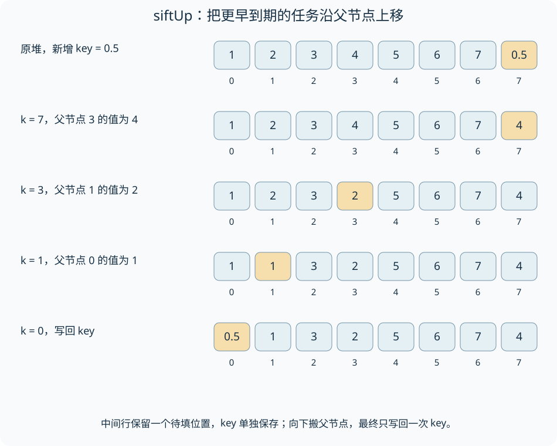
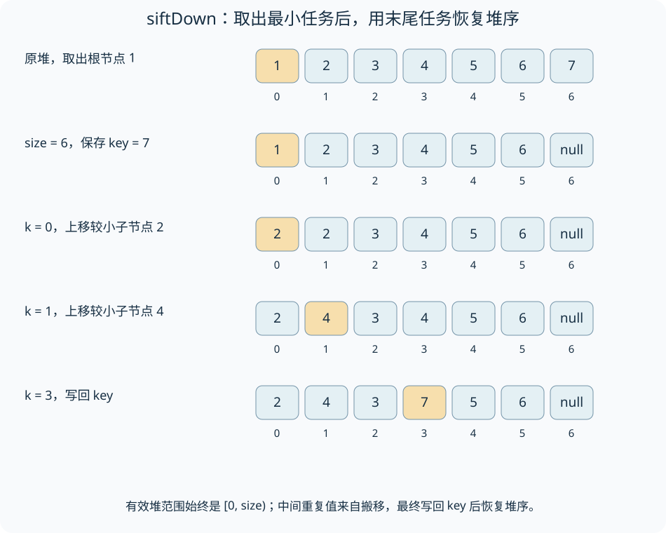

ScheduledThreadPoolExecutor 安排的是任务最早可以执行的时间，不是实时执行保证。固定频率按预定时间序列计算下一轮，固定延迟从上次完成后再计时；同一个周期任务不会重叠，某轮抛出异常会阻止后续正常周期。

本文先通过有限实验比较两种周期，再分析 [OpenJDK 8u202-b08](https://github.com/openjdk/jdk8u/blob/jdk8u202-b08/jdk/src/share/classes/java/util/concurrent/ScheduledThreadPoolExecutor.java) 中的任务包装、最小堆与 Leader-Follower 等待。需要理解 [线程池执行流程](/thread-pool-internals/) 和 [FutureTask 状态](/future-task/)。完整用法示例仅依赖标准库，已在 Windows、Oracle JDK 25.0.2（25.0.2+10-LTS-69）下编译运行。内部源码仍按 OpenJDK 8u202-b08 研究，不能把旧字段布局当作新版 JDK 的实现承诺。

## 用有限实验比较两种周期

先只运行一种周期任务，以免其他任务和线程数量干扰观察。每次工作休眠约 4 秒，周期或延迟设为 2 秒，共观察三次执行：固定频率的第二次任务会因第一次尚未完成而迟到；固定延迟则从每次完成后再等约 2 秒。输出记录相对程序起点的时间，包含调度误差，不是实时保证。

将下面代码保存为 `ScheduledThreadPoolExecutorDemo.java`。示例目标为 Java 25，只使用标准库，不需要 Lombok 或日志框架：

```shell
javac -encoding UTF-8 -d out ScheduledThreadPoolExecutorDemo.java
java -cp out io.allurx.ScheduledThreadPoolExecutorDemo rate
java -cp out io.allurx.ScheduledThreadPoolExecutorDemo delay
```

两条运行命令分别需要约 13 秒和 17 秒。main 等待三次工作完成后取消后续周期并关闭执行器；如果等待超时或主线程中断，finally 同样发出关闭请求。工作线程遇到中断会退出模拟耗时操作。

```java
package io.allurx;

import java.util.concurrent.CountDownLatch;
import java.util.concurrent.ScheduledFuture;
import java.util.concurrent.ScheduledThreadPoolExecutor;
import java.util.concurrent.TimeUnit;
import java.util.concurrent.atomic.AtomicInteger;

/**
 * @author allurx
 */
public class ScheduledThreadPoolExecutorDemo {

    public static void main(String[] args) throws InterruptedException {
        boolean fixedRate = args.length == 1 && args[0].equals("rate");
        if (!fixedRate && !(args.length == 1 && args[0].equals("delay"))) {
            throw new IllegalArgumentException("参数必须为 rate 或 delay");
        }

        ScheduledThreadPoolExecutor executor = new ScheduledThreadPoolExecutor(1);
        CountDownLatch completed = new CountDownLatch(3);
        AtomicInteger sequence = new AtomicInteger();
        long origin = System.nanoTime();
        Runnable work = () -> {
            int index = sequence.incrementAndGet();
            print(origin, index, "开始");
            try {
                TimeUnit.SECONDS.sleep(4);
                print(origin, index, "结束");
            } catch (InterruptedException exception) {
                Thread.currentThread().interrupt();
            } finally {
                completed.countDown();
            }
        };

        ScheduledFuture<?> future = fixedRate
                ? executor.scheduleAtFixedRate(work, 1, 2, TimeUnit.SECONDS)
                : executor.scheduleWithFixedDelay(work, 1, 2, TimeUnit.SECONDS);
        try {
            if (!completed.await(25, TimeUnit.SECONDS)) {
                throw new IllegalStateException("示例未在等待上限内完成");
            }
        } finally {
            future.cancel(true);
            executor.shutdownNow();
            if (!executor.awaitTermination(5, TimeUnit.SECONDS)) {
                throw new IllegalStateException("执行器未在等待上限内退出");
            }
        }
    }

    private static void print(long origin, int index, String event) {
        double seconds = (System.nanoTime() - origin) / 1_000_000_000.0;
        System.out.printf(java.util.Locale.ROOT, "%d %s %.3fs%n", index, event, seconds);
    }
}
```

rate 模式的前三次开始时间通常接近 1、5、9 秒；delay 模式通常接近 1、7、13 秒。这是由任务耗时与调度公式推导的观察范围，实际以本机打印结果为准。固定频率可能在主线程取消前开始第四次执行，因此边界处可能多一条“开始”记录；取消可以中断该次休眠，不会让同一周期任务重叠运行。

这次在上述环境中观察到以下记录。rate 的第四条开始记录展示了取消与下一轮开始之间的竞争，不代表并行执行：

```text
rate
1 开始 1.007s
1 结束 5.024s
2 开始 5.025s
2 结束 9.036s
3 开始 9.037s
3 结束 13.039s
4 开始 13.040s

delay
1 开始 1.008s
1 结束 5.042s
2 开始 7.047s
2 结束 11.049s
3 开始 13.062s
3 结束 17.075s
```

一次性调度则使用 `schedule(Runnable, delay, unit)` 或 `schedule(Callable, delay, unit)`：前者的 Future 在正常完成后返回 null，后者返回 Callable 的结果。周期 Future 在正常执行每一轮时不会完成；发生异常、取消或执行器终止相关处理后，调用者才会观察到终止状态。需要读取失败原因时保存 Future 并处理 get 抛出的 ExecutionException。


## 四种调度入口，组合成两类执行协议

| 入口 | 下一次执行的安排 | 正常完成后的 Future |
| --- | --- | --- |
| schedule(Runnable, delay, unit) | 一次性延迟 | 返回 null |
| schedule(Callable, delay, unit) | 一次性延迟 | 返回 Callable 结果 |
| scheduleAtFixedRate | initialDelay + n × period | 每轮正常结束不会完成 |
| scheduleWithFixedDelay | 上轮完成时刻 + delay | 每轮正常结束不会完成 |

负的一次性 delay 当作零处理；周期或固定延迟必须大于零。execute 和 submit 也被包装成延迟为零的一次性任务。调度时间已到但线程全忙时，任务仍需等待工作线程可用。

## ScheduledFutureTask 同时保存结果和时间

内部任务继承 FutureTask 并实现 RunnableScheduledFuture，组合了 Runnable 执行入口、Future 结果句柄、Delayed 剩余时间和 isPeriodic 标记。公开调用者通常拿到 ScheduledFuture，不承担执行任务的责任。

| 字段 | 用途 |
| --- | --- |
| time | 基于 nanoTime 的触发时刻，不是剩余时间 |
| period | 正数为固定频率、负数为固定延迟、零为一次性 |
| sequenceNumber | 触发时刻相同时的顺序依据 |
| outerTask | decorateTask 可能返回的包装任务，用于重新入队 |
| heapIndex | 任务在延迟堆中的位置 |

getDelay 用 time - now 计算剩余时间。比较两个内部任务时先比较触发时刻，时刻相同再比较序号；不能把墙上时钟回拨直接套到这套相对时间机制。

## 周期任务依靠 runAndReset 重新入队

一次性任务使用 FutureTask.run 发布结果。周期任务使用 runAndReset，只有业务正常完成且没有取消时，才计算下一次触发时刻并重新加入队列。异常会让 Future 终止，因此周期不会静默继续。

```java
public void run() {
    boolean periodic = isPeriodic();
    if (!canRunInCurrentRunState(periodic))
        cancel(false);
    else if (!periodic)
        ScheduledFutureTask.super.run();
    else if (ScheduledFutureTask.super.runAndReset()) {
        setNextRunTime();
        reExecutePeriodic(outerTask);
    }
}

private void setNextRunTime() {
    long p = period;
    if (p > 0)
        time += p;
    else
        time = triggerTime(-p);
}
```

固定频率保留预定时间序列，因此任务耗时超过周期后会迟到，后续可能紧接着执行，但不保证马上获得 CPU。固定延迟基于完成后的当前时刻，任务自身耗时会进入相邻开始时刻的间隔。

## 为什么 maximumPoolSize 不起常规扩容作用

构造器使用无界 DelayedWorkQueue，maximumPoolSize 为 Integer.MAX_VALUE。队列不会因达到一个业务容量限制而拒绝 offer，所以普通 ThreadPoolExecutor 的“入队失败再扩容”路径不承担调度并发控制；正常并行度主要由 corePoolSize 决定。

无界只表示没有配置固定上限，不表示内存无限。大量长延迟任务仍可能积压。取消任务默认也未必立即从延迟队列移除；需要该行为时了解 setRemoveOnCancelPolicy。关闭后是否继续一次性延迟任务或周期任务，则由相应关闭策略决定，不能只看 shutdown 是否已调用。

## 最小堆如何选择最早到期的任务

DelayedWorkQueue 用数组保存二叉最小堆。根节点是最早到期任务；节点 k 的父节点为 (k - 1) >>> 1，左右孩子为 2k + 1、2k + 2。只有 [0, size) 范围是有效堆，末尾空槽不参与比较。

插入时，siftUp 保存待插入的 key，沿父节点向上寻找位置，把较大的父节点向下搬，最后写回 key。中间出现重复数组值是搬移过程，不表示最终堆允许重复占用同一个槽。

```java
private void siftUp(int k, RunnableScheduledFuture<?> key) {
    while (k > 0) {
        int parent = (k - 1) >>> 1;
        RunnableScheduledFuture<?> e = queue[parent];
        if (key.compareTo(e) >= 0)
            break;
        queue[k] = e;
        setIndex(e, k);
        k = parent;
    }
    queue[k] = key;
    setIndex(key, k);
}
```

[](./images/min-heap-sift-up.svg)

取出根节点时，finishPoll 保存最后一个任务，把 size 减一并清空末尾，然后从根开始 siftDown。每层先选择较小孩子；key 不大于它时即可停止，否则把该孩子向上搬。

```java
private RunnableScheduledFuture<?> finishPoll(RunnableScheduledFuture<?> f) {
    int s = --size;
    RunnableScheduledFuture<?> x = queue[s];
    queue[s] = null;
    if (s != 0)
        siftDown(0, x);
    setIndex(f, -1);
    return f;
}
```

```java
private void siftDown(int k, RunnableScheduledFuture<?> key) {
    int half = size >>> 1;
    while (k < half) {
        int child = (k << 1) + 1;
        RunnableScheduledFuture<?> c = queue[child];
        int right = child + 1;
        if (right < size && c.compareTo(queue[right]) > 0)
            c = queue[child = right];
        if (key.compareTo(c) <= 0)
            break;
        queue[k] = c;
        setIndex(c, k);
        k = child;
    }
    queue[k] = key;
    setIndex(key, k);
}
```

[](./images/min-heap-sift-down.svg)

内部 ScheduledFutureTask 通过 heapIndex 可以 O(1) 定位，移除后恢复堆序仍是 O(log n)。被 decorateTask 包装成其他任务类型时，定位可能退化为线性扫描；不能把未包装任务的定位复杂度推广到所有任务。

## Leader-Follower 避免所有空闲线程一起定时等待

队列为空时，线程在 available 上普通等待。队头尚未到期时，只选一个 leader 按队头延迟定时等待，其余线程等待通知；leader 返回后释放这个角色，必要时唤醒另一个等待者。

```java
public RunnableScheduledFuture<?> take() throws InterruptedException {
    final ReentrantLock lock = this.lock;
    lock.lockInterruptibly();
    try {
        for (;;) {
            RunnableScheduledFuture<?> first = queue[0];
            if (first == null)
                available.await();
            else {
                long delay = first.getDelay(NANOSECONDS);
                if (delay <= 0)
                    return finishPoll(first);
                first = null; // don't retain ref while waiting
                if (leader != null)
                    available.await();
                else {
                    Thread thisThread = Thread.currentThread();
                    leader = thisThread;
                    try {
                        available.awaitNanos(delay);
                    } finally {
                        if (leader == thisThread)
                            leader = null;
                    }
                }
            }
        }
    } finally {
        if (leader == null && queue[0] != null)
            available.signal();
        lock.unlock();
    }
}
```

如果插入了一个更早到期的新根，offer 会把 leader 设为 null 并 signal，让等待者重新检查新的队头。原 leader 在 finally 中只在自己仍是 leader 时清空角色，避免覆盖别的线程已经建立的新角色。

这里的 leader 是等待策略，不是永久绑定到某个线程的身份。通知、超时、中断和虚假唤醒都可能使等待结束，所以 take 必须循环重读队头。队列取出任务只说明它已到期且取得执行机会，业务代码实际何时开始还受线程调度影响。

## 极大延迟为什么需要 overflowFree

触发时刻和比较差值都存放在 long 中。新延迟接近 Long.MAX_VALUE，而队头已过期时，delay - headDelay 可能溢出，错误反转时间顺序。overflowFree 检查这一组合，把延迟限制到能保持相对时间差可比较的范围；它处理的是极大差值，不是把 nanoTime 当作永不溢出的绝对时间。

完整的 decorateTask、取消、关闭策略与溢出处理见固定版本源码。业务使用调度器时，应同时明确任务耗时、异常停止、取消行为、积压数量和关闭策略，而不是只指定一个 period。

## 资料来源

- [OpenJDK 8u202-b08 ScheduledThreadPoolExecutor：完整任务与队列实现](https://github.com/openjdk/jdk8u/blob/jdk8u202-b08/jdk/src/share/classes/java/util/concurrent/ScheduledThreadPoolExecutor.java)
- [ScheduledThreadPoolExecutor：队列、取消移除与关闭策略](https://docs.oracle.com/en/java/javase/25/docs/api/java.base/java/util/concurrent/ScheduledThreadPoolExecutor.html)
- [ScheduledExecutorService：固定频率与固定延迟](https://docs.oracle.com/en/java/javase/25/docs/api/java.base/java/util/concurrent/ScheduledExecutorService.html)
