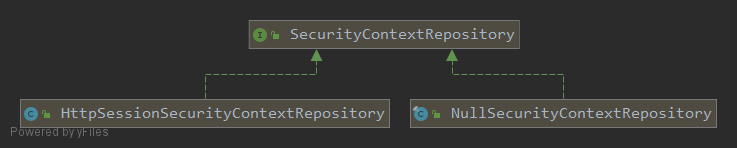
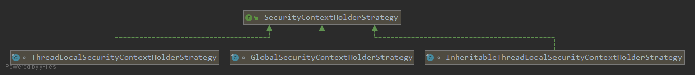

登录成功后，浏览器再请求个人页面，应用为什么还知道用户是谁？反过来，处理登录请求的工作线程随后可能去服务另一个用户，为什么不能继续保留上一人的身份？前一个问题需要跨请求保存认证，后一个问题需要在请求结束时清理线程绑定。

`SecurityContextPersistenceFilter` 把这两件事连接起来：进入请求时从仓库加载上下文，让下游代码通过 Holder 访问；离开请求时保存需要保留的结果，并解除当前线程的绑定。

本文以 **Spring Boot 2.1.5.RELEASE / Spring Security 5.1.5.RELEASE** 的 Servlet 源码为准，前置知识是[上下文与认证令牌](/spring-security-basics/)。源码分别见 [SecurityContextPersistenceFilter](https://github.com/spring-projects/spring-security/blob/5.1.5.RELEASE/web/src/main/java/org/springframework/security/web/context/SecurityContextPersistenceFilter.java) 和 [HttpSessionSecurityContextRepository](https://github.com/spring-projects/spring-security/blob/5.1.5.RELEASE/web/src/main/java/org/springframework/security/web/context/HttpSessionSecurityContextRepository.java)。

文中框架源码摘录来自所链接的固定版本，版权归 Spring 项目原作者，按 [Apache License 2.0](https://www.apache.org/licenses/LICENSE-2.0) 提供。省略部分通过原始实现查阅，摘录不作为独立 Java 程序编译。

## 先区分仓库、Holder 和上下文对象

| 对象 | 负责的生命周期 |
| --- | --- |
| SecurityContext | 保存本次使用的 Authentication |
| SecurityContextHolder | 给当前执行上下文提供访问入口，委托内部策略保存绑定 |
| SecurityContextRepository | 跨请求加载或保存上下文 |
| SecurityContextPersistenceFilter | 把仓库与请求执行过程连接起来 |

清理 Holder 只是解除当前线程对上下文的绑定，不意味着删除会话里的对象；创建一个空 SecurityContext，也不意味着已经创建 HttpSession。

## 沿一次请求看加载、执行与保存

### 请求进入时，从已有会话读取上下文

过滤器的默认构造器使用 HttpSessionSecurityContextRepository。仓库先调用 `request.getSession(false)`，按 `SPRING_SECURITY_CONTEXT` 属性名读取已有上下文；没有会话、没有属性或属性类型不正确时，返回新的空上下文。

[](./images/security-context-repository.png)

NullSecurityContextRepository 每次提供空上下文且不保存，适合不需要仓库存储的配置。它改变的是仓库存取，并不会自动替应用设计好所有无状态认证行为。

`forceEagerSessionCreation` 是过滤器自己的提前创建会话选项，默认 false；仓库的 `allowSessionCreation` 默认 true。一个决定是否提前创建，另一个决定保存时是否允许新建，不能混用。

### 执行下游前绑定，返回时先清理线程

过滤器用 HttpRequestResponseHolder 把请求和响应交给仓库，因为仓库可能替换为包装对象。主生命周期如下，省略了日志和请求重入标记：

```java
HttpRequestResponseHolder holder = new HttpRequestResponseHolder(request, response);
SecurityContext contextBeforeChainExecution = repo.loadContext(holder);
try {
    SecurityContextHolder.setContext(contextBeforeChainExecution);
    chain.doFilter(holder.getRequest(), holder.getResponse());
}
finally {
    SecurityContext contextAfterChainExecution = SecurityContextHolder.getContext();
    SecurityContextHolder.clearContext();
    repo.saveContext(contextAfterChainExecution, holder.getRequest(), holder.getResponse());
    request.removeAttribute(FILTER_APPLIED);
}
```

注意三个顺序关系：必须把仓库返回的包装请求和响应传给下游；保存的是下游执行后 Holder 当前持有的上下文；先清理线程绑定，再执行最终仓库保存。这样仓库保存失败时，也不会让后续复用该线程的请求继续拿到旧绑定。

请求属性 `FILTER_APPLIED` 使同一请求的嵌套调用不会重复进入整个加载与清理流程。这不是“所有 Servlet 分派都会无条件只调用一次”的抽象保证，实际入口仍要结合代理注册的 dispatcher types 理解。

### 登录重定向可能提前触发保存

HttpSessionSecurityContextRepository 在 loadContext 时安装响应包装器。下游调用 sendRedirect、sendError 或提交响应时，包装器可能提前保存，避免等响应提交后才尝试创建会话。最后的 saveContext 会检查是否已经保存，避免同一请求重复执行这一步。

因此，观察登录跳转时，不能只在过滤器 finally 处寻找首次写会话的位置，也不能丢弃仓库提供的响应包装对象。

#### 哪些上下文会进入会话

| 情况 | 该版本的处理边界 |
| --- | --- |
| Authentication 为 null 或匿名 | 不把它作为已登录上下文存入会话，必要时清除此前的会话属性 |
| 已有会话且上下文或认证引用改变，或属性缺失 | 写入当前上下文 |
| 没有会话 | 只有允许新建、上下文不是默认空值且没有其他禁止条件时才创建 |
| 会话在本次请求中被失效处理 | 不为了保存上下文立即重建 |
| Authentication 标记为 Transient | 不为它新建保存用会话 |

这里的“改变”包含对象引用比较，不是对整个认证对象做深度变化检测。完整条件应以固定版本的 SaveToSessionResponseWrapper 为准。

## Holder 策略决定绑定放在哪里

[](./images/security-context-holder-strategy.png)

| 策略 | 适用边界 |
| --- | --- |
| ThreadLocalSecurityContextHolderStrategy | 默认策略，每个线程持有自己的绑定 |
| InheritableThreadLocalSecurityContextHolderStrategy | 创建子线程时继承；不等于线程池每次提交任务都重新传递 |
| GlobalSecurityContextHolderStrategy | JVM 范围共享，不适合作为多用户 Web 请求隔离方式 |

Holder 的策略可由系统属性或配置入口选择，但不应在活跃请求中反复改变全局策略。跨线程任务需要相应传播和清理机制，单纯切到可继承策略不能覆盖线程池复用场景。

还有一个不同层次的边界：线程绑定彼此独立，不等于绑定的 SecurityContext 对象一定是副本。默认会话仓库可以把同一个会话对象交给并发请求；临时改身份时不应假定修改共享对象完全只影响当前线程。[该版本的上下文说明](https://docs.spring.io/spring-security/site/docs/5.1.5.RELEASE/reference/htmlsingle/#technical-overview)

## 按两个连续请求验证生命周期

第一次请求完成登录时，认证过滤器把成功结果放进上下文。保存路径将它关联到会话，随后过滤器清理 Holder。此时当前线程不再持有绑定，但会话仍保存着认证，这是正常的结束状态。

第二次请求携带同一个会话标识，仓库才能取回认证并重新绑定；不携带会话时，则应从空上下文开始。排查“登录后下一页又要求登录”时，沿这两个请求检查会话标识、仓库读取和保存时机；排查线程身份残留时，检查请求结束后的 Holder 清理。两类问题的观察点不同。
