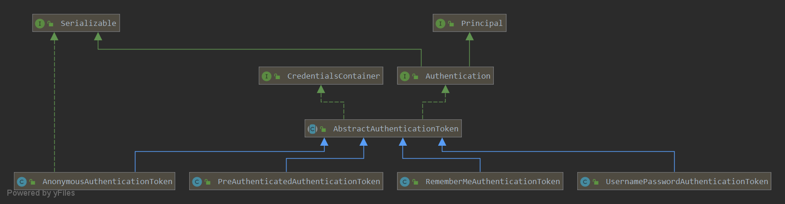

Spring Security 的认证与授权都围绕当前主体展开，但“上下文里有一个 Authentication”不等于“用户已经完成真实登录”。先把请求入口、上下文、令牌和权限分开，再观察一次默认登录，后续过滤器源码才有清楚的参照。

本文固定分析 **Spring Boot 2.1.5.RELEASE / Spring Security 5.1.5.RELEASE** 的历史 Servlet 表单链，使用 **Eclipse Temurin JDK 11.0.32.1+1、Apache Maven 3.10.0**。JDK 11 位于 Boot 2.1.5 声明的 Java 8—11 兼容范围；这些旧依赖用于学习历史实现，不是当前新项目推荐。[该版本运行要求](https://docs.spring.io/spring-boot/docs/2.1.5.RELEASE/reference/html/getting-started-system-requirements.html)

这个固定版本适合维护旧系统或对照过滤链机制的演进。新项目应从 [当前 Servlet 安全架构](https://docs.spring.io/spring-security/reference/servlet/architecture.html)和 [Spring Boot 当前文档](https://docs.spring.io/spring-boot/)选择配置与受支持依赖，不应直接把下面的历史 POM 用于新服务。

## 先启动只有一个受保护接口的工程

下载 [完整 POM](./pom.xml) 和 [SecurityBasicsApplication.java](./SecurityBasicsApplication.java)，把入口放到 `src/main/java/io/allurx/SecurityBasicsApplication.java`。POM 继承 `spring-boot-starter-parent:2.1.5.RELEASE`，同时包含 Web 与 Security starter；不要只加安全依赖却假定已经有 Servlet Web 应用。

可在 `src/main/resources/application.yml` 添加调试日志：

```yaml
logging:
  level:
    org.springframework.security: debug
```

在项目根目录执行：

```sh
java -version
mvn -version
mvn package
java -jar target/historical-security-basics-demo-1.0.0.jar
```

应用仅提供 `GET /`，成功访问时返回 `authenticated`。未自定义用户时，默认用户名为 user，当前启动生成的密码在开发日志中；这个配置不承担真实账号管理职责。

浏览器访问 `http://localhost:8080/` 会被引导到默认登录页。输入错误凭据时返回失败页，正确登录后再请求受保护接口；API 客户端使用其他 Accept 头时也可能得到 HTTP Basic 的 401 入口，不能把浏览器的一次重定向当作所有客户端的统一响应。

该完整工程已在上述 JDK/Maven 的 Windows 11 x64 环境构建，并核对未认证 API 的 401、HTML 入口的登录重定向及正确/错误 HTTP Basic 凭据的 200/401。浏览器还完成了错误表单反馈、成功登录返回原资源、确认退出和退出后重新要求登录的流程；它不代表其他自定义认证方式也已验证。

## 请求先选链，再执行链内职责

```text
Servlet 代理
  → FilterChainProxy
    → 第一条匹配的 SecurityFilterChain
      → 上下文、认证、匿名、异常转换、授权等过滤器
        → 原始 Servlet 链与业务处理
```

一个 FilterChainProxy 可以持有多条安全链，但只选择第一条匹配链。链内过滤器也可以提前响应而不再继续，所以“经过安全入口”不等于每个过滤器都执行到了。

默认表单场景的日志中可见以下链条；这是本文版本与配置的观察对象，不是任何应用的固定清单：

```text
WebAsyncManagerIntegrationFilter
SecurityContextPersistenceFilter
HeaderWriterFilter
CsrfFilter
LogoutFilter
UsernamePasswordAuthenticationFilter
DefaultLoginPageGeneratingFilter
DefaultLogoutPageGeneratingFilter
BasicAuthenticationFilter
RequestCacheAwareFilter
SecurityContextHolderAwareRequestFilter
AnonymousAuthenticationFilter
SessionManagementFilter
ExceptionTranslationFilter
FilterSecurityInterceptor
```

先关注职责而不是死记序号：上下文过滤器为请求准备身份载体，认证过滤器尝试建立真实身份，匿名支持补齐尚无身份的路径，授权组件判断资源是否允许访问，异常转换再把下游拒绝变成响应。[FilterChainProxy 选择过程](/filter-chain-proxy/)

## SecurityContext 保存当前使用的认证信息

SecurityContext 的核心是一个 Authentication。默认 SecurityContextImpl 实现这个存取接口；SecurityContextHolder 则通过内部策略提供当前执行上下文的访问入口，默认策略使用 ThreadLocal。

| 名称 | 含义 |
| --- | --- |
| SecurityContext | 当前使用的安全上下文对象 |
| Authentication | 主体、凭据、权限与认证状态的载体 |
| SecurityContextHolder | 当前执行上下文访问 SecurityContext 的入口 |
| SecurityContextRepository | 需要跨请求时，负责加载与保存上下文 |

线程绑定与跨请求保存不是同一件事。默认会话方案在请求结束时清理 Holder，又可在下次请求从会话恢复认证；无状态配置则可能每次都重新认证。[上下文生命周期](/security-context-persistence/)

## Authentication 的字段不是同一种信息

[](./images/authentication.png)

Authentication 同时扩展 Principal 和 Serializable。它的主要方法可以按职责理解：

| 方法 | 返回或表达什么 |
| --- | --- |
| getPrincipal | 被认证的主体；可先是用户名，成功后通常是更完整的用户对象 |
| getCredentials | 用于认证的凭据，例如密码；成功后可能被擦除 |
| getAuthorities | 当前主体持有的 GrantedAuthority 集合 |
| getDetails | 与认证请求有关的额外信息，例如 IP 和会话标识 |
| isAuthenticated | 框架是否可把当前令牌视作已认证结果；不是通用的“用户已真实登录”判断 |
| setAuthenticated | 改变令牌信任状态的接口，具体实现可能限制将其直接设为 true |

主体、凭据和请求详情应分开处理。不要把 details 当作用户数据库记录，也不要假定成功后仍可取回密码。[Authentication 5.1.5 API](https://docs.spring.io/spring-security/site/docs/5.1.5.RELEASE/api/org/springframework/security/core/Authentication.html)

## 令牌类型与认证状态要一起看

UsernamePasswordAuthenticationToken 和 PreAuthenticatedAuthenticationToken 提供用于请求与成功结果的不同构造方式；AnonymousAuthenticationToken 和 RememberMeAuthenticationToken 代表另外两种身份来源。

| 令牌场景 | 如何理解 |
| --- | --- |
| 提交用户名密码、尚未验证 | 是认证请求，不应携带被随意信任的权限 |
| 提供者验证成功后的令牌 | 表达认证结果，带相应主体与权限 |
| 匿名令牌 | 方便统一授权路径，不表示访问者输入过真实凭据 |
| Remember-Me 令牌 | 表达记住我方式恢复的身份，不等于本次完成了完整凭据认证 |

匿名令牌的 authenticated 可以为 true，所以授权规则还会用 AuthenticationTrustResolver 区分身份来源；仅凭 isAuthenticated 做业务登录判断容易丢失这个边界。[匿名支持](/anonymous-authentication/)、[认证管理器](/authentication-manager/)

## 认证回答身份，授权决定操作

成功认证后，访问仍可能被拒绝，因为主体没有资源所需权限。反过来，公开资源可能允许匿名访问，却不能因此把匿名访问者当成已登录用户。

后续可以沿两条主线继续：启动阶段由 [自动配置](/security-auto-config-overview/)准备对象；请求阶段从 [用户名密码过滤器](/username-password-filter/)取得凭据，经认证管理器建立身份，再由 [FilterSecurityInterceptor](/filter-security-interceptor/)检查规则。两条主线连接起来后，配置变化与 HTTP 结果才有完整解释。
