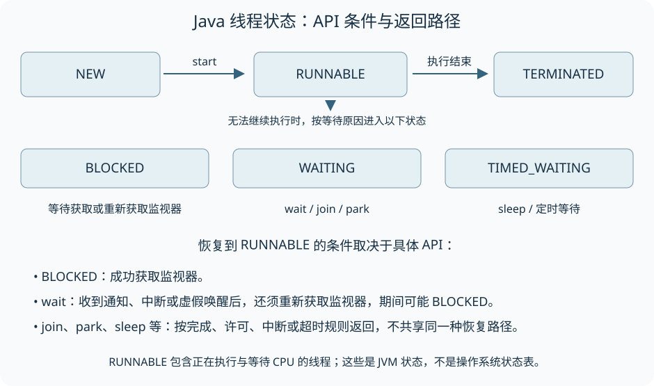

创建一个 `Thread` 对象后，代码还没有开始并行执行。调用 `start()` 才会启动新的执行流程；如果直接调用 `run()`，任务仍在当前线程里完成。

从创建到结束，一条线程会经历不同状态。理解这些状态以后，才能读懂线程转储中的等待，判断程序为什么没有退出，也能知道优先级到底能帮上什么忙。

本文以平台线程为范围。示例仅依赖标准库，已在 Windows、Oracle JDK 25.0.2（25.0.2+10-LTS-69）下编译运行。公开行为以 Java SE 25 的 `Thread` API 为准。

## 创建对象、启动与结束是三个阶段

new Thread 只是创建对象，尚未启动独立执行流程。start 调用只能成功一次，线程结束后也不能再次 start；需要重复执行工作，应创建新的线程或使用执行器。run 中可以执行构造时传入的 Runnable，也可以由子类重写，不是两套不同的线程调度机制。

例如，主线程创建了负责下载文件的线程，调用 `start()` 后就可以继续处理界面或提交其他工作。下载何时完成需要另行等待；`start()` 返回只说明启动调用已经完成。即使下载线程已经退出，也不能再次启动同一个 `Thread` 对象，因为一个对象只代表这一次线程生命周期。

## 从线程状态判断它在等什么

### 六种状态的含义

| 状态 | 典型条件 |
| --- | --- |
| NEW | 已构造但未启动 |
| RUNNABLE | JVM 中可运行，可能正在执行，也可能等待 CPU 等资源 |
| BLOCKED | 等待进入或重新进入 synchronized 监视器 |
| WAITING | 无时限的 wait、join 或 park 等等待 |
| TIMED_WAITING | sleep、带超时的 wait/join/park 等等待 |
| TERMINATED | 执行已经结束，包括因未捕获异常退出 |

[](./images/thread-state-transitions.svg)

### 状态只是观察结果

getState 只是读取那一刻的状态，不能作为同步协议。start 返回后，新线程可能已经等待甚至结束，因此不能断言下一行 getState 必然为 RUNNABLE。

Object.wait 释放目标监视器；通知、中断或虚假唤醒之后，还要重新取得监视器。竞争时可能表现为 BLOCKED，取得后才继续执行。LockSupport.park 则基于许可等待，不能把它的返回路径画成必经监视器竞争。详见 [线程常用方法](/thread-methods/) 与 [LockSupport](/lock-support/)。

## 优先级不提供顺序保证

平台线程的优先级范围是 1 到 10，NORM_PRIORITY 为 5。新线程继承创建者优先级，并受所属线程组最大优先级约束；并不是每个构造环境都固定得到 5。

优先级如何映射到操作系统调度取决于实现，有的平台可能忽略它。即使某线程优先级更高，也不能据此推导它先打印、先获取锁或先完成。要求顺序时应使用锁、条件、join 或其他明确同步关系。

## 守护属性影响 JVM 何时结束

平台线程默认继承创建者的守护属性；必须在启动前调用 setDaemon 调整。JVM 不会为了尚未完成的守护线程保持进程存活，所以守护线程不适合承载必须可靠完成的提交、文件刷新等收尾动作。

保存为 DemoApplication.java，执行 `javac -encoding UTF-8 -d out DemoApplication.java`、`java -cp out io.allurx.DemoApplication`。

```java
package io.allurx;

public class DemoApplication {

    public static void main(String[] args) {
        print();
        UserThread userThread = new UserThread("UserThread");
        DaemonThread daemonThread = new DaemonThread("DaemonThread");
        daemonThread.setDaemon(true);

        userThread.start();
        daemonThread.start();
    }

    static class UserThread extends Thread {

        UserThread(String name) {
            super(name);
        }

        @Override
        public void run() {
            print();
            try {
                Thread.sleep(1000);
            } catch (InterruptedException e) {
                e.printStackTrace();
            }
        }
    }

    static class DaemonThread extends Thread {

        DaemonThread(String name) {
            super(name);
        }

        @Override
        public void run() {
            print();
            new Thread(DemoApplication::print).start();
            new Thread(() -> {
                try {
                    Thread.sleep(1000);
                    print();
                } catch (InterruptedException e) {
                    e.printStackTrace();
                }
            }).start();
        }
    }

    static void print() {
        System.out.println(Thread.currentThread().getName() + ":" + Thread.currentThread().isDaemon());
    }

}
```

输出中，main、UserThread 的守护标记为 false，DaemonThread 以及它创建的子线程为 true。两个子线程是否都有机会打印，取决于调度和最后一个非守护线程结束的时刻，因而不应给这段程序指定一份固定行数的输出。

可以特别观察那个先休眠的子线程：它还没醒来时，如果 UserThread 已结束，JVM 就可能退出。把线程设为守护线程没有取消任务，只是允许进程不再等待它。

判断程序能否退出，应查看仍存活的非守护线程；判断某项工作是否完成，则应等待该工作自己的完成信号。二者不能用守护属性互相替代。

## 资料来源

- [Thread：生命周期、优先级与守护属性](https://docs.oracle.com/en/java/javase/25/docs/api/java.base/java/lang/Thread.html)
- [Thread.State：JVM 状态的定义](https://docs.oracle.com/en/java/javase/25/docs/api/java.base/java/lang/Thread.State.html)
