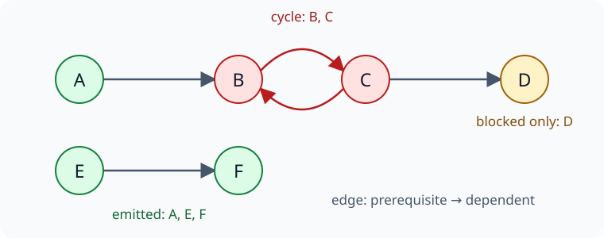

构建系统、数据处理流水线和模块初始化经常需要回答同一个问题：已知任务之间的先后约束，能不能安排一个合法的执行顺序？拓扑排序可以解决这个问题，也能发现循环依赖。但当算法返回一组“无法继续处理的节点”时，把它们全部标成“环上的节点”会误导排查。

例如 B 与 C 相互等待，D 只依赖 C。D 本身没有参与循环，却同样无法开始。本文通过 Kahn 算法的入度消除过程，解释这种差别，并给出一个可直接运行的 JavaScript 示例。讨论限于**有限、固定的有向图**，每条依赖都必须满足，不包含“多个前置任务完成任意一个即可”的选择关系。

## 先把依赖的方向说清楚

把任务表示为节点。如果 U 必须先于 V，本文画一条 `U → V` 的边。箭头从前置任务指向后继任务，不是从任务指向“它所依赖的对象”。不同 API 的输入习惯可能不同，建图时必须先转换成一致语义。

一个完整的拓扑序需要包含每个节点恰好一次，并让每条边的起点都出现在终点之前。有向无环图通常缩写为 DAG；只有不含有向环的图才能拥有完整拓扑序。[MIT 6.006 的拓扑排序讲义](https://ocw.mit.edu/courses/6-006-introduction-to-algorithms-spring-2020/d9265b3b33d238ff914b0223ac8e7628_MIT6_006S20_r10.pdf)给出了这种定义及其与环检测的联系。

这不是按名称或数值大小排序。如果两个任务没有先后约束，它们在结果中的相对位置可以不同。算法返回一个确定顺序，不代表该图只有这一个合法顺序。

下面这张图包含六个节点，边是 `A → B`、`B → C`、`C → B`、`C → D` 和 `E → F`。颜色区分的是算法最终的状态，不是额外的依赖规则。



B、C 构成循环；A 虽然指向这个循环，但它没有前置依赖；E、F 则是一条独立的任务链。D 只有入边，没有出边，所以它不可能位于任何有向环上。

## 入度必须表示还没有消除的前置约束

一个节点的**入度**是指向它的边数。Kahn 算法先找出入度为 0 的节点，将它们放入就绪队列。每取出一个节点，就把它加入结果，并消除它发出的边；某个后继节点的剩余入度降到 0 时，再将其入队。[NetworkX 的官方拓扑排序教程](https://networkx.org/nx-guides/content/algorithms/dag/index.html)介绍了这一算法。

在这个过程中，最关键的不变量是：对于还未输出的节点，其当前入度等于**来自还未输出节点的入边数量**。它不是图最初的入度，也不只是“曾经发现过多少前置任务”。

如果某节点入度为 0，它的全部前置节点都已经输出，因此把它放在结果末尾不会违反依赖。这个性质在每一步都成立，就保证了已输出序列中各节点的前置约束已经得到满足。

对上图使用先进先出队列，并按 A、B、C、D、E、F 的顺序初始化节点，过程如下：

| 阶段 | 未输出节点中的入度变化 | 队列中等待处理的节点 | 已输出序列 |
| --- | --- | --- | --- |
| 初始化 | A=0，B=2，C=1，D=1，E=0，F=1 | A、E | 空 |
| 输出 A | B 从 2 降到 1，仍有 C 指向它 | E | A |
| 输出 E | F 从 1 降到 0 | F | A、E |
| 输出 F | 没有新的节点变为 0 | 空 | A、E、F |

队列已经为空，但 B、C、D 还没有输出。B 等待 C，C 等待 B，D 等待 C。此时得到的是一个依赖合法的**部分序列**，不是六个节点的完整拓扑序。

算法并没有漏看 A 的作用：`A → B` 已经消除了。B 剩下的那条入边来自 C，所以再次处理 A 或者不断重试 B 都不会改变阻塞状态。

## 剩余集合包含环，也包含环的所有下游

对固定图完整执行上述消除过程后，可以作出一个比“图里有环”更精确的判断：

**剩余节点恰好是有向环上的节点，以及从这些环沿箭头能够到达的节点。**

这里的“下游”包括经过多条边才能到达的节点。这个结论可以从三个方向证明，不需要依赖示例中的特殊形状。

首先，环上的节点不会被输出。假设某个环上存在第一个被输出的节点，那么在输出它之前，环内指向它的那个前驱一定还未输出。这条入边还在，它的入度就不可能为 0，与入队条件矛盾。

其次，环的下游节点也不会被输出。环上的节点始终保留，那么它直接指向的节点就至少保留一条入边；沿着任意一条从环出发的路径逐步推下去，整条路径上的节点都会保留。即使一个节点还有其他已经完成的前置任务，只要来自这条路径的约束尚未解除，它仍然不能入队。

最后，剩余集合里不会凭空出现与任何环都无关的节点。算法停止时，每个剩余节点都有至少一个仍在剩余集合内的前驱，否则它早已因入度归零而入队。任选一个剩余节点 V，沿着入边不断向前追溯。图是有限的，追溯过程必然重复遇到某个节点，形成一个有向环。把追溯链按边的正方向读回来，就得到从这个环通往 V 的路径。

因此，B、C、D 全部出现在剩余集合里，并不说明 D 也参与循环。更合适的变量名是 `blocked`，而不是 `cycleNodes`。前者描述受影响范围，后者则暗示已经完成了更精确的结构分析。

A 也说明了方向的重要性：它是环的上游，不是从环可达的下游，所以能够被消除。“只要与环相连就会剩下”同样不正确。

## 一个保留阻塞信息的 JavaScript 实现

完整示例见 [topological-sort-demo.mjs](./topological-sort-demo.mjs)。输入由节点列表和 `[from, to]` 边列表组成，节点使用字符串。节点列表独立提供，因此没有任何边的孤立节点也不会丢失。

程序使用 `Map` 保存每个节点的后继集合与当前入度。重复的节点声明和重复边会被合并；边的端点不在节点列表中则报错。这里把重复边解释成同一个前置约束，因而新增后继和增加入度必须一起去重。如果只在后继集合中去重，却对入度重复计数，消除一条边时就会留下无法清零的虚假依赖。

初始化完成后，核心循环如下。`ready` 最初包含全部零入度节点，`successors` 的值是去重后的后继集合：

```javascript
const order = [];

for (let head = 0; head < ready.length; head += 1) {
  const node = ready[head];
  order.push(node);

  for (const target of successors.get(node)) {
    const remaining = indegree.get(target) - 1;
    indegree.set(target, remaining);
    if (remaining === 0) ready.push(target);
  }
}

const blocked = vertices.filter(node => indegree.get(node) > 0);
return { order, blocked };
```

`head` 表示队首位置，追加的节点会在后续迭代中处理。这样不必反复对数组执行 `shift()`，也不需要每轮重新扫描所有节点寻找零入度节点。

每个节点最多入队一次，每条去重后的边最多在其起点输出时访问一次。在将 `Map`、`Set` 的查询和更新视为平均常数时间的常用实现模型下，建图及排序需要 `O(V + E)` 时间和空间；这里 `E` 按输入边记录数计算，重复记录仍然需要读取。图分析本身不包含真实任务的运行时间。

下载附件后，在其所在目录运行：

```sh
node topological-sort-demo.mjs
```

示例只依赖 Node.js 标准库。在 Linux、Node.js 24.19.0 下，输出如下：

```text
cyclic: order=A,E,F; blocked=B,C,D
repaired: order=A,E,B,F,C,D; blocked=(none)
self-loop: order=(none); blocked=X,Y
```

第一行对应配图。第二行从示例输入中移除了 `C → B`，原来的循环被打断，六个节点都能输出。程序还逐条检查每条边的起点是否早于终点，而不仅仅检查输出数量。

这里移除边是为了观察结构变化，意味着**改变了被建模的要求**，不是建议调度器随意删边“自动修复”循环。实际系统中必须先确认哪条依赖定义有误，或者重新拆分任务职责。

第三行单独检查 `X → X` 和 `X → Y`。自环已经构成循环，所以 X 不能开始；Y 不在环上，但依然被阻塞。附件也对空图、孤立节点和重复边进行了断言，覆盖建图约定对结果的影响。

## 想报告具体的环，需要继续分析什么

Kahn 算法回答了能否形成完整顺序，也给出了无法消除的范围，但它没有返回一条闭合的循环路径。错误提示如果要明确指出“B 依赖 C，C 又依赖 B”，还需要额外的环定位步骤。

一种做法是在剩余子图上执行深度优先搜索（DFS），区分尚未访问、仍在当前搜索路径中、已经结束的节点。发现一条边指向当前路径上的祖先时，该边和路径中的对应片段就构成一个环。只用一个“曾经访问过”的标记不够：指向已结束分支的边，并不一定产生环。前面的 MIT 讲义也给出了利用 DFS 回边恢复环的办法。

如果需要一次找出所有参与循环的节点，可以计算**强连通分量**：在同一分量中，任意两个节点都能沿有向路径相互到达，而且这个集合不能再扩张而仍保持该性质。包含至少两个节点的强连通分量内，每个节点都参与某个有向环；只包含一个节点时，还要检查它是否有自环。可参考 [NetworkX 的强连通分量接口](https://networkx.org/documentation/stable/reference/algorithms/generated/networkx.algorithms.components.strongly_connected_components.html)。

本例的循环分量是 `{B, C}`，而 `{D}` 是没有自环的单节点分量。这样就能分别报告“循环依赖涉及 B、C”和“D 因上游循环而阻塞”，避免把受影响任务误当成问题根源。找出一个环也不代表图中只有这一个环，修复后仍需重新分析整张图。

## 排序过程不等于真实任务已经完成

示例中的“输出节点、消除出边”是同步的图计算步骤，没有执行实际任务。如果系统要求整个计划合法后才能产生任何副作用，应先检查 `blocked` 为空，再开始执行；不要一边枚举部分结果一边运行任务，最后才发现整体无法完成。

若允许在有环时仍推进互不受阻的任务，也必须明确这是业务策略。Python 3.12 的 [`graphlib.TopologicalSorter`](https://docs.python.org/zh-cn/3.12/library/graphlib.html)支持在检测到 `CycleError` 后继续获取能够就绪的节点；异常提供的是一个被发现的环，并不等于全部受阻节点。

并行调度还需要把“已经派发”与“已经完成”分开。派发任务 U 后，应等它真正完成并满足依赖要求，再解除 `U → V`，而不是一派发就让 V 开始。上述接口也将 `get_ready()` 与 `done()` 分开表达这两个阶段。

因此，在异步执行器中，就绪队列暂时为空不能单独证明存在环：可能还有运行中的任务尚未完成，也可能是失败处理策略没有释放后继。本文“队列为空且仍有剩余节点就说明有环”的结论，针对的是已经完整运行的同步消除算法，其入度始终准确表示剩余图中的入边。

拓扑排序的失败结果最适合先回答“哪些节点仍然无法推进”。要回答“循环究竟由谁组成”，应继续定位闭合路径或强连通分量；要决定是否执行已经排出的部分，则还需要系统自己的副作用和失败策略。这三个问题对应不同的证据，不能用一份剩余节点列表替代。
