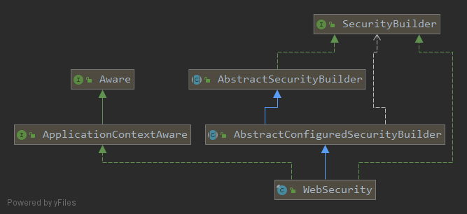
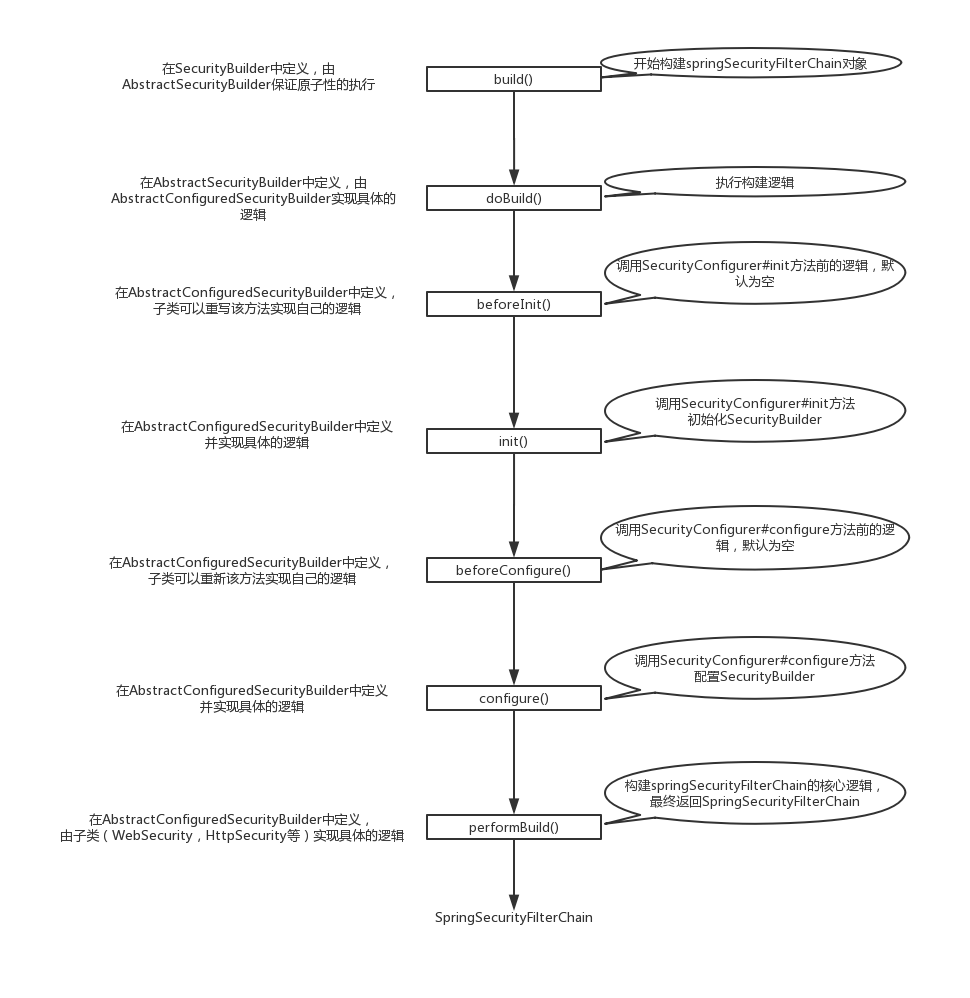

## 核心结论

WebSecurity 维护用于构建 SecurityFilterChain 的构建器，完成构建后将多条链组合成 FilterChainProxy。SecurityConfigurer 负责配置构建器，SecurityBuilder 负责生成目标对象；最终的 springSecurityFilterChain Bean 是过滤器代理，不是一条单独的 SecurityFilterChain。

## 问题与适用范围

本文回答：多条 HttpSecurity 配置如何组合成统一的安全过滤入口？

本文分析旧的 WebSecurity、AbstractConfiguredSecurityBuilder 与适配器协作。SpringSecurityFilterChain 在原文中有时用作统称，应区分 Bean 名 springSecurityFilterChain、接口 SecurityFilterChain 和具体 FilterChainProxy。

本系列声明的基线为 Spring Boot 2.1.5.RELEASE，其默认管理 Spring Security 5.1.5.RELEASE。正文保留该时期的源码与配置方式，用于理解历史实现，不代表当前版本的全部行为。

## 概述

WebSecurity是spring-security整个体系里面最为重要的一个安全类，通过之前的文章分析，我们可以得知spring-security是通过一个名称为springSecurityFilterChain的过滤器对所有的请求进行过滤的，同时在WebSecurityConfiguration源码分析中我们可以得知这个过滤器是通过以下方式被WebSecurity构建出来的

```java
@Bean(name = AbstractSecurityWebApplicationInitializer.DEFAULT_FILTER_NAME)
public Filter springSecurityFilterChain() throws Exception {
    boolean hasConfigurers = webSecurityConfigurers != null
        && !webSecurityConfigurers.isEmpty();
    if (!hasConfigurers) {
        WebSecurityConfigurerAdapter adapter = objectObjectPostProcessor
            .postProcess(new WebSecurityConfigurerAdapter() {
            });
        webSecurity.apply(adapter);
    }
    return webSecurity.build();
}
```

本章主要分析WebSecurity构建FilterChainProxy的流程，围绕WebSecurity的build方法展开。

<!-- more -->

## SecurityConfigurer和SecurityBuilder的关系

在开始分析WebSecurity前，有一个很重的概念我们需要先了解一下：**过滤器是被SecurityBuilder构建出来的，而SecurityConfigurer是用来配置SecurityBuilder内部的一些属性的**。暂时我们可能不太明白这句话是什么意思，我们现在只需要记住这个结论就行了。

### SecurityConfigurer

```java
// 返现参数O代表构建的对象类型，B代表builder类型，很显然就是SecurityBuilder的子类型
public interface SecurityConfigurer<O, B extends SecurityBuilder<O>> {

   // 初始化SecurityBuilder，在这个方法中只应该修改builder的共享状态
   // 从文档的注释上作者提醒只应该更改builder的构建状态，但实际上我在
   // 很多的SecurityConfigurer实现类上发现它们都修改了builder属性，这很奇怪
   void init(B builder) throws Exception;

   // 配置builder的属性
   void configure(B builder) throws Exception;
}
```

### SecurityBuilder

```java
public interface SecurityBuilder<O> {

   // 构建安全对象
   O build() throws Exception;
}
```

## AbstractConfiguredSecurityBuilder

先来看一下WebSecurity的类图



WebSecurity继承了AbstractConfiguredSecurityBuilder实现了SecurityBuilder和ApplicationContextAware接口，咋一看好像很复杂，Builder，Configurer，Aware这些显眼的关键字，处处体现了设计模式。不要慌，一步一步分析，我们先来看它的父类AbstractConfiguredSecurityBuilder

```java
// 泛型O代表的是builder构建的对象，B代表builder
public abstract class AbstractConfiguredSecurityBuilder<O, B extends SecurityBuilder<O>>
		extends AbstractSecurityBuilder<O> {
	private final Log logger = LogFactory.getLog(getClass());
	// 所有builder的Configurer
	private final LinkedHashMap<Class<? extends SecurityConfigurer<O, B>>, List<SecurityConfigurer<O, B>>> configurers = new LinkedHashMap<Class<? extends SecurityConfigurer<O, B>>, List<SecurityConfigurer<O, B>>>();
	// 所有正在初始化的Configurer
	private final List<SecurityConfigurer<O, B>> configurersAddedInInitializing = new ArrayList<SecurityConfigurer<O, B>>();
	// 共享的对象
	private final Map<Class<? extends Object>, Object> sharedObjects = new HashMap<Class<? extends Object>, Object>();
	// 是否允许同样类型的Configurer，默认为false
	private final boolean allowConfigurersOfSameType;
	// 构建状态
	private BuildState buildState = BuildState.UNBUILT;

	private ObjectPostProcessor<Object> objectPostProcessor;

	// 构造函数，默认不允许同样类型的Configurer
	protected AbstractConfiguredSecurityBuilder(
			ObjectPostProcessor<Object> objectPostProcessor) {
		this(objectPostProcessor, false);
	}

	protected AbstractConfiguredSecurityBuilder(
			ObjectPostProcessor<Object> objectPostProcessor,
			boolean allowConfigurersOfSameType) {
		Assert.notNull(objectPostProcessor, "objectPostProcessor cannot be null");
		this.objectPostProcessor = objectPostProcessor;
		this.allowConfigurersOfSameType = allowConfigurersOfSameType;
	}
	// 如果当前对象还没有构建则进行构建否则返回已经构建的对象
	public O getOrBuild() {
		if (isUnbuilt()) {
			try {
				return build();
			}
			catch (Exception e) {
				logger.debug("Failed to perform build. Returning null", e);
				return null;
			}
		}
		else {
			return getObject();
		}
	}

	// 将SecurityConfigurerAdapter应用到builder中，因为allowConfigurersOfSameType默认为false
	// 所以其实本质上是覆盖先前所有已经应用的SecurityConfigurer，同时设置
	// SecurityConfigurerAdapter的builder
	@SuppressWarnings("unchecked")
	public <C extends SecurityConfigurerAdapter<O, B>> C apply(C configurer)
			throws Exception {
		configurer.addObjectPostProcessor(objectPostProcessor);
		configurer.setBuilder((B) this);
		add(configurer);
		return configurer;
	}
    // 将SecurityConfigurer应用到builder中，因为allowConfigurersOfSameType默认为false
    // 所以其实本质上是覆盖先前所有已经应用的SecurityConfigurer，和上面的方法差不多
	public <C extends SecurityConfigurer<O, B>> C apply(C configurer) throws Exception {
		add(configurer);
		return configurer;
	}

	@SuppressWarnings("unchecked")
	public <C> void setSharedObject(Class<C> sharedType, C object) {
		this.sharedObjects.put(sharedType, object);
	}

	@SuppressWarnings("unchecked")
	public <C> C getSharedObject(Class<C> sharedType) {
		return (C) this.sharedObjects.get(sharedType);
	}

	public Map<Class<? extends Object>, Object> getSharedObjects() {
		return Collections.unmodifiableMap(this.sharedObjects);
	}

	// 添加SecurityConfigurer
	@SuppressWarnings("unchecked")
	private <C extends SecurityConfigurer<O, B>> void add(C configurer) throws Exception {
		Assert.notNull(configurer, "configurer cannot be null");
		// 获取将要添加的SecurityConfigurer的class
		Class<? extends SecurityConfigurer<O, B>> clazz = (Class<? extends SecurityConfigurer<O, B>>) configurer
				.getClass();
		// 同步已有的所有SecurityConfigurer
		synchronized (configurers) {
			if (buildState.isConfigured()) {
				throw new IllegalStateException("Cannot apply " + configurer
						+ " to already built object");
			}
			// 是否允许配置多个SecurityConfigurer，默认是不允许的
			List<SecurityConfigurer<O, B>> configs = allowConfigurersOfSameType ? this.configurers
					.get(clazz) : null;
			if (configs == null) {
				configs = new ArrayList<SecurityConfigurer<O, B>>(1);
			}
			// 将SecurityConfigurer添加到list中
			configs.add(configurer);
			// 将SecurityConfigurer重新设置回去
			this.configurers.put(clazz, configs);
			if (buildState.isInitializing()) {
				this.configurersAddedInInitializing.add(configurer);
			}
		}
	}
	// 返回所有某种类型的SecurityConfigurer
	@SuppressWarnings("unchecked")
	public <C extends SecurityConfigurer<O, B>> List<C> getConfigurers(Class<C> clazz) {
		List<C> configs = (List<C>) this.configurers.get(clazz);
		if (configs == null) {
			return new ArrayList<>();
		}
		return new ArrayList<>(configs);
	}
	// 移除某种类型的SecurityConfigurer
	@SuppressWarnings("unchecked")
	public <C extends SecurityConfigurer<O, B>> List<C> removeConfigurers(Class<C> clazz) {
		List<C> configs = (List<C>) this.configurers.remove(clazz);
		if (configs == null) {
			return new ArrayList<>();
		}
		return new ArrayList<>(configs);
	}

	// 获取单个SecurityConfigurer，由于allowConfigurersOfSameType默认为false所以返回的就是
	// 唯一的那个SecurityConfigurer
	@SuppressWarnings("unchecked")
	public <C extends SecurityConfigurer<O, B>> C getConfigurer(Class<C> clazz) {
		List<SecurityConfigurer<O, B>> configs = this.configurers.get(clazz);
		if (configs == null) {
			return null;
		}
		if (configs.size() != 1) {
			throw new IllegalStateException("Only one configurer expected for type "
					+ clazz + ", but got " + configs);
		}
		return (C) configs.get(0);
	}
	// 移除单个SecurityConfigurer
	@SuppressWarnings("unchecked")
	public <C extends SecurityConfigurer<O, B>> C removeConfigurer(Class<C> clazz) {
		List<SecurityConfigurer<O, B>> configs = this.configurers.remove(clazz);
		if (configs == null) {
			return null;
		}
		if (configs.size() != 1) {
			throw new IllegalStateException("Only one configurer expected for type "
					+ clazz + ", but got " + configs);
		}
		return (C) configs.get(0);
	}

	@SuppressWarnings("unchecked")
	public O objectPostProcessor(ObjectPostProcessor<Object> objectPostProcessor) {
		Assert.notNull(objectPostProcessor, "objectPostProcessor cannot be null");
		this.objectPostProcessor = objectPostProcessor;
		return (O) this;
	}

	protected <P> P postProcess(P object) {
		return this.objectPostProcessor.postProcess(object);
	}
	// 开始构建对象
	@Override
	protected final O doBuild() throws Exception {
		synchronized (configurers) {
			buildState = BuildState.INITIALIZING;

			beforeInit();
			init();

			buildState = BuildState.CONFIGURING;

			beforeConfigure();
			configure();

			buildState = BuildState.BUILDING;

			O result = performBuild();

			buildState = BuildState.BUILT;

			return result;
		}
	}
	// 子类可以重写这个方法以便在SecurityConfigurer初始化前处理其它逻辑
	protected void beforeInit() throws Exception {
	}
	// 子类可以重写这个方法以便在SecurityConfigurer配置前处理其它逻辑
	protected void beforeConfigure() throws Exception {
	}
	// 子类重写该方法，实现具体的构建逻辑
	protected abstract O performBuild() throws Exception;

	// SecurityConfigurer开始初始化
	@SuppressWarnings("unchecked")
	private void init() throws Exception {
		Collection<SecurityConfigurer<O, B>> configurers = getConfigurers();
		// SecurityConfigurer初始化，将builder对象传入
		for (SecurityConfigurer<O, B> configurer : configurers) {
			configurer.init((B) this);
		}
		// SecurityConfigurer初始化，将builder对象传入
		for (SecurityConfigurer<O, B> configurer : configurersAddedInInitializing) {
			configurer.init((B) this);
		}
	}
	// SecurityConfigurer开始配置
	@SuppressWarnings("unchecked")
	private void configure() throws Exception {
		Collection<SecurityConfigurer<O, B>> configurers = getConfigurers();

		for (SecurityConfigurer<O, B> configurer : configurers) {
			configurer.configure((B) this);
		}
	}

	private Collection<SecurityConfigurer<O, B>> getConfigurers() {
		List<SecurityConfigurer<O, B>> result = new ArrayList<SecurityConfigurer<O, B>>();
		for (List<SecurityConfigurer<O, B>> configs : this.configurers.values()) {
			result.addAll(configs);
		}
		return result;
	}

	private boolean isUnbuilt() {
		synchronized (configurers) {
			return buildState == BuildState.UNBUILT;
		}
	}

	private static enum BuildState {

		UNBUILT(0),


		INITIALIZING(1),


		CONFIGURING(2),


		BUILDING(3),


		BUILT(4);

		private final int order;

		BuildState(int order) {
			this.order = order;
		}

		public boolean isInitializing() {
			return INITIALIZING.order == order;
		}

		public boolean isConfigured() {
			return order >= CONFIGURING.order;
		}
	}
}

```

AbstractConfiguredSecurityBuilder可以理解为它是一个能够被配置的SecurityBuilder基类，能够给它配置一些SecurityConfigurer，这些SecurityConfigurer能够对AbstractConfiguredSecurityBuilder进行配置，最终进行build后构建出来的对象（FilterChainProxy）就拥有了SecurityConfigurer配置的功能。同时它又继承了AbstractSecurityBuilder，保证构建的对象只构建一次。

## AbstractSecurityBuilder

```java
public abstract class AbstractSecurityBuilder<O> implements SecurityBuilder<O> {

    private AtomicBoolean building = new AtomicBoolean();

	private O object;

	// 进行构建对象时保证对象没有构建才调用doBuild方法进行构建
	public final O build() throws Exception {
		if (this.building.compareAndSet(false, true)) {
			this.object = doBuild();
			return this.object;
		}
		throw new AlreadyBuiltException("This object has already been built");
	}

	// 获取被构建的对象，如果该对象还没有构建就抛出异常
	public final O getObject() {
		if (!this.building.get()) {
			throw new IllegalStateException("This object has not been built");
		}
		return this.object;
	}

	// 子类实现该方法进行具体的构建逻辑
	protected abstract O doBuild() throws Exception;
}

```

AbstractSecurityBuilder保证对象在进行构建的时候只构建一次，是通过原子类AtomicBoolean保证的。接下来我们分析一下WebSecurity的源码

## WebSecurity

```java
public final class WebSecurity extends
		AbstractConfiguredSecurityBuilder<Filter, WebSecurity> implements
		SecurityBuilder<Filter>, ApplicationContextAware {
	private final Log logger = LogFactory.getLog(getClass());

    // 在整个web请求中需要忽略的请求
	private final List<RequestMatcher> ignoredRequests = new ArrayList<>();
	// 一些列的SecurityBuilder，从泛型参数可以看出最终每一个SecurityBuilder构建出来的
    // 对象就是SecurityFilterChain
	private final List<SecurityBuilder<? extends SecurityFilterChain>> securityFilterChainBuilders = new ArrayList<SecurityBuilder<? extends SecurityFilterChain>>();

    // 需要忽略的请求的RequestMatcher的Configurer，有点绕口。。。
	private IgnoredRequestConfigurer ignoredRequestRegistry;
	// 熟悉的FilterSecurityInterceptor
	private FilterSecurityInterceptor filterSecurityInterceptor;
	// http防火墙，在过滤器链执行器调用，主要是用来做一些安全的防护
	private HttpFirewall httpFirewall;

	private boolean debugEnabled;

	private WebInvocationPrivilegeEvaluator privilegeEvaluator;

	private DefaultWebSecurityExpressionHandler defaultWebSecurityExpressionHandler = new DefaultWebSecurityExpressionHandler();
	// 熟悉的FilterInvocation
	private SecurityExpressionHandler<FilterInvocation> expressionHandler = defaultWebSecurityExpressionHandler;
	// 用来设置FilterSecurityInterceptor的，会在构建完成后调用该方法
	private Runnable postBuildAction = new Runnable() {
		public void run() {
		}
	};

	public WebSecurity(ObjectPostProcessor<Object> objectPostProcessor) {
		super(objectPostProcessor);
	}
	// 在整个web请求中需要忽略的请求的RequestMatcher的Configurer
	public IgnoredRequestConfigurer ignoring() {
		return ignoredRequestRegistry;
	}
	// 自定义HttpFirewall，默认的实现是StrictHttpFirewall
	public WebSecurity httpFirewall(HttpFirewall httpFirewall) {
		this.httpFirewall = httpFirewall;
		return this;
	}

	public WebSecurity debug(boolean debugEnabled) {
		this.debugEnabled = debugEnabled;
		return this;
	}
	// 添加构建器以创建SecurityFilterChain实例,该方法一般是在
    // WebSecurityConfigurerAdapter#init(WebSecurity)处被调用
	public WebSecurity addSecurityFilterChainBuilder(
			SecurityBuilder<? extends SecurityFilterChain> securityFilterChainBuilder) {
		this.securityFilterChainBuilders.add(securityFilterChainBuilder);
		return this;
	}

	public WebSecurity privilegeEvaluator(
			WebInvocationPrivilegeEvaluator privilegeEvaluator) {
		this.privilegeEvaluator = privilegeEvaluator;
		return this;
	}

	public WebSecurity expressionHandler(
			SecurityExpressionHandler<FilterInvocation> expressionHandler) {
		Assert.notNull(expressionHandler, "expressionHandler cannot be null");
		this.expressionHandler = expressionHandler;
		return this;
	}

	public SecurityExpressionHandler<FilterInvocation> getExpressionHandler() {
		return expressionHandler;
	}

	public WebInvocationPrivilegeEvaluator getPrivilegeEvaluator() {
		if (privilegeEvaluator != null) {
			return privilegeEvaluator;
		}
		return filterSecurityInterceptor == null ? null
				: new DefaultWebInvocationPrivilegeEvaluator(filterSecurityInterceptor);
	}

	public WebSecurity securityInterceptor(FilterSecurityInterceptor securityInterceptor) {
		this.filterSecurityInterceptor = securityInterceptor;
		return this;
	}

	public WebSecurity postBuildAction(Runnable postBuildAction) {
		this.postBuildAction = postBuildAction;
		return this;
	}
	// 最终的构建逻辑
	@Override
	protected Filter performBuild() throws Exception {
		Assert.state(
				!securityFilterChainBuilders.isEmpty(),
				() -> "At least one SecurityBuilder<? extends SecurityFilterChain> needs to be specified. "
						+ "Typically this done by adding a @Configuration that extends WebSecurityConfigurerAdapter. "
						+ "More advanced users can invoke "
						+ WebSecurity.class.getSimpleName()
						+ ".addSecurityFilterChainBuilder directly");
        // 过滤器链数为需要忽略的请求数加上已经配置的builder数
		int chainSize = ignoredRequests.size() + securityFilterChainBuilders.size();
		List<SecurityFilterChain> securityFilterChains = new ArrayList<>(
				chainSize);
        // 每一个忽略的请求对应的过滤器链是DefaultSecurityFilterChain
		for (RequestMatcher ignoredRequest : ignoredRequests) {
			securityFilterChains.add(new DefaultSecurityFilterChain(ignoredRequest));
		}
        // 已配置的securityFilterChainBuilder构建相应的过滤器链
		for (SecurityBuilder<? extends SecurityFilterChain> securityFilterChainBuilder : securityFilterChainBuilders) {
			securityFilterChains.add(securityFilterChainBuilder.build());
		}
        // 很重要，这就是最终的过滤器，将所有的过滤器链包含在里面了！！！
		FilterChainProxy filterChainProxy = new FilterChainProxy(securityFilterChains);
		if (httpFirewall != null) {
			filterChainProxy.setFirewall(httpFirewall);
		}
		filterChainProxy.afterPropertiesSet();

		Filter result = filterChainProxy;
		if (debugEnabled) {
			logger.warn("\n\n"
					+ "********************************************************************\n"
					+ "**********        Security debugging is enabled.       *************\n"
					+ "**********    This may include sensitive information.  *************\n"
					+ "**********      Do not use in a production system!     *************\n"
					+ "********************************************************************\n\n");
			result = new DebugFilter(filterChainProxy);
		}
		postBuildAction.run();
		return result;
	}

	public final class MvcMatchersIgnoredRequestConfigurer
			extends IgnoredRequestConfigurer {
		private final List<MvcRequestMatcher> mvcMatchers;

		private MvcMatchersIgnoredRequestConfigurer(ApplicationContext context,
				List<MvcRequestMatcher> mvcMatchers) {
			super(context);
			this.mvcMatchers = mvcMatchers;
		}

		public IgnoredRequestConfigurer servletPath(String servletPath) {
			for (MvcRequestMatcher matcher : this.mvcMatchers) {
				matcher.setServletPath(servletPath);
			}
			return this;
		}
	}

	public class IgnoredRequestConfigurer
			extends AbstractRequestMatcherRegistry<IgnoredRequestConfigurer> {

		private IgnoredRequestConfigurer(ApplicationContext context) {
			setApplicationContext(context);
		}

		@Override
		public MvcMatchersIgnoredRequestConfigurer mvcMatchers(HttpMethod method,
				String... mvcPatterns) {
			List<MvcRequestMatcher> mvcMatchers = createMvcMatchers(method, mvcPatterns);
			WebSecurity.this.ignoredRequests.addAll(mvcMatchers);
			return new MvcMatchersIgnoredRequestConfigurer(getApplicationContext(),
					mvcMatchers);
		}

		@Override
		public MvcMatchersIgnoredRequestConfigurer mvcMatchers(String... mvcPatterns) {
			return mvcMatchers(null, mvcPatterns);
		}

		@Override
		protected IgnoredRequestConfigurer chainRequestMatchers(
				List<RequestMatcher> requestMatchers) {
			WebSecurity.this.ignoredRequests.addAll(requestMatchers);
			return this;
		}

		/**
		 * Returns the {@link WebSecurity} to be returned for chaining.
		 */
		public WebSecurity and() {
			return WebSecurity.this;
		}
	}

	@Override
	public void setApplicationContext(ApplicationContext applicationContext)
			throws BeansException {
		this.defaultWebSecurityExpressionHandler
				.setApplicationContext(applicationContext);
		try {
			this.defaultWebSecurityExpressionHandler.setPermissionEvaluator(applicationContext.getBean(
					PermissionEvaluator.class));
		} catch(NoSuchBeanDefinitionException e) {}

		this.ignoredRequestRegistry = new IgnoredRequestConfigurer(applicationContext);
		try {
			this.httpFirewall = applicationContext.getBean(HttpFirewall.class);
		} catch(NoSuchBeanDefinitionException e) {}
	}
}

```

分析到这，我们对WebSecurity就已经有一个大概的了解了，下面对它进行一个总结

1. WebSecurity内部维护了一个SecurityBuilder列表，每一个相关的构建器都会构建一个SecurityFilterChain
2. WebSecurity将这些SecurityFilterChain组合成FilterChainProxy。FilterChainProxy实现Filter，作为名为springSecurityFilterChain的Bean接到请求入口；它本身不实现SecurityFilterChain接口。

分析到这，其实还有一个地方没有搞明白，我们现在知道WebSecurity内的SecurityBuilder构建了SecurityFilterChain，最终将这些SecurityFilterChain包装成一个FilterChainProxy，但是WebSecurity内的那些SecurityBuilder是什么时候配置的呢？通过debug发现其实它是在AbstractConfiguredSecurityBuilder类中的init方法配置的

```java
private void init() throws Exception {
    Collection<SecurityConfigurer<O, B>> configurers = getConfigurers();
	// SecurityBuilder就是在这个时候添加的
    for (SecurityConfigurer<O, B> configurer : configurers) {
        configurer.init((B) this);
    }

    for (SecurityConfigurer<O, B> configurer : configurersAddedInInitializing) {
        configurer.init((B) this);
    }
}
```

既然是在这个地方配置的那么这个SecurityConfigurer和SecurityBuilder又是什么呢？这里直接给出结果：WebSecurity内维护的SecurityBuilder是通过调用WebSecurityConfigurerAdapter的init方法添加的，最终的添加的SecurityBuilder就是HttpSecurity。结果其实不意外，平常我们在配置spring-security的时候通常就是继承WebSecurityConfigurerAdapter类然后调用configure(HttpSecurity http)方法进行配置的。这里就又引出了WebSecurityConfigurerAdapter和HttpSecurity类，篇幅有限，下一章我们再继续分析它是如何配置这个HttpSecurity的。

## 总结

WebSecurity通过内部维护的构建器生成多条SecurityFilterChain，再组合成FilterChainProxy。因此最终配置的过滤入口包含多条链，而不是一条链的别名。下面用一张图总结构建流程。



## 资料来源

- [Spring Boot 2.1.5.RELEASE 依赖版本表](https://docs.spring.io/spring-boot/docs/2.1.5.RELEASE/reference/html/appendix-dependency-versions.html)
- [Spring Security 5.1.5.RELEASE 参考文档](https://docs.spring.io/spring-security/site/docs/5.1.5.RELEASE/reference/htmlsingle/)
- [SecurityFilterChain 组件配置迁移指南](https://spring.io/blog/2022/02/21/spring-security-without-the-websecurityconfigureradapter)
